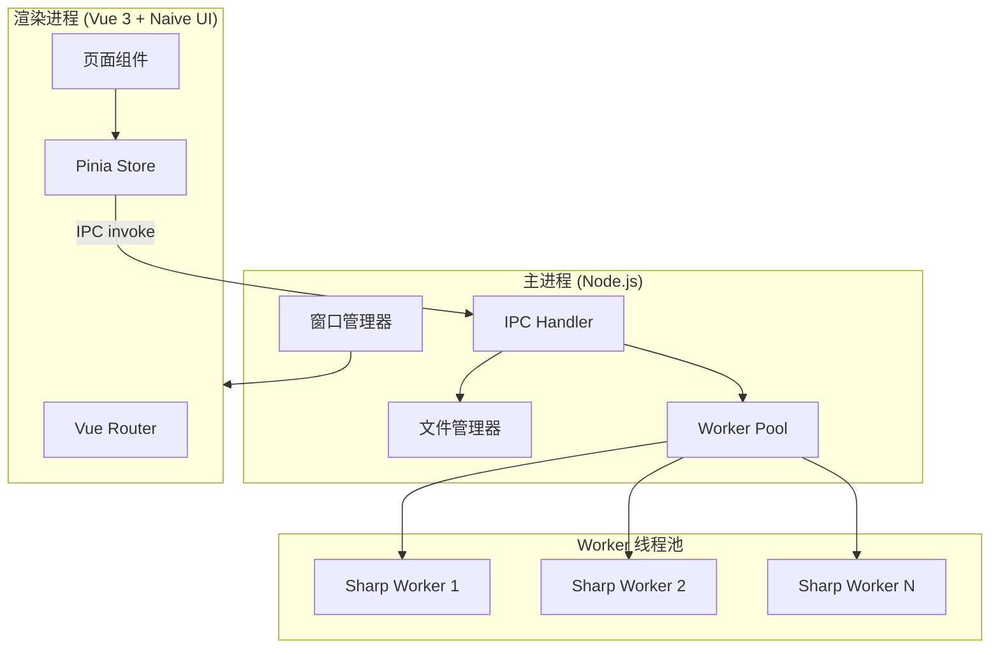
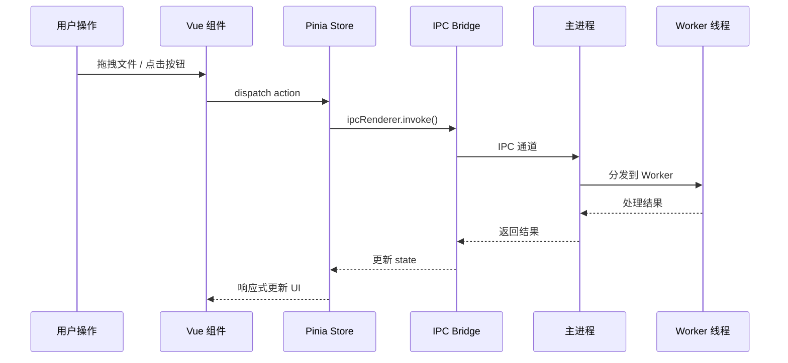

# Electron 图片工具库 - 架构设计 V1.0

## 基本信息

| 项目         | 值                                               |
| ------------ | ------------------------------------------------ |
| **功能名称** | Electron 图片工具库（ImageKit）                  |
| **所属迭代** | 2026-03-Electron工具库                           |
| **创建日期** | 2026-03-16                                       |
| **技术栈**   | Electron + Vue 3 + TypeScript + Naive UI + Sharp |

---

## 一、技术选型

### 1.1 核心框架

| 技术              | 版本   | 用途                 | 选型理由                               |
| ----------------- | ------ | -------------------- | -------------------------------------- |
| **Electron**      | 33+    | 桌面端运行时         | 最新稳定版，Chromium 130+，Node.js 20+ |
| **Vue 3**         | 3.5+   | 渲染进程 UI 框架     | Composition API + TypeScript 完美支持  |
| **TypeScript**    | 5.x    | 类型安全             | 降低大型项目维护成本                   |
| **Vite**          | 6.x    | 构建工具             | 极快 HMR，开发体验最佳                 |
| **electron-vite** | latest | Electron + Vite 集成 | 官方推荐的 Electron Vite 整合方案      |

### 1.2 UI 组件库 — Naive UI

> **为什么选 Naive UI 而不是 Element Plus / Vuetify / Quasar？**

| 对比项           | Naive UI ⭐             | Element Plus       | Vuetify       | Quasar          |
| ---------------- | ----------------------- | ------------------ | ------------- | --------------- |
| **暗色主题**     | 原生内置，一行切换      | 需手动加 CSS class | 内置          | 内置            |
| **包体积**       | 轻量，完整 tree-shake   | 较重               | 最重          | 中等            |
| **设计风格**     | 现代极简，适合工具类    | 企业后台风格       | Material 风格 | 多平台风格      |
| **虚拟滚动**     | 内置 VirtualList        | 需额外集成         | 有            | 有              |
| **TypeScript**   | 原生 TS 编写，类型完美  | TS 支持好          | TS 支持好     | TS 支持好       |
| **自定义主题**   | CSS Variables，极易定制 | CSS Variables      | SASS 变量     | SASS 变量       |
| **桌面端适合度** | ⭐⭐⭐⭐⭐ 工具类首选   | ⭐⭐⭐ 后台系统    | ⭐⭐⭐ 移动端 | ⭐⭐⭐⭐ 跨平台 |

**Naive UI 关键优势**：

- ✅ **原生暗色主题** — 通过 `<n-config-provider :theme="darkTheme">` 一行代码全局切换
- ✅ **虚拟列表** — `<n-virtual-list>` 内置支持，500+ SVG 文件浏览无压力
- ✅ **Tree / TreeSelect** — 完美适配文件夹浏览场景
- ✅ **Image 组件** — 内置图片预览、懒加载、占位符
- ✅ **Notification / Message** — 全局提示系统
- ✅ **极简设计语言** — 视觉上更接近桌面应用，不像"网页"

### 1.3 图片处理引擎

| 功能                | 库                  | 说明                                                     |
| ------------------- | ------------------- | -------------------------------------------------------- |
| 图片压缩 / 格式转换 | **Sharp** 0.33+     | 基于 libvips，性能极强，支持 JPEG/PNG/WebP/AVIF/TIFF/GIF |
| GIF 动图处理        | **gifsicle**        | GIF 专项压缩优化                                         |
| ICO 多尺寸生成      | **png-to-ico**      | 生成含 16/32/48/256 多尺寸的 .ico                        |
| SVG 解析与颜色修改  | **cheerio**         | 解析 SVG DOM，批量修改 fill/stroke 属性                  |
| SVG → PNG 栅格化    | **resvg-js**        | Rust 编写的 SVG 渲染器，高保真导出                       |
| EXIF 元信息读取     | **exif-reader**     | 读取 JPEG/TIFF 的 EXIF 数据                              |
| PDF 处理            | **pdf-lib** + Sharp | PDF 页面转图片 / 多图合成 PDF                            |
| 二维码生成          | **qrcode**          | 生成自定义二维码图片                                     |
| 雪碧图生成          | **spritesmith**     | 多图合成 Sprite Sheet + CSS 坐标                         |
| 图标字体生成        | **fantasticon**     | SVG → woff2/ttf 图标字体                                 |
| 颜色处理            | **colord**          | 颜色空间转换，取色器支持                                 |

### 1.4 工程工具

| 用途     | 技术                                         |
| -------- | -------------------------------------------- |
| 打包分发 | electron-builder（Windows NSIS + macOS DMG） |
| 自动更新 | electron-updater（待定）                     |
| 代码规范 | ESLint + Prettier                            |
| 状态管理 | Pinia                                        |
| 路由     | vue-router                                   |

---

## 二、系统架构

### 2.1 进程架构



### 2.2 数据流



### 2.3 多线程模型

```
┌──────────────────────────────┐
│ 主进程 (Main Process)         │
│  ├── IPC Handler             │
│  ├── 文件系统操作              │
│  └── Worker Pool Manager     │
│      ├── Worker 1: Sharp     │  ← CPU 密集型任务
│      ├── Worker 2: Sharp     │
│      └── Worker N: Sharp     │
└──────────────────────────────┘
        ↕ IPC 通信
┌──────────────────────────────┐
│ 渲染进程 (Renderer Process)   │
│  ├── Vue 3 + Naive UI        │
│  ├── Pinia (状态管理)          │
│  └── 纯 UI 展示，不做 CPU 运算  │
└──────────────────────────────┘
```

> **关键设计决策**：所有图片处理操作在 Worker 线程执行，主进程只负责调度，渲染进程只负责 UI。避免任何线程阻塞，确保界面始终流畅响应。

---

## 三、目录结构

```
electron-image-toolkit/
├── electron/                    # 主进程代码
│   ├── main.ts                 # 入口，窗口创建
│   ├── preload.ts              # 预加载脚本，暴露安全 API
│   ├── ipc/                    # IPC 通信处理器
│   │   ├── file.handler.ts     # 文件选择/保存
│   │   ├── compress.handler.ts # 图片压缩
│   │   ├── convert.handler.ts  # 格式转换
│   │   └── svg.handler.ts      # SVG 操作
│   └── workers/                # Worker 线程
│       ├── pool.ts             # Worker 线程池管理
│       ├── compress.worker.ts  # 压缩 Worker
│       └── convert.worker.ts   # 转换 Worker
│
├── src/                        # 渲染进程 (Vue 3)
│   ├── App.vue                 # 根组件
│   ├── main.ts                 # 渲染进程入口
│   ├── router/                 # 路由配置
│   │   └── index.ts
│   ├── stores/                 # Pinia 状态管理
│   │   ├── svg.store.ts        # SVG 查看状态
│   │   ├── compress.store.ts   # 压缩任务队列
│   │   └── convert.store.ts    # 转换任务队列
│   ├── views/                  # 页面组件
│   │   ├── SvgViewer.vue       # SVG 批量查看
│   │   ├── ImageCompress.vue   # 图片压缩
│   │   ├── FormatConvert.vue   # 格式转换
│   │   └── Settings.vue        # 设置页
│   ├── components/             # 通用组件
│   │   ├── AppSidebar.vue      # 侧栏导航
│   │   ├── DropZone.vue        # 拖拽区域
│   │   ├── FileList.vue        # 文件列表
│   │   ├── ComparePanel.vue    # 压缩对比面板
│   │   └── ProgressQueue.vue   # 任务队列进度
│   ├── composables/            # 可组合逻辑
│   │   ├── useFileDrop.ts      # 拖拽文件逻辑
│   │   ├── useClipboard.ts     # 剪贴板粘贴
│   │   └── useTheme.ts         # 主题切换
│   ├── styles/                 # 主题样式
│   │   ├── variables.css       # CSS 变量
│   │   └── global.css          # 全局样式
│   └── types/                  # TypeScript 类型
│       └── index.d.ts
│
├── resources/                  # 静态资源
│   └── icon.png                # 应用图标
├── package.json
├── electron.vite.config.ts     # electron-vite 配置
├── tsconfig.json
└── .eslintrc.cjs
```

---

## 四、核心模块设计

### 4.1 IPC 通信协议

```typescript
// 压缩请求
interface CompressRequest {
  files: string[]; // 文件路径列表
  mode: "lossy" | "lossless" | "smart";
  quality: number; // 1-100
  outputStrategy: "overwrite" | "directory" | "suffix";
  outputDir?: string;
}

// 压缩结果（逐文件回调）
interface CompressResult {
  file: string;
  originalSize: number;
  compressedSize: number;
  savedPercent: number;
  status: "success" | "error";
  error?: string;
}

// SVG 批量操作
interface SvgBatchRequest {
  files: string[];
  action: "changeColor" | "exportPng";
  color?: string;
  scales?: number[]; // [1, 2, 3] for @1x @2x @3x
  outputDir?: string;
}
```

### 4.2 Worker 线程池

```typescript
// electron/workers/pool.ts
class WorkerPool {
  private workers: Worker[];
  private queue: Task[];
  private maxWorkers: number; // = os.cpus().length - 1

  async process(files: string[], handler: string): AsyncGenerator<Result>;
  // 逐文件产出结果，通过 IPC 通知渲染进程更新进度
}
```

### 4.3 Pinia Store 设计

```typescript
// src/stores/compress.store.ts
interface CompressState {
  files: CompressFile[]; // 待处理文件列表
  mode: CompressMode;
  quality: number;
  isProcessing: boolean;
  progress: number; // 0-100
  results: CompressResult[];
}
```

---

## 五、Naive UI 关键组件映射

| 应用场景 | Naive UI 组件                            | 说明               |
| -------- | ---------------------------------------- | ------------------ |
| 整体布局 | `<n-layout>` + `<n-layout-sider>`        | 侧栏 + 主内容区    |
| 暗色主题 | `<n-config-provider :theme="darkTheme">` | 全局主题切换       |
| SVG 宫格 | `<n-image-group>` + `<n-grid>`           | 图标网格展示       |
| SVG 列表 | `<n-virtual-list>` + `<n-data-table>`    | 大量文件虚拟滚动   |
| 搜索框   | `<n-input>` + `<n-icon>`                 | 文件名过滤         |
| 文件队列 | `<n-list>` + `<n-progress>`              | 压缩/转换进度展示  |
| 格式选择 | `<n-card>` + `<n-grid>`                  | 可选格式卡片       |
| 质量滑块 | `<n-slider>`                             | 压缩质量调节       |
| 模式选择 | `<n-select>` / `<n-radio-group>`         | 压缩/转换模式      |
| 对比面板 | `<n-image>` × 2 + `<n-grid>`             | 原图 vs 压缩图     |
| 颜色选择 | `<n-color-picker>`                       | SVG 颜色修改       |
| 全局通知 | `<n-notification-provider>`              | 操作完成提示       |
| 弹窗确认 | `<n-modal>` / `<n-dialog>`               | 导出设置、确认操作 |

---

## 六、非功能设计

### 6.1 性能目标

| 指标            | 目标值     | 实现方式              |
| --------------- | ---------- | --------------------- |
| 10MB JPEG 压缩  | ≤ 3 秒     | Sharp Worker 线程     |
| 500 个 SVG 加载 | ≤ 2 秒     | 虚拟列表 + 异步渲染   |
| UI 响应         | 始终 60fps | 图片处理全部在 Worker |
| 冷启动          | ≤ 3 秒     | 延迟加载非核心模块    |

### 6.2 打包分发

| 平台    | 格式                   | 工具             |
| ------- | ---------------------- | ---------------- |
| Windows | NSIS 安装包 + Portable | electron-builder |
| macOS   | DMG + .app             | electron-builder |

### 6.3 安全

- 渲染进程通过 `contextBridge` + `preload.ts` 调用主进程 API
- 禁用 `nodeIntegration`，启用 `contextIsolation`
- 文件操作仅通过 IPC 白名单通道

---

## 七、MVP 开发路线

### Phase 1：项目骨架（Day 1）

- [ ] 使用 electron-vite 初始化项目
- [ ] 配置 Naive UI + 暗色主题
- [ ] 搭建侧栏导航 + 路由切换框架
- [ ] 实现全局拖拽 + 剪贴板粘贴

### Phase 2：SVG 批量查看（Day 1-2）

- [ ] 文件夹加载 + SVG 列表/宫格双视图
- [ ] 文件名搜索过滤
- [ ] 批量颜色修改（fill/stroke）
- [ ] SVG → PNG @1x @2x @3x 导出

### Phase 3：图片压缩（Day 2-3）

- [ ] Sharp Worker 线程池搭建
- [ ] 有损/无损/智能三种模式
- [ ] 逐文件进度更新
- [ ] 压缩前后预览对比面板
- [ ] 输出策略选择

### Phase 4：格式转换（Day 3）

- [ ] 全格式互转（借助 Sharp）
- [ ] 预设尺寸 + 自定义尺寸
- [ ] ICO 多尺寸嵌入
- [ ] 批量转换 + 进度展示

### Phase 5：打包调优（Day 3-4）

- [ ] electron-builder 配置
- [ ] Windows NSIS + macOS DMG 打包
- [ ] 应用图标 / 启动画面
- [ ] 本地测试

---

## 八、关联文档

| 文档      | 路径                                                                                     |
| --------- | ---------------------------------------------------------------------------------------- |
| 需求澄清  | [工具库-需求澄清.md](../demand/工具库-需求澄清.md)                                       |
| 需求规格  | [工具库-需求.md](../prototypes/2026-03-Electron工具库/requirements/工具库-需求.md)       |
| HTML 原型 | [工具库-prototype.html](../prototypes/2026-03-Electron工具库/html/工具库-prototype.html) |

## 变更记录

| 日期       | 版本 | 变更内容 | 变更人 |
| ---------- | ---- | -------- | ------ |
| 2026-03-16 | V1.0 | 初始版本 | —      |
