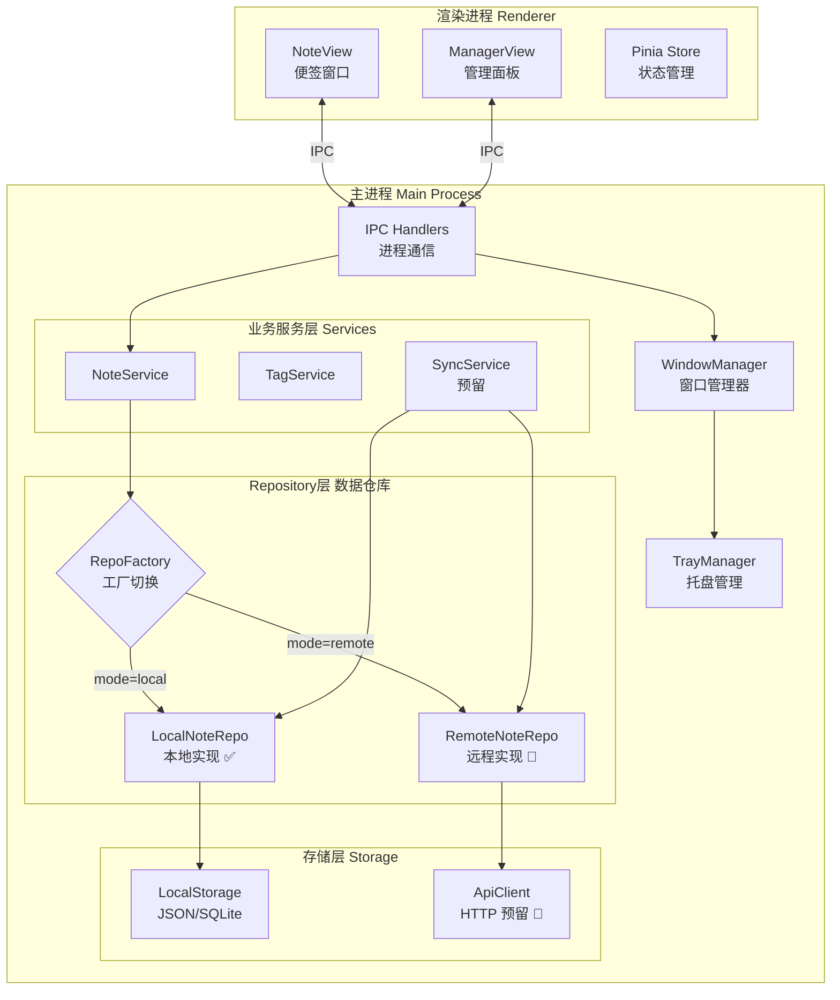
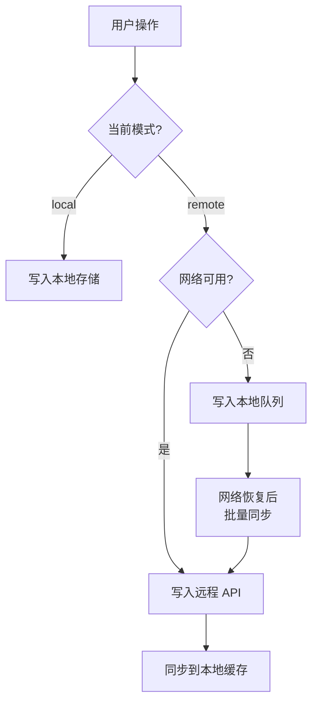

# 功能规格：Electron 桌面便签应用

**功能分支**: `001-desktop-sticky-note`  
**创建日期**: 2026-03-16  
**状态**: Draft  
**输入**: 使用 Electron 实现桌面端便签，结构清晰，拓展性强

---

## 一、项目概述

### 1.1 项目定位

一款基于 Electron 的轻量级桌面便签应用，支持多便签管理、富文本编辑、便签分组/标签、数据本地持久化，未来可拓展云同步、提醒等高级功能。

### 1.2 核心价值

| 维度         | 描述                                        |
| ------------ | ------------------------------------------- |
| **即时记录** | 随时创建便签，快速记录灵感和待办            |
| **桌面常驻** | 便签窗口可钉在桌面，始终可见                |
| **分类管理** | 通过颜色、标签、分组对便签进行归类整理      |
| **跨平台**   | 基于 Electron，支持 Windows / macOS / Linux |

### 1.3 目标用户

- 需要快速记录灵感和待办事项的知识工作者
- 习惯在桌面放置便签的用户
- 需要轻量级笔记工具的开发者

---

## 二、用户场景与测试

### User Story 1 — 创建与编辑便签 (Priority: P1)

用户可以快速创建新便签，在便签窗口中输入和编辑文本内容。每个便签作为独立窗口显示在桌面上，支持拖拽移动和调整大小。

**Why this priority**: 这是便签应用的核心功能，没有它应用无法使用。

**Independent Test**: 启动应用后，点击"新建便签"按钮，在弹出的便签窗口中输入文字，关闭后重新打开应用，内容应被保留。

**验收场景**:

1. **Given** 应用已启动, **When** 用户点击"新建便签", **Then** 弹出一个新的便签窗口，光标自动聚焦到编辑区域
2. **Given** 便签窗口已打开, **When** 用户输入文字, **Then** 内容实时保存，无需手动保存按钮
3. **Given** 便签窗口已打开, **When** 用户拖拽便签标题栏, **Then** 便签窗口在桌面自由移动
4. **Given** 便签窗口已打开, **When** 用户拖拽便签边缘, **Then** 便签窗口大小调整

---

### User Story 2 — 便签列表与管理 (Priority: P1)

用户通过主窗口（管理面板）查看所有便签，可以搜索、排序、删除便签。

**Why this priority**: 当便签数量增多后，管理功能变得必要。

**Independent Test**: 创建多个便签后，在管理面板中查看列表，搜索特定便签，删除不需要的便签。

**验收场景**:

1. **Given** 用户有多个便签, **When** 打开管理面板, **Then** 展示所有便签的列表，显示标题/摘要和创建时间
2. **Given** 管理面板已打开, **When** 用户输入搜索关键词, **Then** 实时过滤匹配的便签
3. **Given** 管理面板已打开, **When** 用户点击删除按钮, **Then** 弹出确认对话框，确认后删除便签
4. **Given** 管理面板已打开, **When** 用户双击某便签, **Then** 打开对应的便签窗口

---

### User Story 3 — 便签外观自定义 (Priority: P2)

用户可以为每个便签设置不同的颜色主题，便于视觉区分不同类型的便签。

**Why this priority**: 颜色区分是便签的经典特性，提升用户体验。

**Independent Test**: 创建便签后，在便签选项中切换颜色主题，便签外观即时更新。

**验收场景**:

1. **Given** 便签已创建, **When** 用户点击颜色选择器, **Then** 显示预定义颜色集（至少 6 种：黄、绿、蓝、粉、紫、橙）
2. **Given** 颜色选择器已打开, **When** 用户选择某颜色, **Then** 便签背景色即时更新，且保存到数据中

---

### User Story 4 — 系统托盘常驻 (Priority: P2)

应用最小化到系统托盘区域，通过托盘图标可以快速新建便签、切换显示/隐藏所有便签。

**Why this priority**: 桌面便签需要常驻运行但不占用任务栏空间。

**Independent Test**: 关闭主窗口后，系统托盘图标仍存在，右键菜单可以新建便签和退出应用。

**验收场景**:

1. **Given** 应用运行中, **When** 用户关闭主窗口（点击 ×）, **Then** 应用最小化到系统托盘，不退出
2. **Given** 应用在系统托盘, **When** 用户右键托盘图标, **Then** 显示菜单：新建便签 / 显示所有 / 隐藏所有 / 管理面板 / 退出
3. **Given** 应用在系统托盘, **When** 用户左键单击托盘图标, **Then** 显示/隐藏管理面板

---

### User Story 5 — 便签置顶与钉住 (Priority: P2)

用户可以将某个便签窗口设为"置顶"，始终显示在其他窗口之上。

**Why this priority**: 桌面便签的核心交互之一，确保重要信息始终可见。

**验收场景**:

1. **Given** 便签窗口已打开, **When** 用户点击"置顶"按钮, **Then** 便签窗口始终在最前面，按钮状态变为"已置顶"
2. **Given** 便签已置顶, **When** 用户再次点击"置顶"按钮, **Then** 取消置顶，恢复正常窗口层级

---

### User Story 6 — 标签与分组 (Priority: P3)

用户可以为便签添加标签（tag），并在管理面板中按标签筛选便签。

**Why this priority**: 分组管理是进阶需求，便于长期使用的组织管理。

**验收场景**:

1. **Given** 便签已创建, **When** 用户添加标签, **Then** 标签显示在便签底部，且可添加多个
2. **Given** 管理面板中有标签, **When** 用户点击某标签, **Then** 只显示包含该标签的便签

---

### User Story 7 — 快捷键支持 (Priority: P3)

全局快捷键和应用内快捷键，提升操作效率。

**验收场景**:

1. **Given** 应用运行中, **When** 用户按下全局快捷键（如 `Ctrl+Shift+N`）, **Then** 即使应用不在前台也能新建便签
2. **Given** 便签窗口聚焦, **When** 用户按 `Ctrl+W`, **Then** 关闭当前便签窗口（仅隐藏，不删除）

---

### 边界情况

- 当用户同时开启大量便签窗口（>20）时，系统资源消耗如何控制？
- 数据文件损坏时，如何进行恢复？
- 多显示器场景下，便签窗口位置如何跨屏记忆？

---

## 三、功能需求

### 3.1 核心功能

| 编号   | 需求                                              | 优先级 |
| ------ | ------------------------------------------------- | ------ |
| FR-001 | 系统必须支持创建、编辑、删除便签                  | P1     |
| FR-002 | 便签内容必须自动保存（debounce 策略，延迟 500ms） | P1     |
| FR-003 | 系统必须持久化所有便签数据到本地                  | P1     |
| FR-004 | 每个便签必须作为独立窗口展示，支持移动和调整大小  | P1     |
| FR-005 | 系统必须记住每个便签窗口的位置和大小              | P1     |
| FR-006 | 系统必须提供管理面板，展示所有便签列表            | P1     |

### 3.2 体验功能

| 编号   | 需求                                                 | 优先级 |
| ------ | ---------------------------------------------------- | ------ |
| FR-007 | 系统必须支持至少 6 种便签颜色主题                    | P2     |
| FR-008 | 系统必须支持便签窗口置顶功能                         | P2     |
| FR-009 | 系统必须支持系统托盘常驻和右键菜单                   | P2     |
| FR-010 | 关闭主窗口（管理面板）时必须最小化到托盘，不退出应用 | P2     |
| FR-011 | 系统必须支持全局快捷键新建便签                       | P3     |

### 3.3 管理功能

| 编号   | 需求                                    | 优先级 |
| ------ | --------------------------------------- | ------ |
| FR-012 | 管理面板必须支持搜索便签                | P2     |
| FR-013 | 管理面板必须支持按创建时间/修改时间排序 | P2     |
| FR-014 | 系统必须支持为便签添加标签              | P3     |
| FR-015 | 管理面板必须支持按标签筛选              | P3     |

### 3.4 拓展预留（接口对接）

| 编号   | 需求                                                                | 优先级 |
| ------ | ------------------------------------------------------------------- | ------ |
| FR-016 | 架构设计必须预留富文本编辑能力（Markdown/HTML）                     | P3     |
| FR-017 | 数据层必须采用 Repository 模式，抽象存储接口，支持本地/远程无缝切换 | P1     |
| FR-018 | 必须预定义完整的 API 接口规范文档，后续对接时直接实现               | P2     |
| FR-019 | 必须设计离线优先 + 增量同步策略，支持断网后自动恢复                 | P3     |
| FR-020 | 架构设计必须预留提醒/闹钟功能接口                                   | P4     |
| FR-021 | 架构设计必须预留插件系统扩展点                                      | P4     |

---

## 四、关键实体

| 实体                           | 描述               | 关键属性                                                          |
| ------------------------------ | ------------------ | ----------------------------------------------------------------- |
| **Note（便签）**               | 单个便签记录       | id, title, content, color, tags[], isTopped, createdAt, updatedAt |
| **NoteWindow（便签窗口状态）** | 便签窗口的展示状态 | noteId, x, y, width, height, isVisible, isAlwaysOnTop             |
| **Tag（标签）**                | 便签分类标签       | id, name, color                                                   |
| **AppSettings（应用设置）**    | 全局设置           | theme, defaultColor, globalShortcuts, autoStart                   |

---

## 五、技术架构建议

### 5.1 技术选型

| 层级         | 技术                            | 说明           |
| ------------ | ------------------------------- | -------------- |
| **框架**     | Electron 33+                    | 桌面应用框架   |
| **前端**     | Vue 3 + TypeScript              | 便签 UI 渲染   |
| **构建**     | Vite + electron-builder         | 开发与打包     |
| **本地存储** | electron-store / better-sqlite3 | 数据持久化     |
| **状态管理** | Pinia                           | Vue 3 状态管理 |
| **UI 组件**  | 自定义 + 少量第三方             | 保持轻量       |

> **说明**: 由于本项目是独立的 Electron 桌面应用（非 Web SaaS），技术选型针对桌面场景优化，不严格遵循 constitution 中的 React/FastAPI 栈约束。

### 5.2 推荐项目结构

```
sticky-note/
├── electron/                    # Electron 主进程
│   ├── main.ts                  # 主进程入口
│   ├── preload.ts               # 预加载脚本
│   ├── windows/                 # 窗口管理
│   │   ├── NoteWindow.ts        # 便签窗口类
│   │   ├── ManagerWindow.ts     # 管理面板窗口类
│   │   └── WindowManager.ts     # 窗口管理器
│   ├── services/                # 主进程服务（业务逻辑层）
│   │   ├── NoteService.ts       # 便签业务服务（调用 Repository）
│   │   ├── TagService.ts        # 标签业务服务
│   │   ├── SyncService.ts       # 同步调度服务（预留）
│   │   └── ShortcutService.ts   # 快捷键服务
│   ├── repositories/            # 数据仓库层（核心抽象层）
│   │   ├── interfaces.ts        # ★ Repository 接口定义（INoteRepo, ITagRepo）
│   │   ├── LocalNoteRepo.ts     # 本地实现（当前使用）
│   │   ├── LocalTagRepo.ts      # 本地标签实现
│   │   ├── RemoteNoteRepo.ts    # 远程实现（预留空壳）
│   │   ├── RemoteTagRepo.ts     # 远程标签实现（预留空壳）
│   │   └── RepoFactory.ts       # 工厂函数，根据配置返回本地/远程实例
│   ├── storage/                 # 底层存储适配
│   │   ├── LocalStorage.ts      # 本地文件/SQLite 存储
│   │   └── ApiClient.ts         # HTTP 客户端（预留，封装 axios/fetch）
│   ├── ipc/                     # IPC 通信
│   │   ├── handlers.ts          # IPC 处理器注册
│   │   └── channels.ts          # 通道名称常量
│   └── tray/                    # 系统托盘
│       └── TrayManager.ts       # 托盘管理
├── src/                         # 渲染进程（Vue 应用）
│   ├── note/                    # 便签窗口页面
│   │   ├── NoteView.vue         # 便签视图
│   │   ├── components/          # 便签组件
│   │   └── composables/         # 便签逻辑
│   ├── manager/                 # 管理面板页面
│   │   ├── ManagerView.vue      # 管理面板视图
│   │   ├── components/          # 管理面板组件
│   │   └── composables/         # 管理面板逻辑
│   ├── shared/                  # 共享模块
│   │   ├── types/               # TypeScript 类型定义
│   │   ├── constants/           # 常量定义
│   │   ├── utils/               # 工具函数
│   │   └── styles/              # 全局样式
│   ├── stores/                  # Pinia 状态管理
│   └── App.vue                  # 根组件
├── resources/                   # 静态资源
│   └── icons/                   # 应用图标
├── docs/                        # 项目文档
├── package.json
├── electron-builder.yml         # 打包配置
├── vite.config.ts               # Vite 配置
└── tsconfig.json                # TypeScript 配置
```

### 5.3 分层架构（含接口对接预留）



> ✅ = 当前实现 | 🔮 = 预留待对接

**核心设计原则**:

1. **Repository 模式（核心）** — 数据访问通过接口抽象，Service 层永远不直接操作存储
2. **工厂切换** — `RepoFactory` 根据配置（`mode: 'local' | 'remote'`）返回不同实现，切换零代价
3. **主进程/渲染进程分离** — 数据和窗口管理在主进程，UI 渲染在渲染进程
4. **IPC 通信层统一管理** — 所有进程间通信通过 `ipc/channels.ts` 的通道名常量
5. **类型安全** — 全量 TypeScript，Repository 接口类型化，IPC 消息类型化
6. **离线优先** — 即使启用远程模式，本地缓存始终保留，断网后自动降级到本地

---

## 六、成功标准

| 编号   | 指标                                                     |
| ------ | -------------------------------------------------------- |
| SC-001 | 用户从启动应用到创建第一个便签，操作不超过 3 秒          |
| SC-002 | 便签内容编辑后自动保存，关闭重新打开后内容完整恢复       |
| SC-003 | 同时打开 10 个便签窗口，应用内存占用不超过 300MB         |
| SC-004 | 应用启动时间不超过 2 秒                                  |
| SC-005 | 支持 Windows 10/11 系统正常运行                          |
| SC-006 | 切换 `mode` 配置后，无需修改任何业务代码即可对接远程 API |

---

## 七、开发里程碑建议

| 阶段         | 内容                                   | 预计周期 |
| ------------ | -------------------------------------- | -------- |
| **MVP v0.1** | 便签创建/编辑/删除 + 本地存储 + 多窗口 | 1 周     |
| **v0.2**     | 管理面板 + 搜索 + 颜色主题             | 1 周     |
| **v0.3**     | 系统托盘 + 置顶 + 快捷键               | 3 天     |
| **v0.4**     | 标签系统 + 排序/筛选                   | 3 天     |
| **v1.0**     | 打包发布 + 自动更新 + 优化             | 3 天     |
| **v2.0**     | 实现 RemoteRepo + API 对接 + 数据同步  | 按需     |

---

## 八、接口对接预留设计

> 本章节定义了未来远程 API 对接的完整规范。当前阶段仅实现 `Local*Repo`，后续对接时只需实现 `Remote*Repo` 并切换工厂配置，**业务层代码零修改**。

### 8.1 Repository 接口定义

```typescript
// electron/repositories/interfaces.ts

/** 便签数据仓库接口 */
export interface INoteRepository {
  /** 获取所有便签 */
  getAll(): Promise<Note[]>;
  /** 根据 ID 获取便签 */
  getById(id: string): Promise<Note | null>;
  /** 创建便签 */
  create(note: CreateNoteDTO): Promise<Note>;
  /** 更新便签 */
  update(id: string, data: UpdateNoteDTO): Promise<Note>;
  /** 删除便签 */
  delete(id: string): Promise<void>;
  /** 搜索便签 */
  search(query: string): Promise<Note[]>;
  /** 按标签筛选 */
  findByTag(tagId: string): Promise<Note[]>;
}

/** 标签数据仓库接口 */
export interface ITagRepository {
  getAll(): Promise<Tag[]>;
  create(tag: CreateTagDTO): Promise<Tag>;
  update(id: string, data: UpdateTagDTO): Promise<Tag>;
  delete(id: string): Promise<void>;
}

/** 设置数据仓库接口 */
export interface ISettingsRepository {
  get(): Promise<AppSettings>;
  update(settings: Partial<AppSettings>): Promise<AppSettings>;
}
```

### 8.2 工厂切换机制

```typescript
// electron/repositories/RepoFactory.ts

import type { INoteRepository, ITagRepository } from "./interfaces";
import { LocalNoteRepo } from "./LocalNoteRepo";
import { LocalTagRepo } from "./LocalTagRepo";
// import { RemoteNoteRepo } from './RemoteNoteRepo'  // 对接时取消注释
// import { RemoteTagRepo } from './RemoteTagRepo'

type StorageMode = "local" | "remote";

export function createNoteRepo(mode: StorageMode): INoteRepository {
  switch (mode) {
    case "local":
      return new LocalNoteRepo();
    case "remote":
      // return new RemoteNoteRepo(apiClient)  // 对接时实现
      throw new Error("Remote mode not implemented yet");
  }
}

export function createTagRepo(mode: StorageMode): ITagRepository {
  switch (mode) {
    case "local":
      return new LocalTagRepo();
    case "remote":
      throw new Error("Remote mode not implemented yet");
  }
}
```

### 8.3 预定义 API 接口规范

后续对接远程接口时，按以下规范实现即可：

| 接口         | 方法     | 路径                | 说明                                |
| ------------ | -------- | ------------------- | ----------------------------------- |
| 获取便签列表 | `GET`    | `/api/v1/notes`     | 支持 `?search=`、`?tagId=` 查询参数 |
| 获取单个便签 | `GET`    | `/api/v1/notes/:id` |                                     |
| 创建便签     | `POST`   | `/api/v1/notes`     | Body: `CreateNoteDTO`               |
| 更新便签     | `PUT`    | `/api/v1/notes/:id` | Body: `UpdateNoteDTO`               |
| 删除便签     | `DELETE` | `/api/v1/notes/:id` |                                     |
| 获取标签列表 | `GET`    | `/api/v1/tags`      |                                     |
| 创建标签     | `POST`   | `/api/v1/tags`      | Body: `CreateTagDTO`                |
| 更新标签     | `PUT`    | `/api/v1/tags/:id`  |                                     |
| 删除标签     | `DELETE` | `/api/v1/tags/:id`  |                                     |
| 获取设置     | `GET`    | `/api/v1/settings`  |                                     |
| 更新设置     | `PUT`    | `/api/v1/settings`  |                                     |
| 数据同步     | `POST`   | `/api/v1/sync`      | Body: `SyncPayload`（增量同步）     |

**统一响应格式**：

```typescript
interface ApiResponse<T> {
  code: number; // 0 = 成功
  message: string;
  data: T;
  timestamp: number;
}
```

### 8.4 数据同步策略（预留设计）



**同步规则**：

| 规则         | 说明                                                  |
| ------------ | ----------------------------------------------------- |
| **离线优先** | 所有操作先写入本地，保证无网络时正常使用              |
| **增量同步** | 基于 `updatedAt` 时间戳，仅同步变更数据               |
| **冲突解决** | 以服务端数据为准（Last Write Wins），保留本地冲突备份 |
| **同步队列** | 离线操作记录到队列，网络恢复后按顺序重放              |

### 8.5 对接步骤清单

当需要对接远程 API 时，按以下步骤操作：

- [ ] **Step 1**: 实现 `ApiClient.ts` — 封装 HTTP 请求、Token 管理、错误处理
- [ ] **Step 2**: 实现 `RemoteNoteRepo.ts` — 实现 `INoteRepository` 接口，调用 API
- [ ] **Step 3**: 实现 `RemoteTagRepo.ts` — 实现 `ITagRepository` 接口
- [ ] **Step 4**: 在 `RepoFactory.ts` 中注册远程实现
- [ ] **Step 5**: 在应用设置中添加 `storageMode` 配置项
- [ ] **Step 6**: 实现 `SyncService.ts` — 离线队列 + 增量同步逻辑
- [ ] **Step 7**: 添加网络状态监听（`navigator.onLine` + 心跳检测）
- [ ] **Step 8**: 编写远程模式的集成测试
