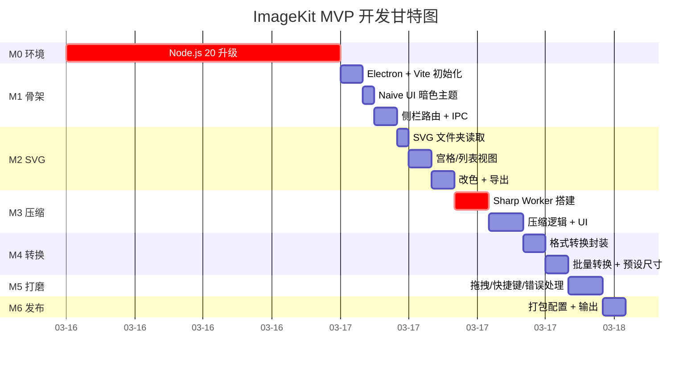

# Electron 图片工具库 - 开发计划

## 基本信息

| 项目         | 值                                                                                                                               |
| ------------ | -------------------------------------------------------------------------------------------------------------------------------- |
| **功能名称** | Electron 图片工具库（ImageKit）                                                                                                  |
| **所属迭代** | 2026-03-Electron工具库                                                                                                           |
| **创建日期** | 2026-03-16                                                                                                                       |
| **前置文档** | [架构设计](../architecture/工具库-架构设计-V1.md) · [需求规格](../prototypes/2026-03-Electron工具库/requirements/工具库-需求.md) |

---

## MVP 定义

### 必须实现（MVP 核心）

- [ ] **项目骨架**：Electron + Vue 3 + Naive UI 暗色主题框架
- [ ] **SVG 批量查看**（P1）：文件夹加载、宫格/列表视图、搜索过滤、批量改色、导出 PNG
- [ ] **图片压缩**（P2）：JPEG/PNG/WebP/GIF/AVIF/TIFF 压缩、有损/无损/智能模式、预览对比
- [ ] **格式转换**（P3）：全格式互转、预设尺寸、ICO 多尺寸、批量转换
- [ ] **通用体验**：拖拽文件、进度队列、暗色模式、Ctrl+V 粘贴

### 可延后（后续迭代）

- [ ] 图片裁剪 / 旋转
- [ ] 批量加水印
- [ ] 图片 ↔ Base64 互转
- [ ] 颜色拾取器
- [ ] 图片元信息查看（EXIF）
- [ ] 多图拼接
- [ ] PDF 转图片 / 图片转 PDF
- [ ] 二维码 / 条形码生成
- [ ] 雪碧图生成
- [ ] SVG → 图标字体生成
- [ ] 自动更新功能
- [ ] 打包分发（NSIS + DMG）

---

## 里程碑

| 里程碑 | 目标         | 预计完成   | 交付物                                           |
| ------ | ------------ | ---------- | ------------------------------------------------ |
| **M0** | 环境准备     | Day 0      | Node.js 20+、项目初始化、依赖安装                |
| **M1** | 项目骨架     | Day 1 上午 | Electron 窗口、Naive UI 暗色布局、路由、IPC 框架 |
| **M2** | SVG 批量查看 | Day 1 下午 | 文件夹加载、双视图、搜索、改色、PNG 导出         |
| **M3** | 图片压缩     | Day 2 上午 | Sharp Worker、三模式、进度队列、对比面板         |
| **M4** | 格式转换     | Day 2 下午 | 全格式互转、预设尺寸、ICO、批量                  |
| **M5** | 通用体验打磨 | Day 3      | 拖拽优化、快捷键、错误处理、UI 微调              |
| **M6** | 打包发布     | Day 4      | electron-builder 配置、NSIS/DMG 输出             |

---

## 工时估算

### M1：项目骨架（4h）

| 任务                     | 预计工时 | 说明                               |
| ------------------------ | -------- | ---------------------------------- |
| Electron + Vite 初始化   | 0.5h     | `create-electron-vite` 脚手架      |
| Naive UI 集成 + 暗色主题 | 0.5h     | `NConfigProvider` + `darkTheme`    |
| 侧栏布局 + 路由          | 1h       | `NLayoutSider` + `vue-router`      |
| IPC 框架搭建             | 1h       | preload + contextBridge + handlers |
| 拖拽 / 粘贴 composable   | 1h       | `useFileDrop` + `useClipboard`     |

### M2：SVG 批量查看（5h）

| 任务                 | 预计工时 | 说明                           |
| -------------------- | -------- | ------------------------------ |
| SVG 文件夹读取 IPC   | 0.5h     | `fs.readdirSync` + SVG 读取    |
| 宫格视图 + 选中状态  | 1h       | `NGrid` + 虚拟列表             |
| 列表视图             | 0.5h     | 复用数据，切换布局             |
| 搜索过滤             | 0.5h     | `computed` 实时过滤            |
| 颜色修改（cheerio）  | 1h       | 解析 SVG DOM，替换 fill/stroke |
| PNG 导出（resvg-js） | 1.5h     | @1x @2x @3x 多倍率渲染         |

### M3：图片压缩（6h）

| 任务                          | 预计工时 | 说明                        |
| ----------------------------- | -------- | --------------------------- |
| Sharp 集成 + Electron rebuild | 1h       | `electron-rebuild` 原生模块 |
| Worker 线程池                 | 1.5h     | `worker_threads` + 任务队列 |
| 有损 / 无损 / 智能压缩逻辑    | 1.5h     | Sharp API 封装三种模式      |
| 文件列表 + 逐条进度           | 1h       | IPC 进度回调                |
| 压缩前后对比面板              | 1h       | Blob URL 预览 + 大小对比    |

### M4：格式转换（4h）

| 任务               | 预计工时 | 说明                        |
| ------------------ | -------- | --------------------------- |
| Sharp 格式转换封装 | 1h       | `sharp().toFormat()` 全格式 |
| 预设尺寸 + resize  | 1h       | `sharp().resize()` + 预设表 |
| ICO 多尺寸嵌入     | 0.5h     | `png-to-ico` 集成           |
| 批量转换 + 进度    | 1h       | 复用 Worker 池              |
| 格式选择卡片 UI    | 0.5h     | Naive UI 卡片组件           |

### M5：体验打磨（3h）

| 任务              | 预计工时 | 说明                      |
| ----------------- | -------- | ------------------------- |
| 全局拖拽优化      | 0.5h     | 根据当前 Tab 自动分发     |
| Ctrl+V 剪贴板粘贴 | 0.5h     | `clipboard.readImage()`   |
| 全局错误处理      | 0.5h     | 异常文件跳过、用户提示    |
| UI 微调 + 动画    | 1h       | 过渡动画、空状态、loading |
| 快捷键绑定        | 0.5h     | `globalShortcut` 注册     |

### M6：打包发布（2h）

| 任务                  | 预计工时 | 说明                     |
| --------------------- | -------- | ------------------------ |
| electron-builder 配置 | 1h       | 应用信息、图标、文件关联 |
| Windows NSIS 打包     | 0.5h     | 安装包 + portable        |
| macOS DMG 打包        | 0.5h     | .app + DMG 镜像          |

### 工时汇总

| 阶段        | 工时    | 累计           |
| ----------- | ------- | -------------- |
| M1 项目骨架 | 4h      | 4h             |
| M2 SVG 查看 | 5h      | 9h             |
| M3 图片压缩 | 6h      | 15h            |
| M4 格式转换 | 4h      | 19h            |
| M5 体验打磨 | 3h      | 22h            |
| M6 打包发布 | 2h      | 24h            |
| **合计**    | **24h** | ≈ 3~4 个工作日 |

---

## 风险识别

| 风险                                 | 概率 | 影响 | 应对措施                                    |
| ------------------------------------ | ---- | ---- | ------------------------------------------- |
| Node.js 版本过低（<18）              | 高   | 高   | 升级到 Node.js 20 LTS                       |
| Sharp 原生模块 Electron rebuild 失败 | 中   | 高   | 使用 `@electron/rebuild`，或降级 Sharp 版本 |
| resvg-js 跨平台兼容性                | 低   | 中   | 备选方案：Sharp 内置 SVG 渲染               |
| GIF 动图压缩效果不佳                 | 低   | 低   | 引入 gifsicle 专项处理                      |
| AVIF 编码速度慢                      | 中   | 低   | 提示用户 AVIF 编码耗时较长                  |
| macOS 签名 / 公证                    | 中   | 中   | 暂不签名，后续申请 Apple Developer          |

---

## 依赖项

| 依赖                        | 负责方               | 状态      | 阻塞   |
| --------------------------- | -------------------- | --------- | ------ |
| Node.js ≥ 18（推荐 20 LTS） | 开发者本地环境       | ⚠️ 待升级 | **是** |
| Sharp 原生编译环境          | 本地 C++ Build Tools | 待确认    | 否     |
| electron-builder            | npm 依赖             | 已就绪    | 否     |
| Naive UI                    | npm 依赖             | ✅ 已安装 | 否     |
| Pinia / Vue Router          | npm 依赖             | ✅ 已安装 | 否     |

---

## 技术关键路径

---

## 变更记录

| 日期       | 版本 | 变更内容 | 变更人 |
| ---------- | ---- | -------- | ------ |
| 2026-03-16 | V1.0 | 初始版本 | —      |
