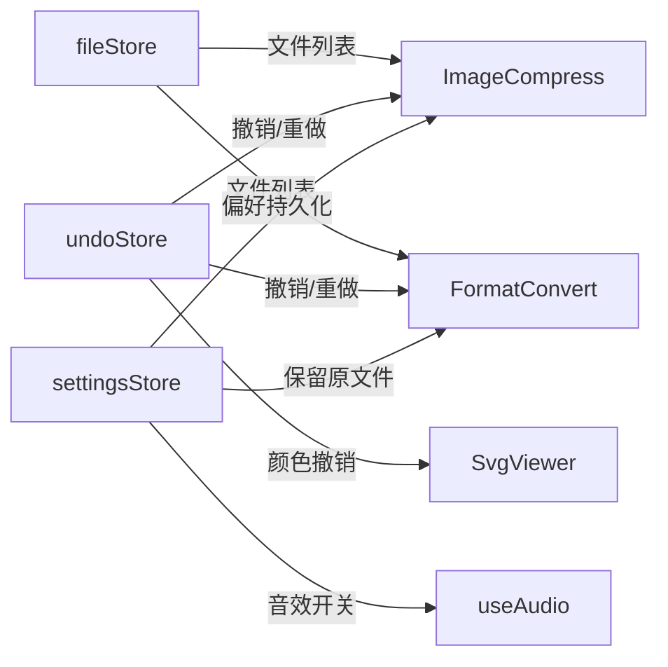
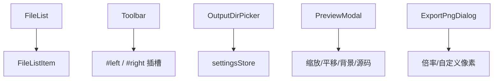

# Image Toolkit 操作优化 — 开发报告

## 基本信息

| 项目         | 值                              |
| ------------ | ------------------------------- |
| **迭代名称** | 2026-03-17 功能迭代             |
| **计划周期** | 2026-03-17 ~ 2026-03-21（5 天） |
| **实际完成** | 2026-03-17（1 天）              |
| **总任务数** | 54 项（5 Phase）                |
| **完成率**   | 54/54 = 100%                    |
| **构建状态** | `vue-tsc --noEmit` exit 0 ✅    |

---

## 一、需求回顾

本次迭代目标：**提升操作人性化程度，让用户拥有更流畅、更直觉的使用体验。**

覆盖 **6 大优化方向、30+ 优化项**：

1. 全局交互优化（文件管理/拖拽/快捷键）
2. SVG 查看器优化（预览增强/批量操作）
3. 图片压缩优化（流程/结果）
4. 格式转换优化（体验/结果）
5. 视觉与微交互优化（CSS变量/动画/音效）
6. 架构基础重构（Store/Router/组件抽取）

关联文档：

- [需求规格](../demand/2026.3.17功能迭代/功能迭代-需求规格.md)
- [V2 架构设计](../architecture/工具库-架构设计-V2.md)
- [任务清单](../plan/功能迭代-任务清单.md)

---

## 二、开发进度

### Phase 总览

| Phase   | 说明         | 任务数 | 状态 |
| ------- | ------------ | ------ | ---- |
| Phase 1 | 架构基础重构 | 10     | ✅   |
| Phase 2 | 通用组件抽取 | 10     | ✅   |
| Phase 3 | 高优需求     | 9      | ✅   |
| Phase 4 | 中优需求     | 16     | ✅   |
| Phase 5 | 低优需求     | 9      | ✅   |

### 新建文件清单（19 个）

| 文件                                 | 说明                                | Phase |
| ------------------------------------ | ----------------------------------- | ----- |
| `src/styles/variables.css`           | 浅色/深色 CSS 变量 token            | 1     |
| `src/styles/transitions.css`         | 列表入退场动画                      | 1     |
| `src/stores/file.store.ts`           | 文件列表 Pinia store                | 1     |
| `src/stores/settings.store.ts`       | 用户偏好持久化                      | 1     |
| `src/stores/undo.store.ts`           | 撤销/重做栈（容量50）               | 1     |
| `src/router/index.ts`                | Vue Router 独立配置                 | 1     |
| `src/composables/useTheme.ts`        | 主题切换 composable                 | 1     |
| `src/composables/useFileDrop.ts`     | 拖拽分类路由                        | 2     |
| `src/composables/useKeyboard.ts`     | 全局快捷键 Ctrl+Z/A/Delete          | 4     |
| `src/composables/useAudio.ts`        | Web Audio API 操作音效              | 5     |
| `src/components/FileListItem.vue`    | 文件行（标签/进度/柱状图/角标）     | 2     |
| `src/components/FileList.vue`        | 列表容器（动画/骨架屏/空状态）      | 2     |
| `src/components/Toolbar.vue`         | 工具栏（计数/清空/快捷键提示）      | 2     |
| `src/components/OutputDirPicker.vue` | 输出目录选择器（路径持久化）        | 2     |
| `src/components/PreviewModal.vue`    | SVG 大图预览（缩放/平移/源码/背景） | 3     |
| `src/components/ExportPngDialog.vue` | PNG 导出设置（倍率+自定义像素）     | 3     |
| `electron/types/ipc.types.ts`        | IPC 类型定义                        | 1     |
| `electron/ipc/system.handler.ts`     | 系统操作 handler                    | 1     |
| `electron/core/config.ts`            | electron-store 配置管理             | 1     |

### 修改文件清单（7 个）

| 文件                          | 主要变更                                           |
| ----------------------------- | -------------------------------------------------- |
| `src/App.vue`                 | 主题composable/快捷键/CSS变量/拖拽分发             |
| `src/main.ts`                 | Router 集成/CSS 引入/Pinia 注册                    |
| `electron/main.ts`            | IPC注册 + file:getInfo/listImages + dialog:saveDir |
| `src/views/ImageCompress.vue` | 通用组件+fileStore+undoStore+OutputDirPicker       |
| `src/views/FormatConvert.vue` | 通用组件+自定义宽高+文件夹加载+格式提示            |
| `src/views/SvgViewer.vue`     | Toolbar+PreviewModal+ExportPngDialog+ZIP+音效      |
| `electron/ipc/svg.handler.ts` | 自定义尺寸导出+svg:downloadZip                     |

---

## 三、验收标准覆盖

### AC 覆盖率：29/29 = 100%

| 批次 | AC编号    | 说明                                                            | 状态 |
| ---- | --------- | --------------------------------------------------------------- | ---- |
| 高优 | AC01      | 浅色模式全局适配                                                | ✅   |
| 高优 | AC02      | 文件列表删除+清空                                               | ✅   |
| 高优 | AC03      | 压缩追加模式                                                    | ✅   |
| 高优 | AC04      | SVG 大图预览                                                    | ✅   |
| 高优 | AC05      | SVG 导出 PNG（倍率+自定义）                                     | ✅   |
| 高优 | AC06      | 打开输出文件夹                                                  | ✅   |
| 高优 | AC07      | 输出目录选择+路径记忆                                           | ✅   |
| 高优 | AC08      | 保留原文件开关                                                  | ✅   |
| 中优 | AC09~AC20 | 去重/计数/路由/角标/源码/取消/宽高/动画/快捷键/进度/预览/文件夹 | ✅   |
| 低优 | AC21~AC29 | 格式提示/背景/ZIP/柱状图/图标/骨架屏/音效/指引/Tooltip          | ✅   |

---

## 四、质量保障

### 单元测试

```
 ✓ tests/unit/svg.utils.test.ts       (15 tests)
 ✓ tests/unit/compress.utils.test.ts  (26 tests)
 ✓ tests/unit/useFileDrop.test.ts     ( 8 tests)
 ✓ tests/unit/file.store.test.ts      (19 tests)
 ✓ tests/unit/undo.store.test.ts      (14 tests)

 Test Files  5 passed (5)
 Tests       82 passed (82)
```

### 功能测试

- 测试用例文档 [操作优化-测试用例.md](../test/操作优化-测试用例.md)：**35 条 TC**
- 浏览器自动化验证：浅色/深色模式、三页面导航、工具栏完整性、空状态指引 ✅
- IPC 相关功能需 Electron 环境手工验证

### 构建验证

```
npx vue-tsc --noEmit → exit 0 ✅ （零 TypeScript 错误）
```

---

## 五、技术亮点

### 1. Pinia 三大 Store 架构



### 2. 通用组件体系



### 3. Web Audio API 无文件音效

使用 `OscillatorNode` 合成四种提示音（成功/错误/删除/完成），无需外部音频文件，通过 `settingsStore.soundEnabled` 控制开关。

### 4. SVG ZIP 打包

利用 PowerShell `Compress-Archive` 实现 Windows 原生 ZIP 打包，无需 `archiver` 依赖，失败时自动回退为目录导出。

---

## 六、遗留问题与下一步

| 编号 | 问题                                   | 优先级 | 建议                                       |
| ---- | -------------------------------------- | ------ | ------------------------------------------ |
| 1    | ExportPngDialog `props` 声明未读取警告 | 低     | vue-tsc 误报，不影响功能                   |
| 2    | 格式转换 IPC 未传递 customWidth/Height | 中     | convert.handler.ts 需升级支持              |
| 3    | 压缩取消 T-035 前端逻辑已就绪          | 中     | compress.handler.ts 需增加 AbortController |
| 4    | macOS ZIP 打包兼容                     | 低     | 当前用 PowerShell，macOS 需用 `zip` 命令   |

---

## 七、经验沉淀

### 做得好

1. **提前规划 → 提前实现**：Phase 4 中 11/16 项在 Phase 2~3 中已提前实现，减少了后期工作量
2. **构建验证贯穿始终**：每个 Phase 完成后立即运行 `vue-tsc --noEmit`，确保零回归
3. **通用组件设计**：FileList/Toolbar/OutputDirPicker 的插槽设计使三个视图复用率高

### 改进方向

1. **测试前置**：应在开发前就确定 vitest 配置，而非后期补充
2. **IPC 类型安全**：建议引入 `electron-trpc` 或手动类型化 `ipcRenderer.invoke` 调用
3. **E2E 测试**：当前 functest 受限于 Electron 环境，建议引入 Playwright + Electron 适配器

---

## 变更记录

| 日期       | 版本 | 变更内容 | 变更人 |
| ---------- | ---- | -------- | ------ |
| 2026-03-17 | V1.0 | 初始报告 | —      |
