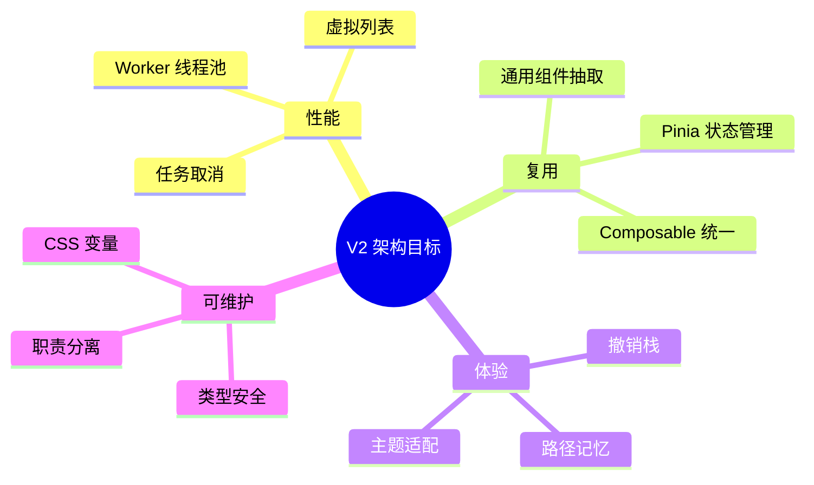
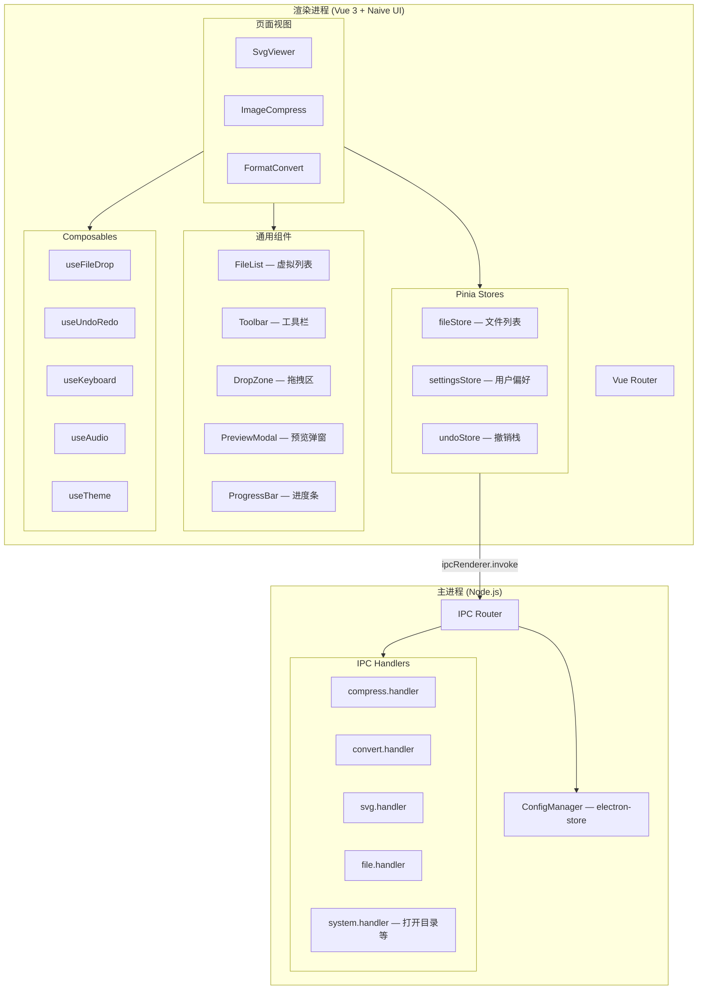
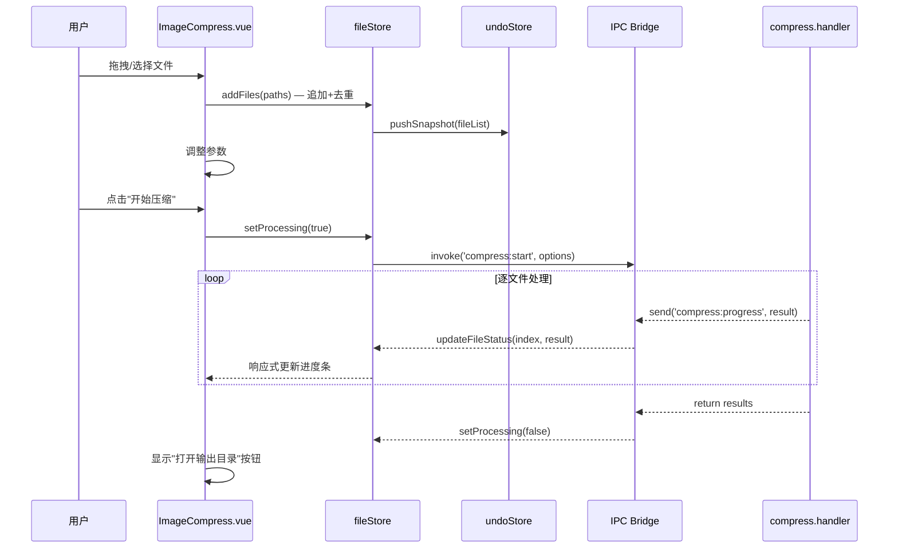
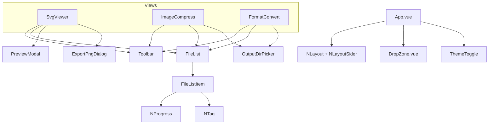

# Image Toolkit 架构设计 V2.0 — 操作优化迭代

## 基本信息

| 项目         | 值                                                      |
| ------------ | ------------------------------------------------------- |
| **功能名称** | Image Toolkit 操作优化（30+ 功能项）                    |
| **所属迭代** | 2026-03-17 功能迭代                                     |
| **基线版本** | 架构设计 V1.0（2026-03-16）                             |
| **创建日期** | 2026-03-17                                              |
| **技术栈**   | Electron 30 + Vue 3 + Vite 5 + Naive UI + Pinia + Sharp |

---

## 一、现状与差距分析

### 1.1 现有架构实况

```
image-toolkit/
├── electron/
│   ├── main.ts              # 入口 + 窗口 + 通用 IPC + 快捷键（all-in-one）
│   ├── preload.ts           # contextBridge 暴露 ipcRenderer
│   ├── ipc/
│   │   ├── compress.handler.ts   # 主线程同步压缩（无 Worker）
│   │   ├── convert.handler.ts    # 主线程同步转换（无 Worker）
│   │   └── svg.handler.ts        # SVG 读取/改色/导出
│   └── core/
│       ├── compress.utils.ts     # 纯函数工具
│       └── svg.utils.ts          # 纯函数工具
├── src/
│   ├── main.ts              # 路由内联、Pinia 已创建但无 store
│   ├── App.vue              # 全局拖拽/主题/菜单（~248行，职责过重）
│   ├── views/
│   │   ├── SvgViewer.vue    # ~250行，状态+UI全耦合
│   │   ├── ImageCompress.vue # ~220行，同上
│   │   └── FormatConvert.vue # ~220行，同上
│   ├── composables/
│   │   ├── useFileDrop.ts   # 存在但 App.vue 未使用
│   │   └── useClipboard.ts  # 剪贴板粘贴
│   └── components/          # ⚠️ 空目录
└── tests/unit/              # 2 个单元测试文件
```

### 1.2 V1 架构与现状差距

| V1 规划            | 实际现状                                 | 影响                     |
| ------------------ | ---------------------------------------- | ------------------------ |
| Worker 线程池      | ❌ 未实现，主线程同步处理                | 上百文件时 UI 阻塞       |
| Pinia Store        | ❌ 引入但空，状态在组件内管理            | 跨组件通信困难           |
| 通用组件抽取       | ❌ `components/` 为空                    | 三个视图存在大量重复代码 |
| 路由独立配置       | ❌ 内联在 `main.ts`                      | 难以扩展                 |
| CSS 变量主题       | ❌ 硬编码色值（`rgba(255,255,255,0.5)`） | 浅色模式不可用           |
| `useFileDrop` 复用 | ❌ App.vue 自行实现拖拽                  | composable 被闲置        |

---

## 二、V2 架构目标

> 支撑 30+ 优化项落地，解决 V1 遗留的架构债务。



---

## 三、技术选型增量

仅列出 V1 基础上**新增或变更**的技术选择：

| 技术                     | 用途                                   | 选型理由                          |
| ------------------------ | -------------------------------------- | --------------------------------- |
| **electron-store**       | 用户偏好持久化（输出路径、音效开关等） | 轻量 JSON 存储，Electron 生态首选 |
| **archiver**             | SVG 批量打包 ZIP                       | 成熟的 Node.js ZIP 库             |
| **Naive UI VirtualList** | 上百文件的文件列表渲染                 | Naive UI 内置，无需额外依赖       |
| **Web Audio API**        | 操作音效播放                           | 浏览器原生，无需外部库            |

---

## 四、系统架构

### 4.1 进程架构（V2 升级）



### 4.2 数据流（以压缩为例）



---

## 五、目录结构（V2）

```
image-toolkit/
├── electron/                         # 主进程
│   ├── main.ts                      # 入口：窗口创建 + IPC 注册
│   ├── preload.ts                   # contextBridge
│   ├── ipc/
│   │   ├── compress.handler.ts      # 压缩 IPC
│   │   ├── convert.handler.ts       # 转换 IPC
│   │   ├── svg.handler.ts           # SVG IPC
│   │   ├── file.handler.ts          # [新] 通用文件操作（读取/保存/打开目录）
│   │   └── system.handler.ts        # [新] 系统操作（shell.openPath 等）
│   ├── core/
│   │   ├── compress.utils.ts        # 压缩纯函数
│   │   ├── svg.utils.ts             # SVG 纯函数
│   │   └── config.ts                # [新] electron-store 配置管理
│   └── types/
│       └── ipc.types.ts             # [新] IPC 通信类型定义
│
├── src/                              # 渲染进程
│   ├── main.ts                      # 入口
│   ├── router/
│   │   └── index.ts                 # [新] 路由独立配置
│   ├── App.vue                      # 精简：布局 + DropZone + 主题
│   ├── stores/                      # [新] Pinia 状态管理
│   │   ├── file.store.ts            # 文件列表（追加/删除/去重/清空）
│   │   ├── settings.store.ts        # 用户偏好（输出路径/音效开关等）
│   │   └── undo.store.ts            # 撤销/重做栈
│   ├── views/
│   │   ├── SvgViewer.vue            # 精简：仅视图编排
│   │   ├── ImageCompress.vue        # 精简：仅视图编排
│   │   └── FormatConvert.vue        # 精简：仅视图编排
│   ├── components/                   # [新] 通用组件
│   │   ├── FileList.vue             # 虚拟列表 + 删除/hover/动画
│   │   ├── FileListItem.vue         # 单文件项（进度/状态/删除按钮）
│   │   ├── Toolbar.vue              # 工具栏（文件计数/清空/操作按钮）
│   │   ├── DropZone.vue             # 拖拽区域 + 格式提示
│   │   ├── PreviewModal.vue         # SVG 大图预览（缩放/平移/代码/背景切换）
│   │   ├── ExportPngDialog.vue      # PNG 导出设置（倍率+自定义像素）
│   │   └── OutputDirPicker.vue      # 输出目录选择器（路径记忆）
│   ├── composables/
│   │   ├── useFileDrop.ts           # 文件拖拽（升级：格式识别+自动路由）
│   │   ├── useClipboard.ts          # 剪贴板粘贴
│   │   ├── useUndoRedo.ts           # [新] 多级撤销/重做
│   │   ├── useKeyboard.ts           # [新] 快捷键管理
│   │   ├── useAudio.ts              # [新] 操作音效
│   │   └── useTheme.ts              # [新] 主题切换（替代 App.vue 内联逻辑）
│   ├── styles/
│   │   ├── variables.css            # [新] CSS 变量（浅色/深色双主题）
│   │   └── transitions.css          # [新] TransitionGroup 动画
│   ├── types/
│   │   └── index.d.ts               # [新] 渲染端 TypeScript 类型
│   └── assets/
│       └── sounds/                  # [新] 音效文件
│           ├── success.mp3
│           └── error.mp3
│
└── tests/
    └── unit/
        ├── compress.utils.test.ts   # 已有
        ├── svg.utils.test.ts        # 已有
        ├── file.store.test.ts       # [新] 文件列表 store 测试
        └── undo.store.test.ts       # [新] 撤销栈测试
```

---

## 六、核心模块设计

### 6.1 文件管理 Store（fileStore）

解决需求：F1.1.1 删除 / F1.1.2 清空 / F1.1.3 追加 / F1.1.4 去重 / F1.1.5 计数

```typescript
// src/stores/file.store.ts
interface FileEntry {
  path: string
  name: string
  size: number
  type: string        // 扩展名大写
  status: 'pending' | 'processing' | 'success' | 'error'
  progress?: number   // 0-100
  result?: {
    outputPath: string
    outputSize: number
    savedPercent: number
  }
  error?: string
}

interface FileStoreState {
  files: FileEntry[]
  isProcessing: boolean
}

// 关键 actions
addFiles(paths: string[]): void        // 追加 + 去重
removeFile(path: string): void         // 单个删除
clearFiles(): void                     // 清空列表
updateFileStatus(index, result): void  // 更新单文件状态
// getter
fileCount: ComputedRef<number>         // 文件总数
selectedCount: ComputedRef<number>     // 选中数
```

### 6.2 撤销/重做系统（undoStore）

解决需求：F1.3.1 完整多级撤销栈

```typescript
// src/stores/undo.store.ts
interface UndoableAction {
  type: string; // 'file:remove' | 'file:clear' | 'color:change' | ...
  timestamp: number;
  undo: () => void; // 撤销回调
  redo: () => void; // 重做回调
  description: string; // 供 UI 显示："删除了 icon.svg"
}

interface UndoStoreState {
  undoStack: UndoableAction[]; // 最大容量 50
  redoStack: UndoableAction[];
}

// 快捷键绑定
// Ctrl+Z → undo()
// Ctrl+Shift+Z → redo()
```

### 6.3 用户偏好 Store（settingsStore）

解决需求：F3.1.1 路径记忆 / F4.1.1 保留原文件 / F5.4 音效开关

```typescript
// src/stores/settings.store.ts
interface SettingsState {
  outputDir: string | null; // 记忆的输出路径
  keepOriginalFile: boolean; // 保留原文件（默认 true）
  soundEnabled: boolean; // 音效开关（默认 true）
  theme: "light" | "dark"; // 主题
}
// 通过 IPC 调用 electron-store 持久化
```

### 6.4 拖拽自动路由

解决需求：F1.2.1 拖拽自动路由 + 混合格式拆分

```typescript
// src/composables/useFileDrop.ts（升级版）
function classifyFiles(paths: string[]): {
  svg: string[];
  image: string[]; // jpg/png/webp/gif/avif/tiff
} {
  // 按扩展名分类
}

function handleDrop(paths: string[]) {
  const classified = classifyFiles(paths);

  if (classified.svg.length > 0) {
    svgStore.addFiles(classified.svg);
    router.push("/svg"); // 或同时处理
  }
  if (classified.image.length > 0) {
    fileStore.addFiles(classified.image);
    // 根据当前路由自动决定模块
  }
}
```

### 6.5 SVG 大图预览弹窗

解决需求：F2.1.1 大图预览 / F2.1.2 代码查看 / F2.1.3 复制代码 / F2.1.4 背景切换

```typescript
// src/components/PreviewModal.vue
interface PreviewModalProps {
  visible: boolean;
  svgContent: string;
  fileName: string;
}

// 功能：
// - 缩放：鼠标滚轮 + 按钮（fit / 100% / 200%）
// - 平移：鼠标拖拽
// - 标签页切换：预览 | 源代码
// - 背景切换：棋盘格 | 白色 | 深色
// - 复制代码按钮
```

### 6.6 PNG 导出设置弹窗

解决需求：F2.2.2 倍率+自定义像素

```typescript
// src/components/ExportPngDialog.vue
interface ExportPngOptions {
  mode: "scale" | "custom";
  scales: number[]; // [1, 2, 3]
  customWidth?: number;
  customHeight?: number;
  lockRatio: boolean; // 锁定比例
  outputDir: string;
}
```

### 6.7 IPC 通信协议（V2 增量）

```typescript
// electron/types/ipc.types.ts

// ===== 新增通道 =====

// 打开系统文件管理器
'system:openPath'    (dirPath: string) => void

// 用户偏好
'config:get'         (key: string) => any
'config:set'         (key: string, value: any) => void

// ===== 升级通道 =====

// 压缩（新增 outputDir 路径记忆 + abort 信号）
'compress:start'     (options: CompressOptions) => CompressResult[]
'compress:abort'     () => void              // [新] 取消压缩

// 格式转换（新增 keepOriginal + customSize）
'convert:start'      (options: ConvertOptions) => ConvertResult[]

// SVG 导出 PNG（升级：支持自定义像素尺寸）
'svg:exportPng'      (options: ExportPngOptions) => ExportResult
```

---

## 七、组件架构

### 7.1 FileList 虚拟列表组件

解决需求：上百文件性能 / F1.1.1 删除 / F5.2 动画 / F5.3 hover

```typescript
// src/components/FileList.vue
interface FileListProps {
  files: FileEntry[];
  showDelete: boolean; // 显示删除按钮
  showProgress: boolean; // 显示进度条
  selectable: boolean; // 可选中（SVG 模块）
}

interface FileListEmits {
  remove: (path: string) => void;
  select: (path: string) => void;
  preview: (file: FileEntry) => void;
}

// 技术要点：
// - 使用 Naive UI <n-virtual-list> 渲染上百文件
// - <TransitionGroup> 实现入场/退场动画
// - 每项 hover 高亮 + 阴影提升
// - 删除按钮 hover 时显示
```

### 7.2 Toolbar 工具栏组件

解决需求：F1.1.2 清空 / F1.1.5 文件计数 / F1.3.4 快捷键提示

```typescript
// src/components/Toolbar.vue
interface ToolbarProps {
  fileCount: number;
  selectedCount?: number;
  isProcessing: boolean;
}

interface ToolbarSlots {
  left: () => VNode; // 左侧自定义按钮
  right: () => VNode; // 右侧自定义按钮
}

// 通用功能：
// - "共 N 个文件" 标签
// - "清空列表" 按钮
// - 按钮 Tooltip 含快捷键提示
```

### 7.3 组件关系图



---

## 八、CSS 变量与主题适配

解决需求：F5.1 浅色模式全局适配

```css
/* src/styles/variables.css */

/* 浅色模式（默认） */
:root {
  --text-primary: rgba(0, 0, 0, 0.85);
  --text-secondary: rgba(0, 0, 0, 0.55);
  --text-muted: rgba(0, 0, 0, 0.35);
  --bg-page: #ffffff;
  --bg-card: rgba(0, 0, 0, 0.02);
  --bg-card-hover: rgba(0, 0, 0, 0.04);
  --bg-sider: #f8f8fa;
  --border-light: rgba(0, 0, 0, 0.06);
  --accent: #667eea;
  --accent-light: rgba(102, 126, 234, 0.15);
  --success: #4caf50;
  --error: #f44336;
}

/* 深色模式 */
[data-theme="dark"] {
  --text-primary: rgba(255, 255, 255, 0.9);
  --text-secondary: rgba(255, 255, 255, 0.6);
  --text-muted: rgba(255, 255, 255, 0.35);
  --bg-page: #0f1123;
  --bg-card: rgba(255, 255, 255, 0.03);
  --bg-card-hover: rgba(255, 255, 255, 0.06);
  --bg-sider: #18181c;
  --border-light: rgba(255, 255, 255, 0.06);
  /* accent/success/error 保持不变 */
}
```

**迁移策略**：全局搜索替换所有硬编码色值 → 替换为 `var(--xxx)`。

---

## 九、快捷键系统设计

解决需求：F1.3.1~F1.3.4

```typescript
// src/composables/useKeyboard.ts
const SHORTCUTS = {
  "ctrl+z": { action: "undo", label: "撤销" },
  "ctrl+shift+z": { action: "redo", label: "重做" },
  "ctrl+a": { action: "selectAll", label: "全选" },
  delete: { action: "removeSelected", label: "删除选中" },
  "ctrl+o": { action: "openFiles", label: "打开文件" }, // 已有
  "ctrl+shift+o": { action: "openFolder", label: "打开文件夹" }, // 已有
};

// 在 Toolbar 按钮 Tooltip 中显示：
// "开始压缩" → Tooltip: "开始压缩 (Ctrl+Enter)"
```

---

## 十、非功能设计

### 10.1 性能目标（V2 更新）

| 指标               | 目标值  | 实现方式                           |
| ------------------ | ------- | ---------------------------------- |
| 200 个文件列表渲染 | < 100ms | Naive UI VirtualList               |
| 单文件操作响应     | < 200ms | 响应式 + 逐文件进度                |
| 压缩中 UI 帧率     | 60fps   | 主进程异步处理，渲染进程仅更新进度 |
| 撤销操作响应       | < 50ms  | 内存快照，无 IPC 调用              |

### 10.2 持久化策略

| 数据           | 存储方式       | 说明               |
| -------------- | -------------- | ------------------ |
| 输出目录路径   | electron-store | 跨会话记忆         |
| 音效开关       | electron-store | 跨会话记忆         |
| 主题偏好       | electron-store | 跨会话记忆         |
| 保留原文件开关 | electron-store | 默认 true          |
| 撤销栈         | 内存           | 不持久化，关闭清空 |
| 文件列表       | 内存           | 不持久化           |

---

## 十一、实施路线

### Phase 1：架构基础重构（Day 1）

- [ ] 创建 CSS 变量文件，全局替换硬编码色值
- [ ] 创建 Pinia stores（fileStore / settingsStore / undoStore）
- [ ] 路由独立到 `router/index.ts`
- [ ] App.vue 瘦身，抽取 `useTheme` composable

### Phase 2：通用组件抽取（Day 1-2）

- [ ] FileList + FileListItem（虚拟列表 + 删除/hover/动画）
- [ ] Toolbar（文件计数 + 清空 + 快捷键提示）
- [ ] DropZone（格式识别 + 拖拽提示）
- [ ] OutputDirPicker（路径选择 + 记忆）

### Phase 3：第一批高优需求（Day 2-3）

- [ ] F5.1 浅色模式全局适配
- [ ] F1.1.1~3 文件删除/清空/追加
- [ ] F2.1.1 SVG 大图预览弹窗
- [ ] F2.2.2 完善 SVG 导出 PNG（倍率+自定义像素）
- [ ] F3.1.5 + F4.1.4 打开输出目录
- [ ] F3.1.1 输出目录选择（路径记忆）
- [ ] F4.1.1 保留原文件选项

### Phase 4：第二批中优需求（Day 3-4）

- [ ] F1.1.4~5 去重 + 计数
- [ ] F1.2.1 拖拽自动路由 + 混合格式拆分
- [ ] F2.1.2~3 SVG 代码查看/复制
- [ ] F2.2.1 选中角标
- [ ] F3.1.4 + F3.2.3 压缩取消 + 失败重试
- [ ] F4.1.2~3 自定义尺寸 + 格式兼容提示
- [ ] F5.2~3 动画 + hover 效果
- [ ] F1.3.1~3 快捷键（Ctrl+Z/A/Delete）
- [ ] F3.2.1 进度条 + F3.1.2~3 预览/重新压缩
- [ ] F4.1.5 + F4.2.1 文件夹支持 + 失败详情

### Phase 5：第三批低优需求（Day 4-5）

- [ ] F1.2.2~3 拖拽格式提示 + 空状态指引
- [ ] F2.1.4 SVG 背景色切换
- [ ] F2.2.3 批量下载 ZIP
- [ ] F3.2.2 前后对比柱状图
- [ ] F4.2.2 格式专属图标
- [ ] F5.5 骨架屏
- [ ] F5.4 音效
- [ ] F1.3.4 快捷键提示

---

## 十二、关联文档

| 文档        | 路径                                                                     |
| ----------- | ------------------------------------------------------------------------ |
| V1 架构设计 | [工具库-架构设计-V1.md](./工具库-架构设计-V1.md)                         |
| 原始需求    | [功能迭代-需求.md](../demand/2026.3.17功能迭代/功能迭代-需求.md)         |
| 需求澄清    | [功能迭代-澄清.md](../demand/2026.3.17功能迭代/功能迭代-澄清.md)         |
| 需求规格    | [功能迭代-需求规格.md](../demand/2026.3.17功能迭代/功能迭代-需求规格.md) |

## 变更记录

| 日期       | 版本 | 变更内容                                                                      | 变更人 |
| ---------- | ---- | ----------------------------------------------------------------------------- | ------ |
| 2026-03-16 | V1.0 | 初始架构设计                                                                  | —      |
| 2026-03-17 | V2.0 | 操作优化迭代架构升级：Pinia Store / 通用组件 / CSS 变量 / 撤销栈 / 快捷键系统 | —      |
