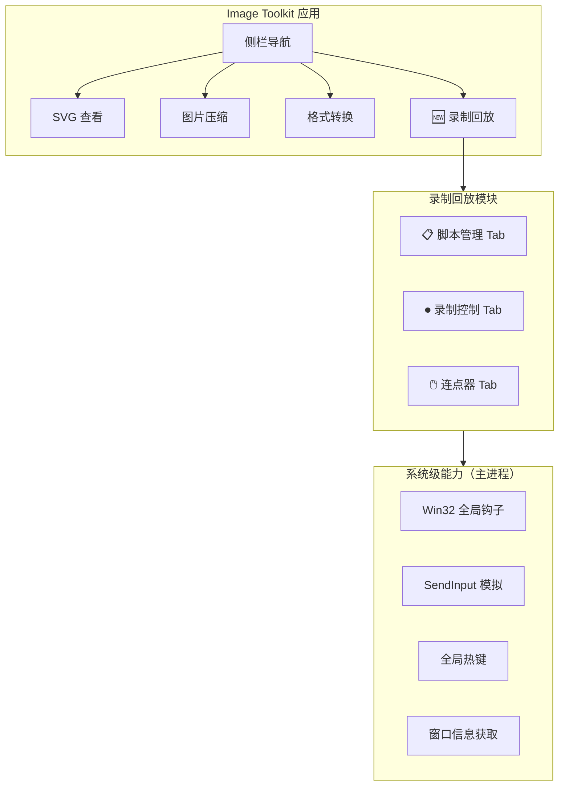
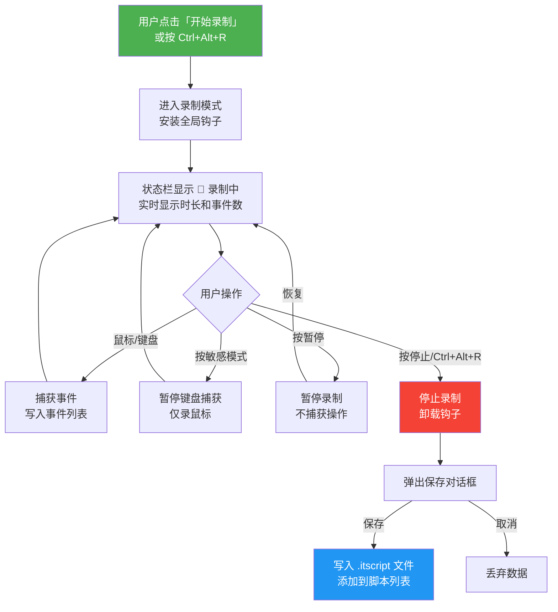
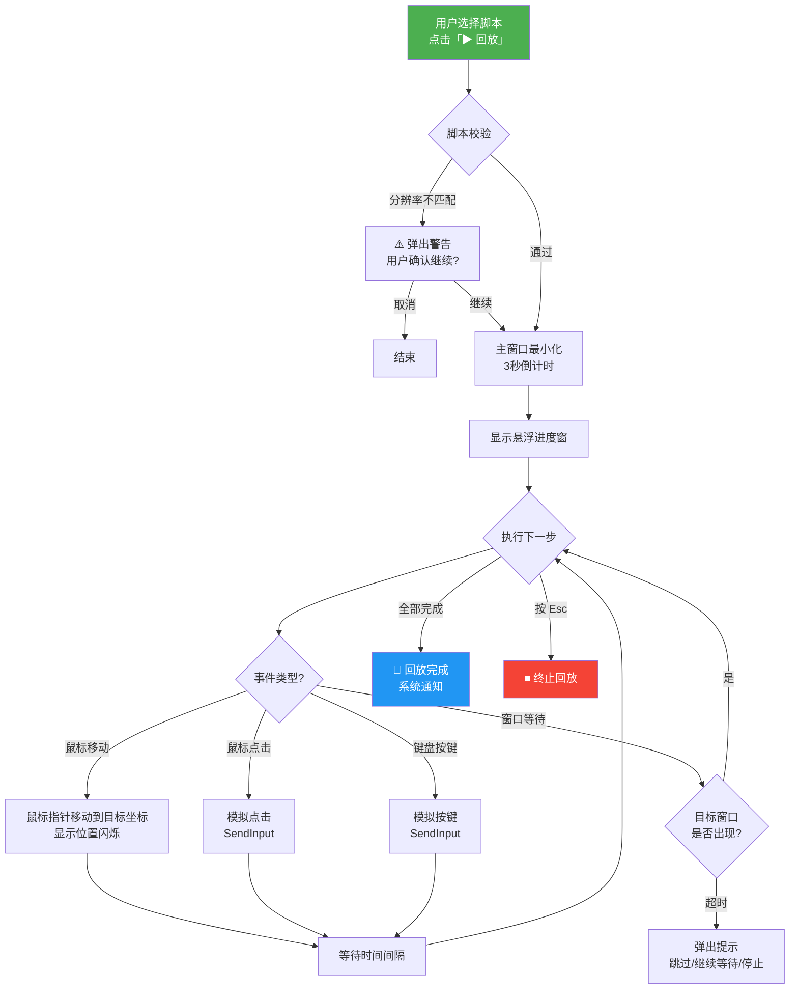
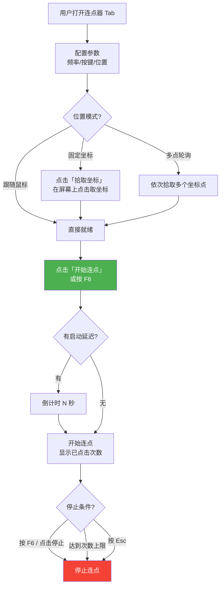

# 操作录制与回放 - 产品设计方案

## 基本信息

| 项目         | 值                               |
| ------------ | -------------------------------- |
| **功能名称** | 操作录制与回放（系统级）+ 连点器 |
| **所属迭代** | 2026-03-18 功能迭代              |
| **创建日期** | 2026-03-18                       |
| **状态**     | 设计中                           |
| **平台限制** | 仅 Windows 10+                   |

## 澄清结论摘要

| 问题         | 结论                                                          |
| ------------ | ------------------------------------------------------------- |
| 使用场景     | **跨应用联动**（C）：Image Toolkit 内部 + Windows 其他应用    |
| 连点器场景   | **通用**：游戏辅助、网页自动化、表单操作等                    |
| UI 入口      | **侧栏新增页面**（A），连点器作为其中一个 **Tab 子功能**（B） |
| 鼠标回放     | **可见移动**（A）：鼠标指针跟随移动到目标位置                 |
| 智能等待     | **支持窗口标题匹配**（C）：等待特定窗口出现后继续             |
| 紧急停止键   | **Esc**（A）                                                  |
| 连点器频率   | **上限 50 CPS**                                               |
| 过滤控制热键 | **是**（A）：`Ctrl+Alt+R` 等控制操作不计入脚本                |
| 敏感模式     | **需要**（A）：可标记不录键盘的时间段                         |
| MVP 分期     | **同意**：第一期做模块一二三六，第二期做四五                  |

---

## 一、功能架构



### 模块与 Tab 划分

| Tab         | 职责                         | MVP |
| ----------- | ---------------------------- | --- |
| 📋 脚本管理 | 脚本列表、回放控制、导入导出 | ✅  |
| ⏺ 录制控制  | 开始/暂停/停止录制、录制设置 | ✅  |
| 🖱️ 连点器   | 连点配置、位置设置、启停控制 | ✅  |

---

## 二、页面布局设计

### 2.1 侧栏导航（更新）

在现有侧栏底部新增「录制回放」菜单项：

```
┌──────────────────┐
│ 🧰 Universal     │
│    Toolkit       │
├──────────────────┤
│ 🖼️  SVG 查看     │
│ 🗜️  图片压缩     │
│ 🔄 格式转换      │
│ ⏺  录制回放  🆕  │  ← 新增
├──────────────────┤
│     🌙 / ☀️       │
└──────────────────┘
```

### 2.2 录制回放主页面

页面顶部使用 Tab 切换三个子功能区：

```
┌─────────────────────────────────────────────────────────────────┐
│  [📋 脚本管理]  [⏺ 录制控制]  [🖱️ 连点器]                       │
├─────────────────────────────────────────────────────────────────┤
│                                                                 │
│                   （各 Tab 内容区）                               │
│                                                                 │
└─────────────────────────────────────────────────────────────────┘
```

---

### 2.3 Tab 1：脚本管理

这是默认展示的 Tab，用于管理已录制的脚本和控制回放。

```
┌─────────────────────────────────────────────────────────────────┐
│  [📋 脚本管理]  [⏺ 录制控制]  [🖱️ 连点器]                       │
├─────────────────────────────────────────────────────────────────┤
│                                                                 │
│  🔍 搜索脚本...                              [导入] [导出]      │
│                                                                 │
│  ┌───────────────────────────────────────────────────────────┐  │
│  │ 📄 批量压缩PNG流程                              ⏱️ 00:15  │  │
│  │    打开文件夹 → 选择文件 → 拖入压缩 → 导出                │  │
│  │    12 步  ·  2026-03-18 10:30     [▶ 回放] [✏️] [🗑️]     │  │
│  ├───────────────────────────────────────────────────────────┤  │
│  │ 📄 SVG图标导出2x                               ⏱️ 00:08  │  │
│  │    选择SVG → 设置2x倍率 → 导出PNG                         │  │
│  │    8 步  ·  2026-03-18 11:00      [▶ 回放] [✏️] [🗑️]     │  │
│  ├───────────────────────────────────────────────────────────┤  │
│  │ 📄 格式转换WebP流程                             ⏱️ 00:22  │  │
│  │    ...                                                     │  │
│  └───────────────────────────────────────────────────────────┘  │
│                                                                 │
│  ──────────── 回放设置 ────────────                              │
│  回放速度:  [0.5x] [1x✓] [2x] [5x] [最快]                      │
│  倒计时:    [3秒✓]  [5秒]  [无]                                 │
│  紧急停止:  Esc                                                  │
│                                                                 │
└─────────────────────────────────────────────────────────────────┘
```

**脚本列表项交互：**

| 操作          | 行为                                  |
| ------------- | ------------------------------------- |
| 点击 `▶ 回放` | 窗口最小化 → 倒计时 3 秒 → 开始回放   |
| 点击 `✏️`     | 展开编辑面板（步骤列表、修改坐标/值） |
| 点击 `🗑️`     | 二次确认后删除脚本                    |
| hover 脚本项  | 背景高亮 + 显示操作按钮               |
| 右键菜单      | 重命名 / 导出 / 复制 / 删除           |

---

### 2.4 Tab 2：录制控制

```
┌─────────────────────────────────────────────────────────────────┐
│  [📋 脚本管理]  [⏺ 录制控制]  [🖱️ 连点器]                       │
├─────────────────────────────────────────────────────────────────┤
│                                                                 │
│               ┌─────────────────────┐                           │
│               │                     │                           │
│               │    ⏺  开始录制      │   ← 大按钮，主操作入口     │
│               │                     │                           │
│               └─────────────────────┘                           │
│                                                                 │
│   全局热键: Ctrl+Alt+R                                           │
│                                                                 │
│  ──────────── 录制设置 ────────────                              │
│                                                                 │
│  录制内容:                                                       │
│    [✓] 鼠标点击    [✓] 鼠标移动    [✓] 鼠标滚轮                 │
│    [✓] 键盘按键    [ ] 窗口标题    [ ] 屏幕截图                  │
│                                                                 │
│  鼠标移动采样:  [每 50ms]  ▼                                     │
│                                                                 │
│  🔒 敏感模式:   [ ] 开启 （开启后可在录制中临时暂停键盘捕获）   │
│                                                                 │
│  ──────────── 智能等待 ────────────                              │
│                                                                 │
│  [ ] 启用窗口等待                                                │
│      等待窗口标题包含: [________________]                        │
│      超时:  [30] 秒                                              │
│                                                                 │
└─────────────────────────────────────────────────────────────────┘
```

**录制中状态（替换上方静态按钮区域）：**

```
┌─────────────────────────────────────────────────────────────────┐
│                                                                 │
│          🔴 录制中    00:01:23    152 个事件                     │
│                                                                 │
│     [⏸ 暂停]    [⏹ 停止并保存]    [✕ 取消]                      │
│                                                                 │
│  🔒 敏感模式:  [暂停键盘录制]  ← 录制中可随时切换               │
│                                                                 │
│  ──────────── 实时事件流 ────────────                            │
│  │ 14:30:01  🖱️  点击 (542, 318) - 文件资源管理器              │
│  │ 14:30:02  ⌨️  Ctrl+A - 文件资源管理器                       │
│  │ 14:30:03  🖱️  右键 (542, 318) - 文件资源管理器              │
│  │ 14:30:05  🖱️  点击 (600, 400) - Image Toolkit              │
│  │ ...                                                         │
│                                                                 │
└─────────────────────────────────────────────────────────────────┘
```

---

### 2.5 Tab 3：连点器

```
┌─────────────────────────────────────────────────────────────────┐
│  [📋 脚本管理]  [⏺ 录制控制]  [🖱️ 连点器]                       │
├─────────────────────────────────────────────────────────────────┤
│                                                                 │
│  ──────────── 点击配置 ────────────                              │
│                                                                 │
│  点击间隔:  [100  ] ms    (= 10 CPS)                            │
│             ├──────●──────────────┤  滑块 10~5000ms             │
│                                                                 │
│  点击按键:  (● 左键)  (○ 右键)  (○ 中键)                       │
│  点击方式:  (● 单击)  (○ 双击)                                  │
│                                                                 │
│  点击次数:  (● 无限)  (○ 固定 [____] 次)                       │
│                                                                 │
│  ──────────── 点击位置 ────────────                              │
│                                                                 │
│  (● 跟随鼠标)  (○ 固定坐标)  (○ 多点轮询)                      │
│                                                                 │
│  ┌─ 固定坐标设置 ──────────────────────────┐                    │
│  │  X: [____]   Y: [____]   [📍 拾取坐标]  │                    │
│  └─────────────────────────────────────────┘                    │
│                                                                 │
│  ┌─ 多点轮询设置 ──────────────────────────┐                    │
│  │  ① (245, 180)  [📍] [✕]                 │                    │
│  │  ② (500, 320)  [📍] [✕]                 │                    │
│  │  ③ (780, 450)  [📍] [✕]                 │                    │
│  │  [+ 添加坐标点]                          │                    │
│  └─────────────────────────────────────────┘                    │
│                                                                 │
│  ──────────── 控制 ────────────                                  │
│                                                                 │
│  启动热键:  [ F6 ]  ▼    启动延迟:  [0] 秒                      │
│                                                                 │
│        ┌──────────────────────┐                                  │
│        │   🖱️  开始连点       │   ← 大按钮                      │
│        └──────────────────────┘                                  │
│                                                                 │
│  预设:  [保存当前配置]   [我的预设 ▼]                            │
│                                                                 │
└─────────────────────────────────────────────────────────────────┘
```

**连点运行中状态：**

```
│        ┌──────────────────────┐                                  │
│        │   ⏹  停止连点        │   ← 按钮变红色                   │
│        │   已点击: 1,247 次    │                                  │
│        └──────────────────────┘                                  │
```

---

### 2.6 回放悬浮窗

回放期间，Image Toolkit 主窗口最小化，屏幕右下角显示始终置顶的小型悬浮控制窗：

```
┌──────────────────────────────┐
│  ▶ 回放中   8/12   1x       │
│  ████████░░░░  00:06/00:15   │
│  [⏸ 暂停] [⏹ 停止] [Esc]    │
└──────────────────────────────┘
```

| 元素     | 说明                             |
| -------- | -------------------------------- |
| 步骤进度 | 当前第 8 步 / 共 12 步           |
| 进度条   | 可视化进度                       |
| 时间     | 已回放时间 / 预计总时长          |
| 速度标签 | 当前回放速度（可点击切换）       |
| 控制按钮 | 暂停/停止/紧急停止               |
| 窗口特性 | 始终置顶、可拖拽移动、半透明背景 |

---

### 2.7 停止录制保存对话框

```
┌───────────────────────────────────┐
│ 💾 保存操作脚本                    │
│                                   │
│ 脚本名称:  [批量压缩PNG流程    ]  │
│ 描述说明:  [打开文件夹→选择文   ] │
│            [件→拖入压缩→导出   ]  │
│                                   │
│ 录制信息:                         │
│   ⏱️ 时长: 00:00:15               │
│   📊 事件数: 42                   │
│   🖱️ 鼠标事件: 28                │
│   ⌨️ 键盘事件: 14                 │
│                                   │
│         [取消]    [💾 保存]        │
└───────────────────────────────────┘
```

---

## 三、用户流程

### 3.1 录制操作流程



### 3.2 回放操作流程



### 3.3 连点器使用流程



---

## 四、智能等待设计

基于澄清结论 Q6=C，回放需要支持「等待特定窗口标题出现后再继续」。

### 4.1 等待事件类型

| 等待类型     | 触发条件                      | 示例                             |
| ------------ | ----------------------------- | -------------------------------- |
| **固定等待** | 等待指定毫秒数                | 等待 2000ms 后继续               |
| **窗口出现** | 前台窗口标题包含指定文本      | 等待标题包含"压缩完成"的窗口出现 |
| **窗口消失** | 包含指定标题的窗口关闭/最小化 | 等待"处理中..."对话框消失        |

### 4.2 脚本中的等待事件格式

```json
{
  "id": 6,
  "type": "wait-window",
  "timestamp": 10000,
  "data": {
    "condition": "title-contains",
    "value": "压缩完成",
    "timeout": 30000,
    "onTimeout": "prompt"
  }
}
```

### 4.3 超时处理

超时后弹出悬浮提示：

```
┌──────────────────────────────────────┐
│ ⚠️ 等待超时                          │
│ 等待窗口「压缩完成」已超过 30 秒      │
│                                      │
│ [继续等待]  [跳过此步]  [停止回放]    │
└──────────────────────────────────────┘
```

---

## 五、敏感模式设计

基于澄清结论 Q12=A，需要提供敏感模式保护键盘隐私。

### 5.1 交互方式

| 场景     | 操作                                           |
| -------- | ---------------------------------------------- |
| 录制前   | 「录制控制」Tab 中勾选「🔒 敏感模式」开关      |
| 录制中   | 点击「暂停键盘录制」按钮，临时停止键盘事件捕获 |
| 恢复     | 再次点击恢复键盘捕获                           |
| 脚本标注 | 敏感模式期间在脚本中插入标记事件               |

### 5.2 脚本中的标记

```json
{
  "id": 10,
  "type": "sensitive-start",
  "timestamp": 5000,
  "data": { "note": "键盘录制已暂停" }
},
{
  "id": 11,
  "type": "sensitive-end",
  "timestamp": 8000,
  "data": { "note": "键盘录制已恢复" }
}
```

---

## 六、热键体系

| 热键         | 功能              | 作用域 | MVP    |
| ------------ | ----------------- | ------ | ------ |
| `Ctrl+Alt+R` | 开始/停止录制     | 全局   | ✅     |
| `Esc`        | 紧急停止回放/连点 | 全局   | ✅     |
| `F6`         | 启动/停止连点器   | 全局   | ✅     |
| `Ctrl+Alt+P` | 快速回放上次脚本  | 全局   | 第二期 |

### 热键冲突处理

- 录制自身控制热键（`Ctrl+Alt+R`）**不记录**到脚本
- 回放期间，`Ctrl+Alt+R` 录制热键**不响应**
- 连点器和回放**互斥**，同时只能运行一个
- `Esc` 为最高优先级，任何情况下立即终止当前自动化操作

---

## 七、数据结构设计

### 7.1 操作脚本 `.itscript` 完整结构

```json
{
  "version": "1.0",
  "name": "批量压缩PNG流程",
  "description": "打开文件夹 → 选择文件 → 拖入Image Toolkit → 压缩 → 打开输出目录",
  "createdAt": "2026-03-18T10:30:00+08:00",
  "platform": "win32",
  "screenResolution": { "width": 1920, "height": 1080 },
  "dpiScale": 1.25,
  "totalDuration": 15000,
  "eventCount": 42,
  "settings": {
    "mouseMove": true,
    "mouseClick": true,
    "mouseScroll": true,
    "keyboard": true,
    "windowTitle": true
  },
  "events": [
    {
      "id": 1,
      "type": "mouse-move",
      "timestamp": 0,
      "data": { "x": 500, "y": 400 }
    },
    {
      "id": 2,
      "type": "mouse-click",
      "timestamp": 200,
      "data": {
        "x": 500,
        "y": 400,
        "button": "left",
        "action": "click",
        "windowTitle": "文件资源管理器"
      }
    },
    {
      "id": 3,
      "type": "key-press",
      "timestamp": 3000,
      "data": {
        "vkCode": 65,
        "key": "A",
        "modifiers": ["ctrl"],
        "action": "down",
        "windowTitle": "Image Toolkit"
      }
    },
    {
      "id": 4,
      "type": "sensitive-start",
      "timestamp": 5000,
      "data": { "note": "键盘录制已暂停" }
    },
    {
      "id": 5,
      "type": "sensitive-end",
      "timestamp": 8000,
      "data": { "note": "键盘录制已恢复" }
    },
    {
      "id": 6,
      "type": "wait-window",
      "timestamp": 10000,
      "data": {
        "condition": "title-contains",
        "value": "压缩完成",
        "timeout": 30000,
        "onTimeout": "prompt"
      }
    }
  ]
}
```

### 7.2 事件类型枚举

| type              | 说明         | data 关键字段                               |
| ----------------- | ------------ | ------------------------------------------- |
| `mouse-move`      | 鼠标移动     | `x`, `y`                                    |
| `mouse-click`     | 鼠标点击     | `x`, `y`, `button`, `action`, `windowTitle` |
| `mouse-scroll`    | 鼠标滚轮     | `x`, `y`, `direction`, `delta`              |
| `key-press`       | 键盘按键     | `vkCode`, `key`, `modifiers`, `action`      |
| `wait-window`     | 智能等待     | `condition`, `value`, `timeout`             |
| `sensitive-start` | 敏感模式开始 | `note`                                      |
| `sensitive-end`   | 敏感模式结束 | `note`                                      |

### 7.3 连点器预设结构

存储在应用数据目录 `clicker-presets.json`：

```json
{
  "presets": [
    {
      "name": "快速左键",
      "interval": 100,
      "button": "left",
      "clickType": "single",
      "count": 0,
      "positionMode": "follow",
      "positions": [],
      "hotkey": "F6",
      "delay": 0
    }
  ]
}
```

---

## 八、分期计划

### 第一期（MVP）

| 模块     | 功能范围                                             |
| -------- | ---------------------------------------------------- |
| 录制     | 鼠标点击/移动/滚轮 + 键盘按键捕获，敏感模式          |
| 回放     | 基本回放 + 速度控制 + 倒计时 + Esc 停止 + 悬浮进度窗 |
| 脚本管理 | 保存/列表/删除/重命名                                |
| 连点器   | 频率/按键/次数设置 + 跟随鼠标/固定坐标 + F6 热键     |
| 全局热键 | `Ctrl+Alt+R` 录制 + `Esc` 停止 + `F6` 连点           |
| UI       | 侧栏新增页面 + 三个 Tab                              |

### 第二期（增强）

| 模块     | 功能范围                                         |
| -------- | ------------------------------------------------ |
| 脚本编辑 | 步骤列表查看 + 删除步骤 + 修改坐标/按键/等待时间 |
| 智能等待 | 窗口标题匹配等待 + 超时处理                      |
| 多点连点 | 多点轮询模式 + 坐标拾取器                        |
| 导入导出 | `.itscript` 文件导入/导出                        |
| 循环回放 | 设置回放次数 / 无限循环                          |
| 快捷操作 | `Ctrl+Alt+P` 快速回放上次脚本                    |

---

## 九、关联文档

- [操作录屏-需求规格](./操作录屏-需求规格.md)
- [操作录屏-澄清](./操作录屏-澄清.md)

## 变更记录

| 日期       | 版本 | 变更内容 | 变更人 |
| ---------- | ---- | -------- | ------ |
| 2026-03-18 | V1.0 | 初始版本 | —      |
