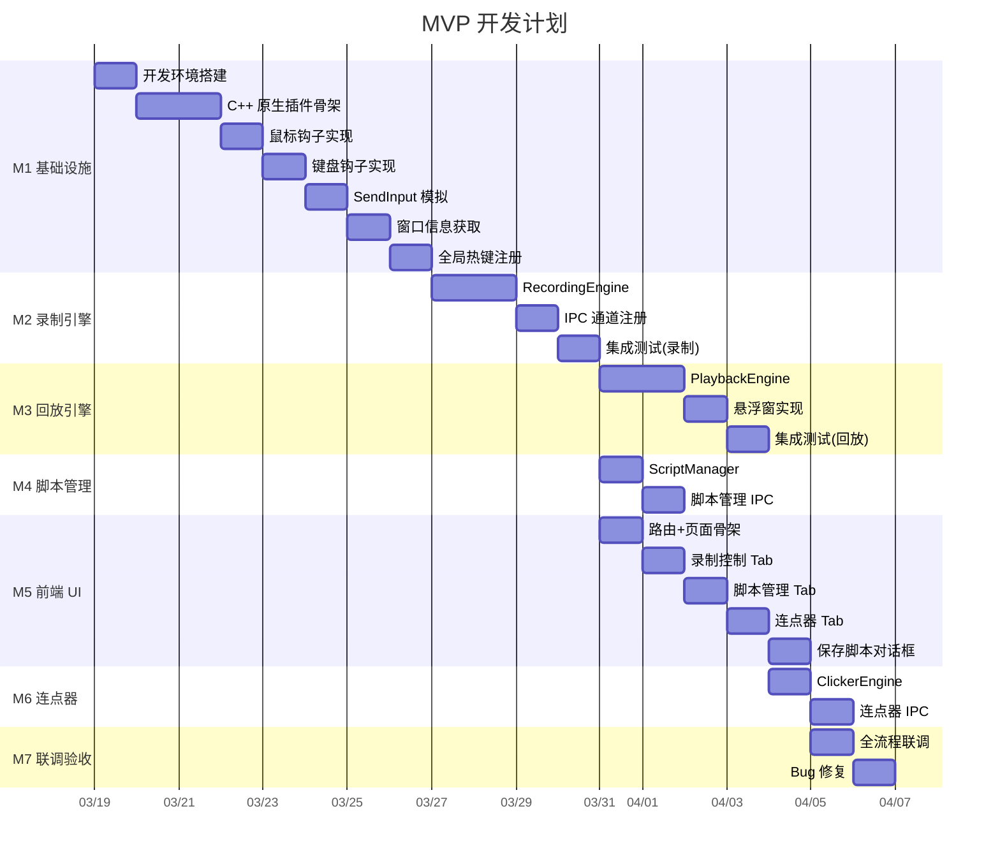
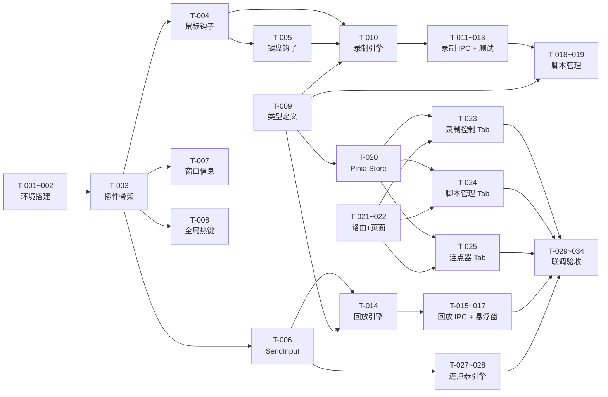

# 操作录制与回放 - 开发计划

## 基本信息

| 项目         | 值                               |
| ------------ | -------------------------------- |
| **功能名称** | 操作录制与回放（系统级）+ 连点器 |
| **所属迭代** | 2026-03-18 功能迭代              |
| **创建日期** | 2026-03-18                       |
| **状态**     | 计划中                           |

---

## MVP 拆解（第一期）

> 第一期目标：完成录制、回放、脚本管理、连点器的核心能力，可正常使用。

---

## 里程碑

| 里程碑 | 目标             | 验收标准                                 | 预估工时   |
| ------ | ---------------- | ---------------------------------------- | ---------- |
| **M1** | C++ 原生插件就绪 | 钩子启停正常、SendInput 可模拟、热键响应 | 5 天       |
| **M2** | 录制引擎可用     | 可录制鼠标+键盘操作并输出事件 JSON       | 3 天       |
| **M3** | 回放引擎可用     | 可回放脚本 + 悬浮窗显示进度              | 3.5 天     |
| **M4** | 脚本管理可用     | CRUD 正常、文件持久化                    | 1.5 天     |
| **M5** | 前端 UI 完成     | 三个 Tab 界面可用、保存对话框完整        | 4 天       |
| **M6** | 连点器可用       | 频率/位置/热键控制正常                   | 1.5 天     |
| **M7** | 全流程联调验收   | 端到端流程走通、关键 Bug 修复            | 2 天       |
|        | **合计**         |                                          | **≈20 天** |

---

## 任务清单

### M1：基础设施（C++ 原生插件）

| 编号  | 任务                                                            | 产出文件                      | 工时 | 依赖  |
| ----- | --------------------------------------------------------------- | ----------------------------- | ---- | ----- |
| T-001 | 安装 cmake-js、node-addon-api 依赖                              | `package.json`                | 0.5d | —     |
| T-002 | 检查/安装 Visual Studio Build Tools、Python                     | 开发环境                      | 0.5d | —     |
| T-003 | 创建 C++ 插件项目骨架（CMakeLists.txt、addon.cpp）              | `electron/native/input-hook/` | 1d   | T-001 |
| T-004 | 实现鼠标钩子（WH_MOUSE_LL + 消息循环线程 + ThreadSafeFunction） | `mouse_hook.cpp`              | 1d   | T-003 |
| T-005 | 实现键盘钩子（WH_KEYBOARD_LL）                                  | `keyboard_hook.cpp`           | 1d   | T-004 |
| T-006 | 实现 SendInput 封装（鼠标移动/点击/滚轮 + 键盘按下/释放）       | `input_sender.cpp`            | 1d   | T-003 |
| T-007 | 实现窗口信息获取（GetForegroundWindow + GetWindowText）         | `window_info.cpp`             | 0.5d | T-003 |
| T-008 | 实现全局热键注册（RegisterHotKey）                              | `addon.cpp` 扩展              | 0.5d | T-003 |

### M2：录制引擎

| 编号  | 任务                                                                             | 产出文件                          | 工时 | 依赖                |
| ----- | -------------------------------------------------------------------------------- | --------------------------------- | ---- | ------------------- |
| T-009 | 定义共享类型（事件类型、脚本结构、配置接口）                                     | `electron/core/recorder/types.ts` | 0.5d | —                   |
| T-010 | 实现 RecordingEngine（状态管理+事件捕获+采样过滤+热键过滤+敏感模式）             | `RecordingEngine.ts`              | 1.5d | T-004, T-005, T-009 |
| T-011 | 注册录制相关 IPC 通道（recorder:start/stop/pause/resume/cancel/toggleSensitive） | `recorder.handler.ts`             | 0.5d | T-010               |
| T-012 | 在 `main.ts` 注册 `registerRecorderHandlers`                                     | `main.ts`                         | 0.1d | T-011               |
| T-013 | 录制引擎集成测试（启动钩子→操作→停止→验证事件数据）                              | 手动测试                          | 0.5d | T-011               |

### M3：回放引擎

| 编号  | 任务                                                               | 产出文件                     | 工时 | 依赖         |
| ----- | ------------------------------------------------------------------ | ---------------------------- | ---- | ------------ |
| T-014 | 实现 PlaybackEngine（状态管理+速度控制+事件执行+倒计时）           | `PlaybackEngine.ts`          | 1.5d | T-006, T-009 |
| T-015 | 注册回放相关 IPC 通道（playback:start/stop/pause/resume/setSpeed） | `recorder.handler.ts` 扩展   | 0.5d | T-014        |
| T-016 | 实现悬浮窗（无边框 BrowserWindow + alwaysOnTop + 进度 UI）         | `PlaybackFloat.vue` + 主进程 | 1d   | T-015        |
| T-017 | 回放引擎集成测试（加载脚本→倒计时→回放→验证鼠标移动+点击）         | 手动测试                     | 0.5d | T-016        |

### M4：脚本管理

| 编号  | 任务                                                         | 产出文件                   | 工时 | 依赖  |
| ----- | ------------------------------------------------------------ | -------------------------- | ---- | ----- |
| T-018 | 实现 ScriptManager（list/load/save/delete/rename）           | `ScriptManager.ts`         | 1d   | T-009 |
| T-019 | 注册脚本管理 IPC 通道（script:list/load/save/delete/rename） | `recorder.handler.ts` 扩展 | 0.5d | T-018 |

### M5：前端 UI

| 编号  | 任务                                                       | 产出文件                               | 工时 | 依赖         |
| ----- | ---------------------------------------------------------- | -------------------------------------- | ---- | ------------ |
| T-020 | 创建 Pinia Store（录制/回放/连点器/脚本状态 + IPC 对接）   | `recorder.store.ts`                    | 1d   | T-009        |
| T-021 | 新增路由 `/recorder` + 侧栏菜单项                          | `router/index.ts`, `App.vue`           | 0.5d | —            |
| T-022 | 实现 RecorderView.vue（三 Tab 容器）                       | `RecorderView.vue`                     | 0.5d | T-021        |
| T-023 | 实现录制控制 Tab（开始/暂停/停止按钮+录制设置+实时事件流） | `RecordControl.vue`                    | 1d   | T-020, T-022 |
| T-024 | 实现脚本管理 Tab（脚本列表+回放按钮+删除+回放设置）        | `ScriptList.vue`, `ScriptListItem.vue` | 1d   | T-020, T-022 |
| T-025 | 实现连点器 Tab（频率/按键/位置配置+启停按钮+状态显示）     | `ClickerPanel.vue`                     | 1d   | T-020, T-022 |
| T-026 | 实现保存脚本对话框                                         | `SaveScriptDialog.vue`                 | 0.5d | T-020        |

### M6：连点器引擎

| 编号  | 任务                                             | 产出文件                   | 工时 | 依赖         |
| ----- | ------------------------------------------------ | -------------------------- | ---- | ------------ |
| T-027 | 实现 ClickerEngine（频率定时+位置计算+次数限制） | `ClickerEngine.ts`         | 1d   | T-006, T-009 |
| T-028 | 注册连点器 IPC 通道 + 热键绑定                   | `recorder.handler.ts` 扩展 | 0.5d | T-027, T-008 |

### M7：联调验收

| 编号  | 任务                                               | 产出文件 | 工时  | 依赖 |
| ----- | -------------------------------------------------- | -------- | ----- | ---- |
| T-029 | 全局热键联调（Ctrl+Alt+R / Esc / F6 三键完整测试） | —        | 0.5d  | 全部 |
| T-030 | 录制→保存→回放 端到端流程测试                      | —        | 0.5d  | 全部 |
| T-031 | 连点器完整流程测试（跟随鼠标+固定坐标）            | —        | 0.25d | 全部 |
| T-032 | 互斥/冲突场景测试（连点器+回放互斥、Esc 停止）     | —        | 0.25d | 全部 |
| T-033 | Bug 修复 + 边界场景处理                            | —        | 1d    | 全部 |
| T-034 | 构建打包测试（electron-builder 含原生插件）        | —        | 0.5d  | 全部 |

---

## 开发顺序（依赖关系）

---

## 第二期任务（增强，暂不排期）

| 编号  | 功能                                              | 预估工时   |
| ----- | ------------------------------------------------- | ---------- |
| T-E01 | 脚本编辑器（步骤列表+删除/修改坐标/修改等待时间） | 2d         |
| T-E02 | 智能等待（窗口标题匹配+超时处理 UI）              | 2d         |
| T-E03 | 坐标拾取器（全屏透明窗口+十字准星）               | 1d         |
| T-E04 | 多点轮询连点                                      | 1d         |
| T-E05 | 脚本导入/导出                                     | 0.5d       |
| T-E06 | 循环回放（N次/无限）                              | 0.5d       |
| T-E07 | `Ctrl+Alt+P` 快速回放上次脚本                     | 0.5d       |
| T-E08 | 回放点击位置闪烁反馈                              | 0.5d       |
| T-E09 | 连点器预设保存/切换                               | 1d         |
| T-E10 | 录制截图快照                                      | 1d         |
|       | **第二期合计**                                    | **≈10 天** |

---

## 风险评估

| 风险                    | 影响             | 概率 | 应对措施                                         |
| ----------------------- | ---------------- | ---- | ------------------------------------------------ |
| C++ 编译环境问题        | M1 延期          | 高   | T-002 提前确保环境就绪；准备 node-gyp 备用方案   |
| 杀毒软件拦截钩子        | 用户无法使用     | 中   | 文档中提示白名单设置；代码签名                   |
| Electron rebuild 兼容性 | 原生插件加载失败 | 中   | 锁定 Electron 版本；CI 中自动 rebuild            |
| 高 DPI 坐标偏移         | 回放位置不准     | 中   | T-006 中调用 `SetProcessDPIAware`；记录 DPI 缩放 |
| 悬浮窗抢焦点            | 干扰回放操作     | 低   | `focusable: false` + `skipTaskbar: true`         |

---

## 关联文档

- [操作录屏-需求规格](./操作录屏-需求规格.md)
- [操作录屏-澄清](./操作录屏-澄清.md)
- [操作录屏-产品设计](./操作录屏-产品设计.md)
- [操作录屏-架构设计](./操作录屏-架构设计.md)

## 变更记录

| 日期       | 版本 | 变更内容 | 变更人 |
| ---------- | ---- | -------- | ------ |
| 2026-03-18 | V1.0 | 初始版本 | —      |
