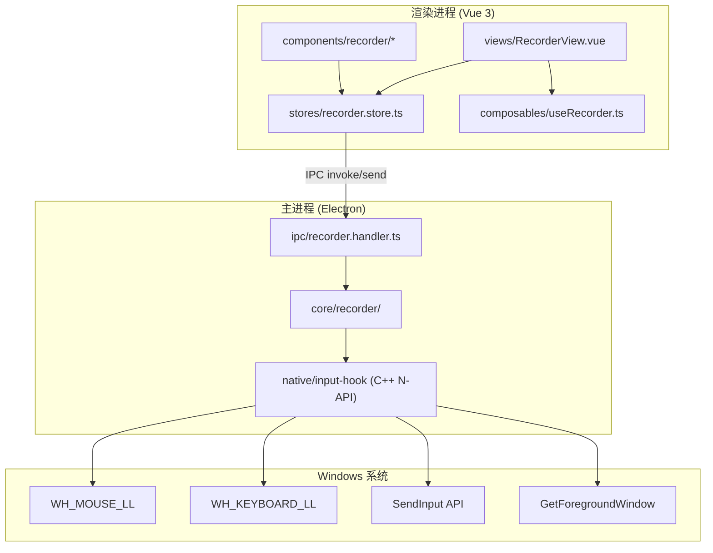
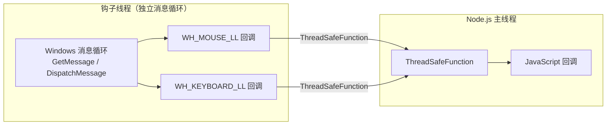
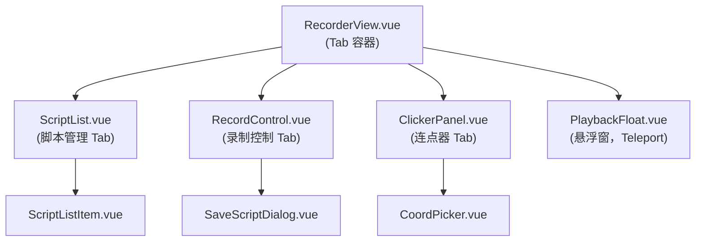
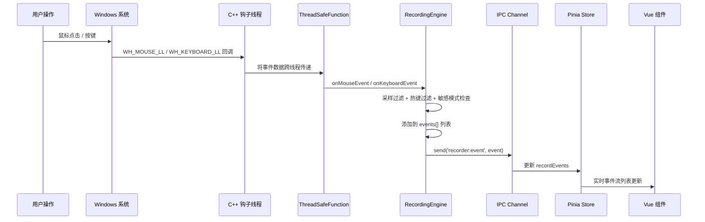
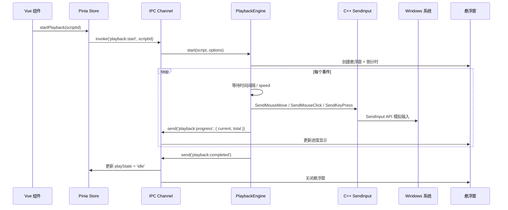

# 操作录制与回放 - 技术架构设计

## 基本信息

| 项目         | 值                               |
| ------------ | -------------------------------- |
| **功能名称** | 操作录制与回放（系统级）+ 连点器 |
| **所属迭代** | 2026-03-18 功能迭代              |
| **创建日期** | 2026-03-18                       |
| **状态**     | 设计中                           |

---

## 一、技术选型

| 技术领域         | 选型                          | 理由                                                |
| ---------------- | ----------------------------- | --------------------------------------------------- |
| **全局钩子**     | C++ N-API 原生插件            | `SetWindowsHookEx` 为系统 API，必须通过原生代码调用 |
| **输入模拟**     | C++ N-API 原生插件            | `SendInput` 为系统 API，同上                        |
| **原生编译工具** | `cmake-js`                    | 比 `node-gyp` 更现代，CMake 生态更好                |
| **前端框架**     | Vue 3 + Naive UI（现有）      | 与项目现有技术栈一致                                |
| **状态管理**     | Pinia（现有）                 | 与项目现有模式一致                                  |
| **持久化**       | JSON 文件（现有 config 模式） | 复用现有 `electron/core/config.ts` 的存储模式       |
| **IPC 通信**     | Electron IPC（现有模式）      | 复用现有 `ipcRenderer.invoke` / `.send` 模式        |
| **脚本格式**     | JSON (`.itscript`)            | 可读性好，编辑方便，无需额外解析库                  |

---

## 二、系统架构

### 2.1 整体分层



### 2.2 目录结构（新增文件）

```
image-toolkit/
├── electron/
│   ├── core/
│   │   └── recorder/                    🆕 录制核心逻辑
│   │       ├── RecordingEngine.ts       🆕 录制引擎（管理钩子生命周期）
│   │       ├── PlaybackEngine.ts        🆕 回放引擎（管理 SendInput 执行）
│   │       ├── ClickerEngine.ts         🆕 连点器引擎
│   │       ├── ScriptManager.ts         🆕 脚本文件 CRUD
│   │       ├── HotkeyManager.ts         🆕 全局热键管理
│   │       └── types.ts                 🆕 共享类型定义
│   ├── ipc/
│   │   └── recorder.handler.ts          🆕 录制模块 IPC 通道注册
│   └── native/
│       └── input-hook/                  🆕 C++ 原生插件
│           ├── CMakeLists.txt           🆕 CMake 构建文件
│           ├── src/
│           │   ├── addon.cpp            🆕 N-API 入口
│           │   ├── mouse_hook.cpp       🆕 鼠标钩子
│           │   ├── keyboard_hook.cpp    🆕 键盘钩子
│           │   ├── input_sender.cpp     🆕 SendInput 封装
│           │   └── window_info.cpp      🆕 窗口信息获取
│           └── binding.gyp             🆕 备用 node-gyp 配置
├── src/
│   ├── views/
│   │   └── RecorderView.vue             🆕 录制回放主页面
│   ├── components/
│   │   └── recorder/                    🆕 录制模块组件
│   │       ├── ScriptList.vue           🆕 脚本列表
│   │       ├── ScriptListItem.vue       🆕 脚本列表项
│   │       ├── RecordControl.vue        🆕 录制控制面板
│   │       ├── ClickerPanel.vue         🆕 连点器面板
│   │       ├── PlaybackFloat.vue        🆕 回放悬浮窗
│   │       ├── SaveScriptDialog.vue     🆕 保存脚本对话框
│   │       └── CoordPicker.vue          🆕 坐标拾取器
│   ├── composables/
│   │   └── useRecorder.ts               🆕 录制模块组合函数
│   └── stores/
│       └── recorder.store.ts            🆕 录制模块状态管理
```

---

## 三、核心模块设计

### 3.1 C++ 原生插件 `input-hook`

这是整个功能的底层基础，通过 N-API 暴露给 Node.js 使用。

#### 3.1.1 导出接口

```cpp
// === 鼠标钩子 ===
Napi::Boolean StartMouseHook(Napi::Env env, Napi::Function callback);
Napi::Boolean StopMouseHook(Napi::Env env);

// === 键盘钩子 ===
Napi::Boolean StartKeyboardHook(Napi::Env env, Napi::Function callback);
Napi::Boolean StopKeyboardHook(Napi::Env env);

// === 输入模拟 ===
Napi::Boolean SendMouseMove(Napi::Env env, int x, int y);
Napi::Boolean SendMouseClick(Napi::Env env, int x, int y, string button, string action);
Napi::Boolean SendMouseScroll(Napi::Env env, int x, int y, int delta);
Napi::Boolean SendKeyPress(Napi::Env env, int vkCode, string action);

// === 窗口信息 ===
Napi::String GetForegroundWindowTitle(Napi::Env env);

// === 全局热键 ===
Napi::Boolean RegisterGlobalHotkey(Napi::Env env, int id, int modifiers, int vkCode, Napi::Function callback);
Napi::Boolean UnregisterGlobalHotkey(Napi::Env env, int id);
```

#### 3.1.2 钩子回调数据格式

```typescript
// 鼠标回调参数
interface MouseHookEvent {
  type:
    | "move"
    | "left-down"
    | "left-up"
    | "right-down"
    | "right-up"
    | "middle-down"
    | "middle-up"
    | "scroll";
  x: number; // 屏幕绝对坐标
  y: number;
  delta?: number; // 滚轮增量
  timestamp: number; // 系统时间戳
}

// 键盘回调参数
interface KeyboardHookEvent {
  type: "key-down" | "key-up";
  vkCode: number; // 虚拟键码
  scanCode: number; // 扫描码
  timestamp: number;
}
```

#### 3.1.3 线程模型



> **关键**：`WH_MOUSE_LL` 和 `WH_KEYBOARD_LL` 要求在拥有消息循环的线程中运行。  
> 原生插件启动时创建专用线程运行 `GetMessage` 消息循环，通过 N-API `ThreadSafeFunction` 将事件安全地回调到 Node.js 主线程。

---

### 3.2 RecordingEngine（录制引擎）

位置：`electron/core/recorder/RecordingEngine.ts`

```typescript
class RecordingEngine extends EventEmitter {
  private state: "idle" | "recording" | "paused";
  private events: RecordEvent[];
  private startTime: number;
  private sensitiveMode: boolean;
  private settings: RecordSettings;

  // 生命周期
  start(settings: RecordSettings): void; // 安装钩子，开始捕获
  pause(): void; // 暂停捕获
  resume(): void; // 恢复捕获
  stop(): RecordResult; // 卸载钩子，返回事件列表
  cancel(): void; // 取消，丢弃数据

  // 敏感模式
  toggleSensitiveMode(): void; // 切换敏感模式

  // 事件处理（内部）
  private onMouseEvent(e: MouseHookEvent): void;
  private onKeyboardEvent(e: KeyboardHookEvent): void;
  private shouldFilterHotkey(vkCode: number, modifiers: string[]): boolean;
  private throttleMouseMove(e: MouseHookEvent): boolean;

  // 事件
  // 'event'        → 新事件被捕获
  // 'state-change' → 状态变更
  // 'stats'        → 统计信息更新（事件数、时长）
}
```

#### 鼠标移动采样策略

```typescript
private lastMoveTime = 0;
private lastMoveX = 0;
private lastMoveY = 0;

private throttleMouseMove(e: MouseHookEvent): boolean {
  const now = Date.now();
  const dx = Math.abs(e.x - this.lastMoveX);
  const dy = Math.abs(e.y - this.lastMoveY);
  const dt = now - this.lastMoveTime;

  // 时间间隔 ≥ 50ms 或 移动距离 ≥ 5px
  if (dt >= 50 || dx >= 5 || dy >= 5) {
    this.lastMoveTime = now;
    this.lastMoveX = e.x;
    this.lastMoveY = e.y;
    return true;  // 通过，记录此事件
  }
  return false;   // 过滤
}
```

---

### 3.3 PlaybackEngine（回放引擎）

位置：`electron/core/recorder/PlaybackEngine.ts`

```typescript
class PlaybackEngine extends EventEmitter {
  private state: "idle" | "countdown" | "playing" | "paused" | "waiting";
  private script: OperationScript;
  private currentIndex: number;
  private speed: number; // 0.5 | 1 | 2 | 5 | 0 (最快)

  // 生命周期
  start(script: OperationScript, options: PlaybackOptions): void;
  pause(): void;
  resume(): void;
  stop(): void;

  // 执行核心（内部）
  private async executeNext(): Promise<void>;
  private async executeEvent(event: RecordEvent): Promise<void>;
  private async executeMouseMove(data: MouseMoveData): Promise<void>;
  private async executeMouseClick(data: MouseClickData): Promise<void>;
  private async executeKeyPress(data: KeyPressData): Promise<void>;
  private async executeWaitWindow(data: WaitWindowData): Promise<void>;
  private sleep(ms: number): Promise<void>;

  // 智能等待
  private async waitForWindow(title: string, timeout: number): Promise<boolean>;

  // 事件
  // 'progress'     → 进度更新 { current, total, event }
  // 'state-change' → 状态变更
  // 'completed'    → 回放完成
  // 'error'        → 执行错误
  // 'wait-timeout' → 等待超时
}
```

#### 回放速度控制

```typescript
private getDelay(interval: number): number {
  if (this.speed === 0) return 0;          // 最快模式
  return Math.round(interval / this.speed); // 原始间隔 / 速度倍数
}
```

---

### 3.4 ClickerEngine（连点器引擎）

位置：`electron/core/recorder/ClickerEngine.ts`

```typescript
class ClickerEngine extends EventEmitter {
  private state: "idle" | "running" | "countdown";
  private config: ClickerConfig;
  private clickCount: number;
  private timer: NodeJS.Timeout | null;

  start(config: ClickerConfig): void;
  stop(): void;

  private tick(): void; // 每次点击执行
  private getNextPosition(): { x: number; y: number }; // 多点轮询

  // 事件
  // 'click'        → 每次点击 { count, position }
  // 'state-change' → 状态变更
  // 'completed'    → 达到次数上限，自动停止
}
```

---

### 3.5 ScriptManager（脚本管理）

位置：`electron/core/recorder/ScriptManager.ts`

```typescript
class ScriptManager {
  private scriptsDir: string; // app.getPath('userData') + '/scripts/'

  listScripts(): ScriptMeta[]; // 列表（不加载events）
  loadScript(id: string): OperationScript; // 完整加载
  saveScript(script: OperationScript): string; // 保存，返回 id
  deleteScript(id: string): void; // 删除
  renameScript(id: string, name: string, desc?: string): void;
  exportScript(id: string, outputPath: string): void;
  importScript(filePath: string): string; // 导入，返回 id
}
```

脚本文件存储格式：`{scriptsDir}/{uuid}.itscript`

---

### 3.6 HotkeyManager（热键管理）

位置：`electron/core/recorder/HotkeyManager.ts`

```typescript
class HotkeyManager {
  private hotkeys: Map<string, HotkeyBinding>;

  register(
    name: string,
    modifiers: number,
    vkCode: number,
    callback: () => void,
  ): void;
  unregister(name: string): void;
  unregisterAll(): void;
  isRegistered(name: string): boolean;
}

// 预设热键
// 'record'   → Ctrl+Alt+R  (录制开始/停止)
// 'stop'     → Esc          (紧急停止)
// 'clicker'  → F6           (连点器开始/停止)
```

---

## 四、IPC 通道设计

### 4.1 通道清单

| 方向 | 通道名                     | 类型   | 描述                        |
| ---- | -------------------------- | ------ | --------------------------- |
| R→M  | `recorder:start`           | invoke | 开始录制                    |
| R→M  | `recorder:stop`            | invoke | 停止录制，返回事件列表      |
| R→M  | `recorder:pause`           | invoke | 暂停录制                    |
| R→M  | `recorder:resume`          | invoke | 恢复录制                    |
| R→M  | `recorder:cancel`          | invoke | 取消录制                    |
| R→M  | `recorder:toggleSensitive` | invoke | 切换敏感模式                |
| M→R  | `recorder:event`           | send   | 实时推送捕获到的事件        |
| M→R  | `recorder:state`           | send   | 推送状态变更                |
| M→R  | `recorder:stats`           | send   | 推送统计信息（事件数/时长） |
| R→M  | `playback:start`           | invoke | 开始回放                    |
| R→M  | `playback:pause`           | invoke | 暂停回放                    |
| R→M  | `playback:resume`          | invoke | 恢复回放                    |
| R→M  | `playback:stop`            | invoke | 停止回放                    |
| R→M  | `playback:setSpeed`        | invoke | 设置回放速度                |
| M→R  | `playback:progress`        | send   | 推送回放进度                |
| M→R  | `playback:state`           | send   | 推送回放状态                |
| M→R  | `playback:completed`       | send   | 回放完成通知                |
| M→R  | `playback:waitTimeout`     | send   | 智能等待超时                |
| R→M  | `clicker:start`            | invoke | 启动连点                    |
| R→M  | `clicker:stop`             | invoke | 停止连点                    |
| M→R  | `clicker:state`            | send   | 推送连点状态                |
| M→R  | `clicker:click`            | send   | 推送点击计数                |
| R→M  | `script:list`              | invoke | 获取脚本列表                |
| R→M  | `script:load`              | invoke | 加载脚本                    |
| R→M  | `script:save`              | invoke | 保存脚本                    |
| R→M  | `script:delete`            | invoke | 删除脚本                    |
| R→M  | `script:rename`            | invoke | 重命名脚本                  |
| R→M  | `script:import`            | invoke | 导入脚本                    |
| R→M  | `script:export`            | invoke | 导出脚本                    |
| M→R  | `hotkey:triggered`         | send   | 全局热键被触发              |

> R→M = 渲染进程 → 主进程，M→R = 主进程 → 渲染进程

### 4.2 IPC Handler 注册

位置：`electron/ipc/recorder.handler.ts`

```typescript
export function registerRecorderHandlers() {
  const recording = new RecordingEngine();
  const playback = new PlaybackEngine();
  const clicker = new ClickerEngine();
  const scripts = new ScriptManager();
  const hotkeys = new HotkeyManager();

  // 录制通道
  ipcMain.handle('recorder:start', ...);
  ipcMain.handle('recorder:stop', ...);
  // ...

  // 回放通道
  ipcMain.handle('playback:start', ...);
  // ...

  // 连点器通道
  ipcMain.handle('clicker:start', ...);
  // ...

  // 脚本管理通道
  ipcMain.handle('script:list', ...);
  // ...

  // 全局热键注册
  hotkeys.register('record', MOD_CTRL | MOD_ALT, 0x52, () => { ... });
  hotkeys.register('stop', 0, VK_ESCAPE, () => { ... });
  hotkeys.register('clicker', 0, VK_F6, () => { ... });
}
```

在 `electron/main.ts` 中注册：

```typescript
import { registerRecorderHandlers } from "./ipc/recorder.handler";
// ...
registerRecorderHandlers();
```

---

## 五、渲染进程架构

### 5.1 Pinia Store

位置：`src/stores/recorder.store.ts`

```typescript
export const useRecorderStore = defineStore('recorder', () => {
  // === 录制状态 ===
  const recordState = ref<'idle' | 'recording' | 'paused'>('idle');
  const recordEvents = ref<RecordEvent[]>([]);
  const recordDuration = ref(0);
  const sensitiveMode = ref(false);

  // === 回放状态 ===
  const playState = ref<'idle' | 'countdown' | 'playing' | 'paused'>('idle');
  const playProgress = ref({ current: 0, total: 0 });
  const playSpeed = ref(1);

  // === 连点器状态 ===
  const clickerState = ref<'idle' | 'running'>('idle');
  const clickerCount = ref(0);
  const clickerConfig = ref<ClickerConfig>(defaultClickerConfig);

  // === 脚本列表 ===
  const scripts = ref<ScriptMeta[]>([]);

  // === Actions ===
  async function startRecording(settings: RecordSettings) { ... }
  async function stopRecording() { ... }
  async function startPlayback(scriptId: string) { ... }
  async function startClicker() { ... }
  async function loadScripts() { ... }
  // ...
});
```

### 5.2 路由更新

```typescript
// src/router/index.ts — 新增路由
{
  path: '/recorder',
  component: () => import('../views/RecorderView.vue')
}
```

### 5.3 组件层次



> `PlaybackFloat.vue` 使用 Vue `Teleport` 渲染到独立的置顶窗口（通过 IPC 请求主进程创建无边框 BrowserWindow）。

---

## 六、关键技术难点

### 6.1 悬浮窗实现

回放悬浮窗需要始终置顶在所有 Windows 窗口之上：

```typescript
// 主进程创建悬浮窗
function createFloatWindow() {
  const float = new BrowserWindow({
    width: 320,
    height: 80,
    x: screenWidth - 340,
    y: screenHeight - 100,
    frame: false,
    transparent: true,
    alwaysOnTop: true,
    skipTaskbar: true,
    resizable: false,
    focusable: false, // 不抢占焦点
    webPreferences: {
      preload: path.join(__dirname, "preload.mjs"),
    },
  });
  float.loadURL(VITE_DEV_SERVER_URL + "#/float");
  // 或 float.loadFile(..., { hash: '/float' })
}
```

### 6.2 坐标拾取器

坐标拾取需要创建全屏透明窗口覆盖整个桌面：

```typescript
function createPickerWindow() {
  const picker = new BrowserWindow({
    fullscreen: true,
    transparent: true,
    frame: false,
    alwaysOnTop: true,
    cursor: "crosshair", // 十字准星光标
  });
  // 用户点击后获取坐标并关闭窗口
}
```

### 6.3 高 DPI 适配

```typescript
// 原生插件中获取 DPI 缩放
int dpi = GetDpiForWindow(GetForegroundWindow());
double scale = dpi / 96.0;

// 使用物理像素坐标（非逻辑像素）
// SetProcessDPIAware() 在插件初始化时调用
```

### 6.4 钩子异常恢复

```typescript
// 主进程退出时确保卸载钩子
app.on("before-quit", () => {
  recordingEngine.cancel();
  playbackEngine.stop();
  clickerEngine.stop();
  hotkeyManager.unregisterAll();
  nativeHook.stopMouseHook();
  nativeHook.stopKeyboardHook();
});

// 崩溃保护
process.on("uncaughtException", (err) => {
  nativeHook.stopMouseHook();
  nativeHook.stopKeyboardHook();
  console.error("Uncaught exception:", err);
});
```

---

## 七、数据流图

### 7.1 录制数据流



### 7.2 回放数据流



---

## 八、构建与打包

### 8.1 原生插件构建

```json
// package.json 新增
{
  "scripts": {
    "build:native": "cmake-js compile -d electron/native/input-hook",
    "rebuild:native": "cmake-js rebuild -d electron/native/input-hook -r electron -v 30.0.1"
  },
  "devDependencies": {
    "cmake-js": "^7.3.0",
    "node-addon-api": "^7.1.0"
  }
}
```

### 8.2 Electron Builder 配置

```json5
// electron-builder.json5 新增
{
  extraResources: [
    {
      from: "electron/native/input-hook/build/Release/input_hook.node",
      to: "native/input_hook.node",
    },
  ],
}
```

### 8.3 原生模块加载

```typescript
// electron/core/recorder/types.ts
import path from "node:path";
import { app } from "electron";

function loadNativeModule() {
  const isDev = !app.isPackaged;
  const modulePath = isDev
    ? path.join(__dirname, "../native/input-hook/build/Release/input_hook.node")
    : path.join(process.resourcesPath, "native/input_hook.node");
  return require(modulePath);
}

export const nativeHook = loadNativeModule();
```

---

## 九、关联文档

- [操作录屏-需求规格](./操作录屏-需求规格.md)
- [操作录屏-澄清](./操作录屏-澄清.md)
- [操作录屏-产品设计](./操作录屏-产品设计.md)

## 变更记录

| 日期       | 版本 | 变更内容 | 变更人 |
| ---------- | ---- | -------- | ------ |
| 2026-03-18 | V1.0 | 初始版本 | —      |
