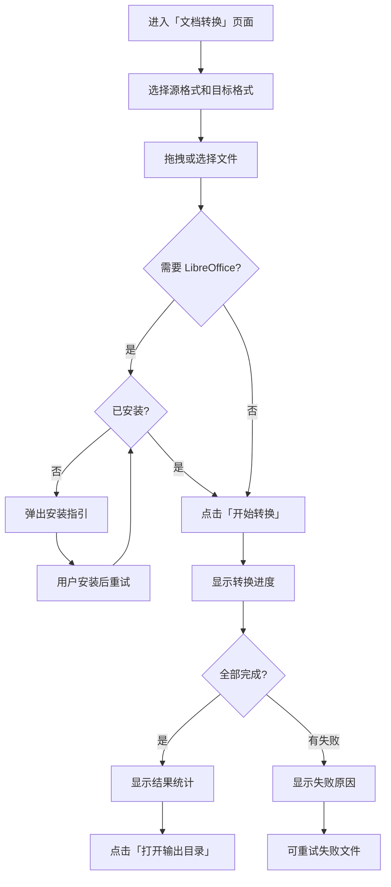
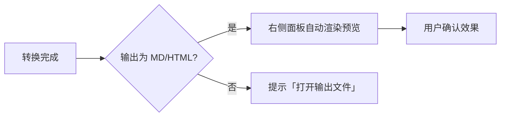

# 文件格式转换 - 产品设计 V1

## 1. 功能概述

为 Universal Toolkit 新增**文档格式转换**模块，提供 11 种主流文档格式互转能力（Word/PPT/PDF/Markdown/HTML），全部离线本地处理，支持批量转换和实时预览，让用户在一个工具中完成日常办公所有文档转换需求。

---

## 2. 目标用户

| 用户角色   | 特征                      | 典型场景                              |
| ---------- | ------------------------- | ------------------------------------- |
| 办公白领   | 日常处理 Office 文档      | PPT 会议纪要转 Word、Word 合同转 PDF  |
| 技术人员   | 熟悉 Markdown，有归档习惯 | Word 文档转 MD 归档 Git、HTML 转 MD   |
| 学生       | 论文编辑、格式适配        | PDF 论文转 Word 修改、Word 论文转 PDF |
| 内容创作者 | 多平台发布内容            | MD 写作后转 Word/HTML 投稿            |

---

## 3. 用户流程

### 3.1 核心转换流程



### 3.2 预览流程（二期）



---

## 4. 功能清单

### MVP（第一期）

- [ ] 侧栏新增「文档转换」入口（DocumentTextOutline 图标）
- [ ] 源格式 / 目标格式下拉框（联动过滤可选项）
- [ ] 文件拖拽 + 选择按钮，支持批量添加
- [ ] 文件列表（文件名、大小、状态、移除按钮）
- [ ] Word → Markdown 转换（图片提取到同名目录）
- [ ] Word → PDF 转换（LibreOffice）
- [ ] PPT → Word 转换（提取文字/图片）
- [ ] PPT → PDF 转换（LibreOffice）
- [ ] PDF → Word 转换（文字层提取）
- [ ] 输出目录选择 + 路径记忆
- [ ] LibreOffice 安装检测 + 引导弹窗
- [ ] 转换完成结果统计 + 打开输出目录

### 第二期

- [ ] Markdown → HTML 转换
- [ ] Markdown → Word 转换
- [ ] HTML → Markdown 转换
- [ ] PDF → Markdown 转换
- [ ] PPT → 图片（PNG/JPG）
- [ ] Word → HTML 转换
- [ ] 实时预览面板（MD/HTML 渲染）
- [ ] 拖拽自动识别源格式
- [ ] 每文件独立进度条
- [ ] 大文档流式处理优化

---

## 5. 界面原型

### 5.1 页面整体布局

```
┌──────────────────────────────────────────────────────────┐
│  侧栏          │              文档转换                    │
│  ──────────    │                                          │
│  🔍 SVG 查看   │  ┌─────────────┐    ┌─────────────┐     │
│  📦 图片压缩   │  │ 源格式  ▼   │ →  │ 目标格式 ▼  │     │
│  🔄 格式转换   │  └─────────────┘    └─────────────┘     │
│  🖱 连点器     │                                          │
│  📄 文档转换 ← │  ┌──────────────────────────────────┐   │
│                │  │                                    │   │
│                │  │      拖拽文件到此处                 │   │
│                │  │      或 [选择文件]                  │   │
│                │  │                                    │   │
│                │  └──────────────────────────────────┘   │
│                │                                          │
│                │  ┌──────────────────────────────────┐   │
│                │  │ 📄 报告.docx    12.3 MB   ⏳ 等待  │   │
│                │  │ 📄 方案.docx     8.1 MB   ⏳ 等待  │   │
│                │  │ 📄 总结.docx     3.2 MB   ✅ 完成  │   │
│                │  └──────────────────────────────────┘   │
│                │                                          │
│                │  [📂 输出目录: D:\output   更改]         │
│                │                                          │
│  ☀️ / 🌙       │  [          🚀 开始转换              ]   │
└──────────────────────────────────────────────────────────┘
```

### 5.2 格式选择器

```
┌───────────────┐         ┌───────────────┐
│ 源格式     ▼  │   →     │ 目标格式   ▼  │
├───────────────┤         ├───────────────┤
│ 📄 Word (.docx)│         │ 📝 Markdown   │ ← 根据源格式
│ 📊 PPT (.pptx) │         │ 📋 PDF        │    联动过滤
│ 📋 PDF (.pdf)  │         │ 📄 Word       │    可选项
│ 📝 Markdown    │         │ 🌐 HTML       │
│ 🌐 HTML        │         │ 🖼 图片       │
└───────────────┘         └───────────────┘
```

### 5.3 转换结果状态

```
┌──────────────────────────────────────────────┐
│ ✅ 转换完成                                   │
│                                               │
│   成功: 8 个文件    失败: 1 个文件             │
│                                               │
│   [📂 打开输出目录]    [🔄 重试失败文件]       │
└──────────────────────────────────────────────┘
```

### 5.4 LibreOffice 检测弹窗

```
┌──────────────────────────────────────────┐
│  ⚠️ 需要安装 LibreOffice                 │
│                                           │
│  当前转换（Word → PDF）需要 LibreOffice   │
│  作为排版引擎。                           │
│                                           │
│  📥 下载地址:                             │
│  https://www.libreoffice.org/download     │
│                                           │
│  安装完成后无需重启应用，直接重试即可。    │
│                                           │
│  [取消]              [🔄 已安装，重试]     │
└──────────────────────────────────────────┘
```

### 5.5 实时预览面板（二期）

```
┌──────────────────────┬────────────────────┐
│     文件列表          │    预览面板        │
│                      │                    │
│  📄 readme.docx  ✅  │  # 标题            │
│  📄 blog.docx   ✅  │                    │
│                      │  这是转换后的       │
│                      │  Markdown 内容...   │
│                      │                    │
│                      │  ## 二级标题        │
│                      │  - 列表项 1         │
│                      │  - 列表项 2         │
└──────────────────────┴────────────────────┘
```

---

## 6. 交互设计

### 6.1 格式选择联动

| 用户操作              | 系统响应                                  |
| --------------------- | ----------------------------------------- |
| 选择源格式 = Word     | 目标格式下拉框显示：PDF / Markdown / HTML |
| 选择源格式 = PPT      | 目标格式下拉框显示：Word / PDF / 图片     |
| 选择源格式 = PDF      | 目标格式下拉框显示：Word / Markdown       |
| 选择源格式 = Markdown | 目标格式下拉框显示：HTML / Word           |
| 选择源格式 = HTML     | 目标格式下拉框显示：Markdown              |

### 6.2 文件添加

| 用户操作         | 系统响应                                           |
| ---------------- | -------------------------------------------------- |
| 拖拽文件到区域   | 自动添加到列表，自动识别源格式并设置下拉框（二期） |
| 点击「选择文件」 | 打开文件选择器，过滤器为当前源格式对应的扩展名     |
| 添加重复文件     | 跳过并 Toast 提示「文件已存在」                    |
| 添加格式不匹配   | Toast 提示「该文件不是 {源格式} 格式」             |

### 6.3 转换过程

| 用户操作         | 系统响应                                          |
| ---------------- | ------------------------------------------------- |
| 点击「开始转换」 | 按钮变为「转换中...」+ 旋转图标，文件列表显示进度 |
| 单文件转换完成   | 状态变为 ✅，显示输出文件大小                     |
| 单文件转换失败   | 状态变为 ❌，hover 显示错误原因                   |
| 全部完成         | 弹出结果统计卡片，显示成功/失败计数 + 操作按钮    |
| 点击输出目录     | 调用系统文件管理器打开目录                        |
| 转换中切换页面   | Toast 确认「转换仍在进行中，确定切换？」          |

### 6.4 键盘快捷键

| 快捷键 | 功能         |
| ------ | ------------ |
| Delete | 移除选中文件 |
| Ctrl+A | 全选文件列表 |
| Enter  | 开始转换     |

---

## 7. 边界情况

| 场景               | 触发条件                | 处理方式                                         |
| ------------------ | ----------------------- | ------------------------------------------------ | ------- |
| LibreOffice 未安装 | 选中需要 soffice 的转换 | 弹出安装指引弹窗，阻断当前转换                   |
| PDF 为扫描件       | PDF 内无文字层          | 标记失败 + 提示「此为扫描件，无法提取文字」      |
| 单文件 > 100MB     | 文件过大                | 添加时提示「文件过大（>100MB），请拆分后再转换」 |
| 文件损坏无法解析   | 格式异常                | 标记失败 + 提示「文件损坏或格式不支持」          |
| 磁盘空间不足       | 输出目录剩余空间 < 需求 | 提示「磁盘空间不足，请清理后重试」               |
| 上百页大文档       | 文档页数极多            | 分块处理 + 进度条，不阻塞 UI                     |
| PPT 含视频/音频    | 幻灯片嵌入多媒体        | 跳过多媒体，仅提取文字和图片，不报错             |
| Word 含 VBA 宏     | .docm 文件              | 提示「不支持含宏文档，请另存为 .docx」           |
| 输出目录被删除     | 记忆的路径不存在了      | 自动回退到源文件同目录 + 提示「路径已失效」      |
| 转换中应用崩溃     | 意外退出                | 已完成文件保留，下次启动无残留锁文件             |
| 文件名含特殊字符   | Windows 保留字符        | 自动替换 `/\:\*?"<>                              | `为`\_` |

---

## 关联文档

- [需求澄清](./澄清.md)
- [需求规格](./需求规格.md)
- [需求分析](./需求分析.md)
