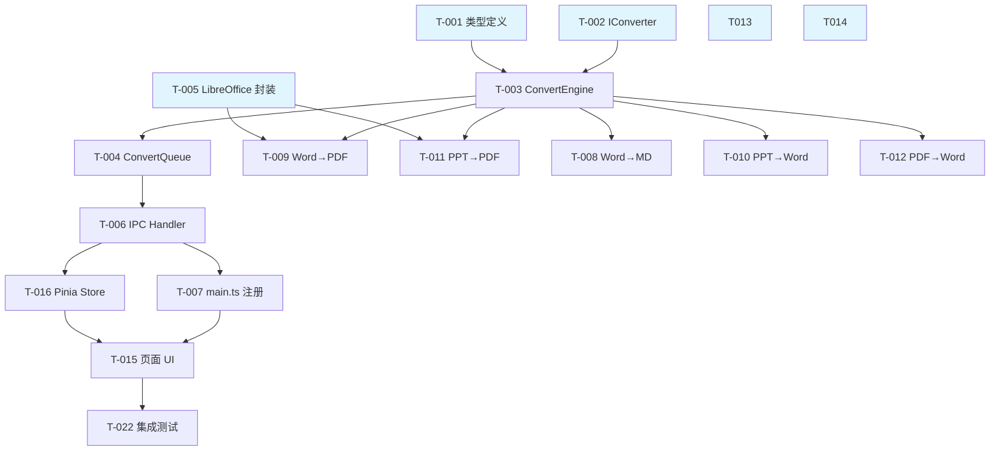

# 文件格式转换 - 任务清单

## 概览

| 项目       | 数值  |
| ---------- | ----- |
| 总任务数   | 38    |
| 可并行     | 12    |
| 预计工时   | 16 天 |
| MVP 任务数 | 24    |
| 二期任务数 | 14    |

---

## M1: 基础框架搭建（Day 1-2）

### US-001: 作为开发者，我需要类型定义和转换器接口，以便统一所有转换器的实现规范

| 任务  | 复杂度 | 并行 | 文件                                               | 状态 |
| ----- | ------ | ---- | -------------------------------------------------- | ---- |
| T-001 | S      | ✅   | `electron/core/converter/types.ts`                 | ⬜   |
| T-002 | S      | ✅   | `electron/core/converter/converters/IConverter.ts` | ⬜   |

- [ ] [P][S] **T-001**: 定义核心类型（DocFormat / ConvertDirection / ConvertTask / ConvertConfig / ConvertStatus） - `electron/core/converter/types.ts`
  - 验收标准: 所有类型通过 TypeScript 编译，包含 FORMAT_MATRIX 格式矩阵
- [ ] [P][S] **T-002**: 定义转换器接口 IConverter（direction / requiresLibreOffice / convert 方法） - `electron/core/converter/converters/IConverter.ts`
  - 验收标准: 接口定义完整，包含 ConvertInput / ConvertOutput 类型

### US-002: 作为开发者，我需要转换引擎和任务队列，以便管理转换流程

| 任务  | 复杂度 | 并行 | 文件                                       | 状态 |
| ----- | ------ | ---- | ------------------------------------------ | ---- |
| T-003 | M      | -    | `electron/core/converter/ConvertEngine.ts` | ⬜   |
| T-004 | M      | -    | `electron/core/converter/ConvertQueue.ts`  | ⬜   |

- [ ] [M] **T-003**: 实现 ConvertEngine（转换器注册表 + 根据 direction 路由到对应 Converter）（依赖 T-001, T-002） - `electron/core/converter/ConvertEngine.ts`
  - 验收标准: 可注册/查找转换器，错误处理完整
- [ ] [M] **T-004**: 实现 ConvertQueue（串行任务队列 + EventEmitter 推送进度/完成/失败）（依赖 T-003） - `electron/core/converter/ConvertQueue.ts`
  - 验收标准: 串行执行、单文件失败不阻断、支持取消

### US-003: 作为开发者，我需要 LibreOffice 检测封装，以便可靠调用 soffice

| 任务  | 复杂度 | 并行 | 文件                                     | 状态 |
| ----- | ------ | ---- | ---------------------------------------- | ---- |
| T-005 | M      | ✅   | `electron/core/converter/libreoffice.ts` | ⬜   |

- [ ] [P][M] **T-005**: 实现 LibreOffice 检测与调用封装（PATH 检测 + 默认路径检测 + execFile 调用 + 超时控制）- `electron/core/converter/libreoffice.ts`
  - 验收标准: 检测安装状态/版本、headless 转换可调用、120s 超时

### US-004: 作为开发者，我需要 IPC handler，以便前后端通信

| 任务  | 复杂度 | 并行 | 文件                                 | 状态 |
| ----- | ------ | ---- | ------------------------------------ | ---- |
| T-006 | M      | -    | `electron/ipc/docConvert.handler.ts` | ⬜   |
| T-007 | S      | -    | `electron/main.ts`                   | ⬜   |

- [ ] [M] **T-006**: 实现 IPC handler（9 个通道：start/cancel/getStatus/checkLO/selectOutputDir + 4 个推送通道）（依赖 T-004） - `electron/ipc/docConvert.handler.ts`
  - 验收标准: 所有 invoke/send 通道可用，错误不崩溃
- [ ] [S] **T-007**: 在 main.ts 注册 docConvert handler（依赖 T-006） - `electron/main.ts`
  - 验收标准: 应用启动时 handler 注册成功

---

## M2: 核心转换器（Day 3-6）

### US-005: 作为技术人员，我希望将 Word 转为 Markdown，以便归档到 Git

| 任务  | 复杂度 | 并行 | 文件                                             | 状态 |
| ----- | ------ | ---- | ------------------------------------------------ | ---- |
| T-008 | L      | -    | `electron/core/converter/converters/WordToMd.ts` | ⬜   |

- [ ] [L] **T-008**: 实现 Word→Markdown 转换器（mammoth 解析 docx → HTML → turndown → MD，图片提取到 `文档名_images/` 目录，MD 使用相对路径引用） - `electron/core/converter/converters/WordToMd.ts`
  - 验收标准: 标题层级/列表/表格/图片保留，图片提取到同名目录

### US-006: 作为办公白领，我希望将 Word 转为 PDF，以便发送给他人

| 任务  | 复杂度 | 并行 | 文件                                              | 状态 |
| ----- | ------ | ---- | ------------------------------------------------- | ---- |
| T-009 | S      | ✅   | `electron/core/converter/converters/WordToPdf.ts` | ⬜   |

- [ ] [P][S] **T-009**: 实现 Word→PDF 转换器（调用 libreoffice.ts 封装，soffice --headless --convert-to pdf） - `electron/core/converter/converters/WordToPdf.ts`
  - 验收标准: 排版正确，LibreOffice 未安装时返回明确错误

### US-007: 作为办公白领，我希望将 PPT 转为 Word，以便提取幻灯片文字

| 任务  | 复杂度 | 并行 | 文件                                              | 状态 |
| ----- | ------ | ---- | ------------------------------------------------- | ---- |
| T-010 | L      | -    | `electron/core/converter/converters/PptToWord.ts` | ⬜   |

- [ ] [L] **T-010**: 实现 PPT→Word 转换器（pptx-parser 解析幻灯片结构 → docx 生成文档，每页一节，提取文字+图片） - `electron/core/converter/converters/PptToWord.ts`
  - 验收标准: 每页幻灯片文字可提取，图片保留

### US-008: 作为办公白领，我希望将 PPT 转为 PDF

| 任务  | 复杂度 | 并行 | 文件                                             | 状态 |
| ----- | ------ | ---- | ------------------------------------------------ | ---- |
| T-011 | S      | ✅   | `electron/core/converter/converters/PptToPdf.ts` | ⬜   |

- [ ] [P][S] **T-011**: 实现 PPT→PDF 转换器（复用 libreoffice.ts，soffice --convert-to pdf） - `electron/core/converter/converters/PptToPdf.ts`
  - 验收标准: 每页幻灯片对应 PDF 一页

### US-009: 作为学生，我希望将 PDF 转为 Word，以便编辑修改

| 任务  | 复杂度 | 并行 | 文件                                              | 状态 |
| ----- | ------ | ---- | ------------------------------------------------- | ---- |
| T-012 | L      | -    | `electron/core/converter/converters/PdfToWord.ts` | ⬜   |

- [ ] [L] **T-012**: 实现 PDF→Word 转换器（pdf-parse 提取文字层 → docx 生成可编辑文档，按页分段） - `electron/core/converter/converters/PdfToWord.ts`
  - 验收标准: 文字内容正确提取，扫描件返回明确错误

---

## M3: 前端 UI（Day 7-8）

### US-010: 作为用户，我希望在侧栏看到「文档转换」入口

| 任务  | 复杂度 | 并行 | 文件                  | 状态 |
| ----- | ------ | ---- | --------------------- | ---- |
| T-013 | S      | ✅   | `src/router/index.ts` | ⬜   |
| T-014 | S      | ✅   | `src/App.vue`         | ⬜   |

- [ ] [P][S] **T-013**: 添加 `/doc-convert` 路由 - `src/router/index.ts`
  - 验收标准: 路由可访问，懒加载
- [ ] [P][S] **T-014**: 侧栏添加「文档转换」菜单项（DocumentTextOutline 图标） - `src/App.vue`
  - 验收标准: 图标可见，点击跳转正确

### US-011: 作为用户，我希望有完整的文档转换操作页面

| 任务  | 复杂度 | 并行 | 文件                             | 状态 |
| ----- | ------ | ---- | -------------------------------- | ---- |
| T-015 | L      | -    | `src/views/DocConvertView.vue`   | ⬜   |
| T-016 | M      | -    | `src/stores/docConvert.store.ts` | ⬜   |

- [ ] [L] **T-015**: 实现文档转换页面（源/目标格式选择器 + 文件拖拽区 + 文件列表 + 转换按钮 + 结果统计 + 输出目录选择） - `src/views/DocConvertView.vue`
  - 验收标准: 格式联动过滤、拖拽添加、进度显示、打开输出目录
- [ ] [M] **T-016**: 实现 Pinia Store（IPC 双向通信、状态管理、配置持久化）（依赖 T-006） - `src/stores/docConvert.store.ts`
  - 验收标准: config 用 JSON.parse(JSON.stringify()) 去代理化后传 IPC

### US-012: 作为用户，LibreOffice 未安装时我希望看到安装指引

| 任务  | 复杂度 | 并行 | 文件                           | 状态 |
| ----- | ------ | ---- | ------------------------------ | ---- |
| T-017 | S      | -    | `src/views/DocConvertView.vue` | ⬜   |

- [ ] [S] **T-017**: 实现 LibreOffice 安装引导弹窗（检测结果 + 下载链接 + 重试按钮）（集成在 T-015 中） - `src/views/DocConvertView.vue`
  - 验收标准: 未安装时弹出指引，安装后可重试

---

## M4: 测试验收（Day 9-10）

### US-013: 作为开发者，我需要单元测试确保转换逻辑正确

| 任务  | 复杂度 | 并行 | 文件                                  | 状态 |
| ----- | ------ | ---- | ------------------------------------- | ---- |
| T-018 | M      | ✅   | `tests/unit/converter.types.test.ts`  | ⬜   |
| T-019 | M      | ✅   | `tests/unit/converter.engine.test.ts` | ⬜   |
| T-020 | M      | ✅   | `tests/unit/converter.queue.test.ts`  | ⬜   |
| T-021 | L      | ✅   | `tests/unit/converters/*.test.ts`     | ⬜   |

- [ ] [P][M] **T-018**: 类型和格式矩阵测试 - `tests/unit/converter.types.test.ts`
  - 验收标准: FORMAT_MATRIX 联动正确，默认配置值合理
- [ ] [P][M] **T-019**: ConvertEngine 测试（注册、路由、错误处理）（mock 转换器） - `tests/unit/converter.engine.test.ts`
  - 验收标准: 转换器注册/查找/未注册方向报错
- [ ] [P][M] **T-020**: ConvertQueue 测试（串行执行、取消、失败不阻断）（mock engine） - `tests/unit/converter.queue.test.ts`
  - 验收标准: 串行顺序、取消停止、单文件失败继续
- [ ] [P][L] **T-021**: 各转换器单元测试（mock mammoth/turndown/pdf-parse/docx/libreoffice） - `tests/unit/converters/*.test.ts`
  - 验收标准: 每个转换器的 convert 方法 mock 测试通过

### US-014: 集成测试与 Bug 修复

| 任务  | 复杂度 | 并行 | 文件   | 状态 |
| ----- | ------ | ---- | ------ | ---- |
| T-022 | M      | -    | 多文件 | ⬜   |
| T-023 | M      | -    | 多文件 | ⬜   |

- [ ] [M] **T-022**: 端到端集成测试（启动应用 → 选格式 → 拖文件 → 转换 → 验证输出） - 多文件
  - 验收标准: MVP 5 种转换方向全部通过
- [ ] [M] **T-023**: Bug 修复 + 体验优化缓冲 - 多文件
  - 验收标准: 无阻断性 Bug

---

## M5: 二期增强（Day 11-16）

### US-015: 作为内容创作者，我需要 Markdown/HTML/Word 互转

| 任务  | 复杂度 | 并行 | 文件                                             | 状态 |
| ----- | ------ | ---- | ------------------------------------------------ | ---- |
| T-024 | S      | ✅   | `electron/core/converter/converters/MdToHtml.ts` | ⬜   |
| T-025 | M      | ✅   | `electron/core/converter/converters/MdToWord.ts` | ⬜   |
| T-026 | S      | ✅   | `electron/core/converter/converters/HtmlToMd.ts` | ⬜   |

- [ ] [P][S] **T-024**: 实现 Markdown→HTML 转换器（marked 渲染，支持 GFM） - `electron/core/converter/converters/MdToHtml.ts`
  - 验收标准: GFM 表格/代码块/任务列表渲染正确
- [ ] [P][M] **T-025**: 实现 Markdown→Word 转换器（marked → HTML → html-docx-js → docx） - `electron/core/converter/converters/MdToWord.ts`
  - 验收标准: 标题/列表/代码块/表格映射到 Word 格式
- [ ] [P][S] **T-026**: 实现 HTML→Markdown 转换器（turndown） - `electron/core/converter/converters/HtmlToMd.ts`
  - 验收标准: HTML 标题/列表/表格/链接正确转为 MD

### US-016: 作为技术人员，我需要 PDF→MD 和 Word→HTML

| 任务  | 复杂度 | 并行 | 文件                                               | 状态 |
| ----- | ------ | ---- | -------------------------------------------------- | ---- |
| T-027 | M      | ✅   | `electron/core/converter/converters/PdfToMd.ts`    | ⬜   |
| T-028 | S      | ✅   | `electron/core/converter/converters/WordToHtml.ts` | ⬜   |

- [ ] [P][M] **T-027**: 实现 PDF→Markdown 转换器（pdf-parse + 格式化） - `electron/core/converter/converters/PdfToMd.ts`
  - 验收标准: 文字层提取为 Markdown
- [ ] [P][S] **T-028**: 实现 Word→HTML 转换器（mammoth 直出 HTML） - `electron/core/converter/converters/WordToHtml.ts`
  - 验收标准: 样式保留，图片内嵌

### US-017: 作为用户，我需要 PPT 转图片

| 任务  | 复杂度 | 并行 | 文件                                               | 状态 |
| ----- | ------ | ---- | -------------------------------------------------- | ---- |
| T-029 | M      | -    | `electron/core/converter/converters/PptToImage.ts` | ⬜   |

- [ ] [M] **T-029**: 实现 PPT→图片转换器（LibreOffice → PDF → sharp 逐页渲染 PNG/JPG） - `electron/core/converter/converters/PptToImage.ts`
  - 验收标准: 每页一张图片，分辨率合理

### US-018: 作为用户，我希望转换结果能实时预览

| 任务  | 复杂度 | 并行 | 文件                              | 状态 |
| ----- | ------ | ---- | --------------------------------- | ---- |
| T-030 | L      | -    | `src/components/PreviewPanel.vue` | ⬜   |
| T-031 | M      | -    | `src/views/DocConvertView.vue`    | ⬜   |

- [ ] [L] **T-030**: 实现预览面板组件（MD 用 marked 渲染 + HTML 用 iframe sandbox 渲染） - `src/components/PreviewPanel.vue`
  - 验收标准: MD/HTML 实时渲染，样式美观
- [ ] [M] **T-031**: 集成预览面板到转换页面（右侧可展开/折叠面板，转换完成自动加载预览）（依赖 T-030） - `src/views/DocConvertView.vue`
  - 验收标准: 点击已完成文件自动预览

### US-019: 大文档优化与二期测试

| 任务  | 复杂度 | 并行 | 文件                                              | 状态 |
| ----- | ------ | ---- | ------------------------------------------------- | ---- |
| T-032 | M      | ✅   | `electron/core/converter/converters/WordToMd.ts`  | ⬜   |
| T-033 | M      | ✅   | `electron/core/converter/converters/PdfToWord.ts` | ⬜   |
| T-034 | M      | -    | `tests/unit/converters/*.test.ts`                 | ⬜   |
| T-035 | M      | -    | 多文件                                            | ⬜   |

- [ ] [P][M] **T-032**: Word→MD 大文档流式处理优化（分段解析，流式写入） - `electron/core/converter/converters/WordToMd.ts`
  - 验收标准: 100 页文档不崩溃，内存 < 500MB
- [ ] [P][M] **T-033**: PDF→Word 大文档按页提取优化 - `electron/core/converter/converters/PdfToWord.ts`
  - 验收标准: 100 页 PDF 可处理
- [ ] [M] **T-034**: 二期转换器单元测试 - `tests/unit/converters/*.test.ts`
  - 验收标准: 6 个追加转换器测试通过
- [ ] [M] **T-035**: 二期集成测试 + Bug 修复 - 多文件
  - 验收标准: 全部 11 种转换方向通过

---

## 任务依赖图

---

## 关联文档

- [开发计划](./开发计划.md)
- [架构设计](./架构设计.md)
- [需求规格](./需求规格.md)
- [产品设计](./产品设计.md)
