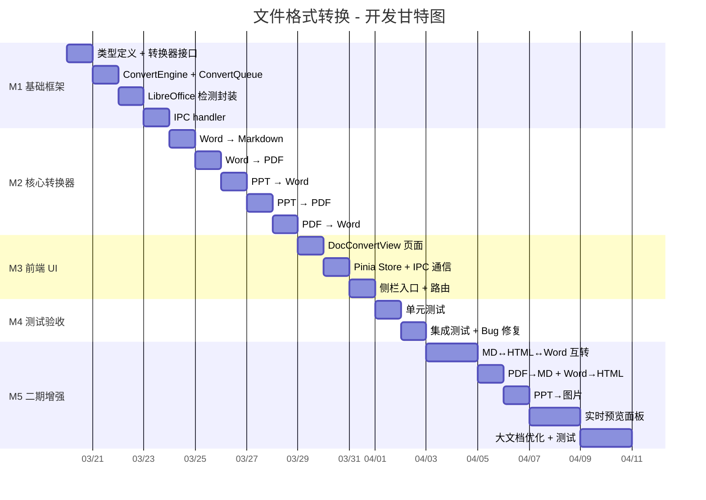

# 文件格式转换 - 开发计划

## MVP 定义

### 必须实现（第一期）

- [ ] 侧栏「文档转换」入口 + 路由注册
- [ ] 转换页面 UI（源/目标格式选择器 + 文件拖拽 + 列表 + 按钮）
- [ ] 类型定义 `electron/core/converter/types.ts`
- [ ] 转换器接口 + 引擎 + 串行队列
- [ ] LibreOffice 检测与安装引导
- [ ] Word → Markdown 转换（图片提取到同名目录）
- [ ] Word → PDF 转换（LibreOffice CLI）
- [ ] PPT → Word 转换（提取文字/图片）
- [ ] PPT → PDF 转换（LibreOffice CLI）
- [ ] PDF → Word 转换（文字层提取）
- [ ] 输出目录选择 + 路径记忆
- [ ] IPC handler + Pinia store
- [ ] 转换结果统计 + 打开输出目录
- [ ] 单元测试（转换器 + 队列）

### 可延后（第二期）

- [ ] Markdown → HTML 转换
- [ ] Markdown → Word 转换
- [ ] HTML → Markdown 转换
- [ ] PDF → Markdown 转换
- [ ] Word → HTML 转换
- [ ] PPT → 图片 转换
- [ ] 实时预览面板（MD/HTML 渲染）
- [ ] 拖拽自动识别源格式
- [ ] 每文件独立进度条
- [ ] 大文档流式处理优化

---

## 里程碑



| 里程碑 | 目标             | 预计完成 | 交付物                                                  |
| ------ | ---------------- | -------- | ------------------------------------------------------- |
| **M1** | 基础框架搭建     | Day 2    | types.ts / ConvertEngine / ConvertQueue / IPC           |
| **M2** | 5 个核心转换器   | Day 6    | WordToMd / WordToPdf / PptToWord / PptToPdf / PdfToWord |
| **M3** | 前端 UI 完整可用 | Day 8    | DocConvertView / Store / 侧栏入口                       |
| **M4** | MVP 测试通过     | Day 10   | 单元测试 + 集成测试 + 修复                              |
| **M5** | 二期全部功能     | Day 16   | 6 个追加转换器 + 预览面板 + 大文档优化                  |

---

## 工时估算

| 阶段              | 任务                                  | 预计工时  | 备注                  |
| ----------------- | ------------------------------------- | --------- | --------------------- |
| **M1 基础框架**   | 类型定义 + 转换器接口                 | 0.5 天    |                       |
|                   | ConvertEngine + ConvertQueue          | 0.5 天    | 参考 ClickerEngine    |
|                   | LibreOffice 检测封装                  | 0.5 天    | child_process         |
|                   | IPC handler（docConvert.handler.ts）  | 0.5 天    | 参考 clicker.handler  |
| **M2 核心转换器** | Word → Markdown（mammoth + turndown） | 1 天      | 含图片提取逻辑        |
|                   | Word → PDF（LibreOffice CLI）         | 0.5 天    | soffice 调用          |
|                   | PPT → Word（pptx 解析 + docx 生成）   | 1 天      | 最复杂的转换器        |
|                   | PPT → PDF（LibreOffice CLI）          | 0.5 天    | 复用 LibreOffice      |
|                   | PDF → Word（pdf-parse + docx）        | 1 天      | 文字层提取            |
| **M3 前端 UI**    | DocConvertView.vue 页面               | 1 天      | 格式选择器 + 文件列表 |
|                   | Pinia Store + IPC 双向通信            | 0.5 天    | 参考 clicker.store    |
|                   | 侧栏入口 + 路由注册                   | 0.5 天    |                       |
| **M4 测试**       | 单元测试（转换器 + 队列）             | 1 天      | vitest + mock         |
|                   | 集成测试 + Bug 修复                   | 1 天      | 缓冲                  |
| **MVP 小计**      |                                       | **10 天** |                       |
| **M5 二期**       | MD↔HTML↔Word 三个转换器               | 1.5 天    |                       |
|                   | PDF→MD + Word→HTML 两个转换器         | 1 天      |                       |
|                   | PPT→图片                              | 0.5 天    |                       |
|                   | 实时预览面板                          | 1.5 天    | MD/HTML 渲染          |
|                   | 大文档优化 + 测试                     | 1.5 天    | 流式处理              |
| **二期小计**      |                                       | **6 天**  |                       |
| **总计**          |                                       | **16 天** |                       |

---

## 依赖项

| 依赖                      | 类型     | 状态     | 阻塞 | 备注                         |
| ------------------------- | -------- | -------- | ---- | ---------------------------- |
| `mammoth` npm 包          | 开发依赖 | 待安装   | 是   | Word 解析核心                |
| `turndown` npm 包         | 开发依赖 | 待安装   | 是   | HTML→Markdown 转换           |
| `marked` npm 包           | 开发依赖 | 待安装   | 否   | 二期 MD→HTML                 |
| `pdf-parse` npm 包        | 开发依赖 | 待安装   | 是   | PDF 文字层提取               |
| `docx` npm 包             | 开发依赖 | 待安装   | 是   | Word 文件生成                |
| `html-docx-js-typescript` | 开发依赖 | 待安装   | 否   | 二期 MD→Word                 |
| LibreOffice 7.x+          | 外部软件 | 用户安装 | 否   | Word/PPT→PDF，运行时可选依赖 |
| `sharp` npm 包            | 已安装   | ✅ 就绪  | 否   | 项目已有，PPT→图片用         |
| `koffi` npm 包            | 已安装   | ✅ 就绪  | 否   | 项目已有（连点器）           |

**安装命令**（MVP 阶段）：

```bash
npm install mammoth turndown pdf-parse docx
npm install -D @types/turndown
```

---

## 风险识别

| 风险                         | 概率 | 影响 | 应对措施                                         |
| ---------------------------- | ---- | ---- | ------------------------------------------------ |
| PPT 解析库兼容性差           | 中   | 高   | 备选方案：LibreOffice 先转 HTML 再提取文字       |
| LibreOffice 安装率低         | 中   | 中   | 提供内嵌安装指引 + 一键跳转下载页                |
| PDF→Word 复杂排版还原率低    | 高   | 中   | 预期管理：明确提示「仅提取文字」，不承诺排版还原 |
| 上百页文档内存溢出           | 中   | 高   | 分块/流式处理 + 内存监控 + 串行队列              |
| mammoth 不支持某些 docx 特性 | 低   | 中   | 降级处理：跳过不支持的元素，日志提示             |
| LibreOffice CLI 并发冲突     | 中   | 中   | 串行队列保证同一时间只有一个 soffice 进程        |
| npm 包安全漏洞               | 低   | 低   | 定期 `npm audit` + 选择活跃维护的包              |

---

## 开发顺序建议

```
Day 1-2:   M1 基础框架（types + engine + queue + IPC + LibreOffice）
Day 3-6:   M2 核心转换器（5 个，先 easy 后 hard）
              ├── Day 3: Word→MD（最重要，先做）
              ├── Day 4: Word→PDF + PPT→PDF（复用 LibreOffice）
              ├── Day 5: PPT→Word（最复杂）
              └── Day 6: PDF→Word
Day 7-8:   M3 前端 UI（页面 + Store + 路由）
Day 9-10:  M4 测试（单测 + 集成 + 修复）
           ── MVP 交付 ──
Day 11-16: M5 二期（6 个追加转换器 + 预览 + 优化）
```

---

## 关联文档

- [需求澄清](./澄清.md)
- [需求分析](./需求分析.md)
- [需求规格](./需求规格.md)
- [产品设计](./产品设计.md)
- [架构设计](./架构设计.md)
