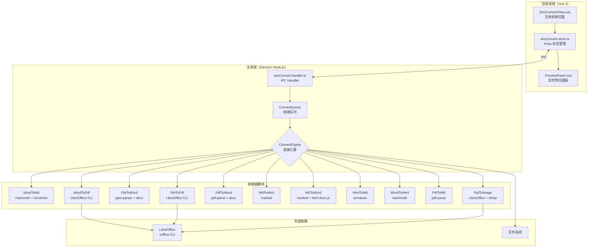
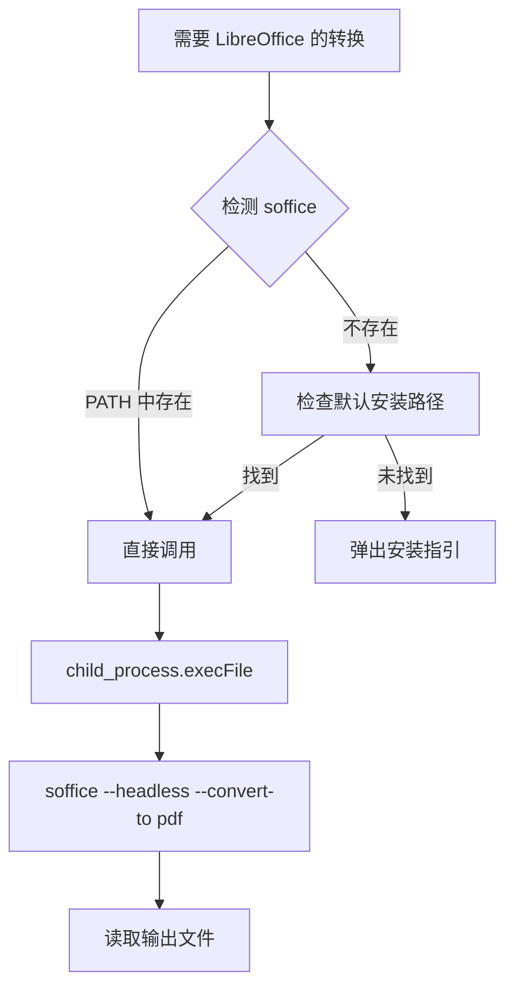
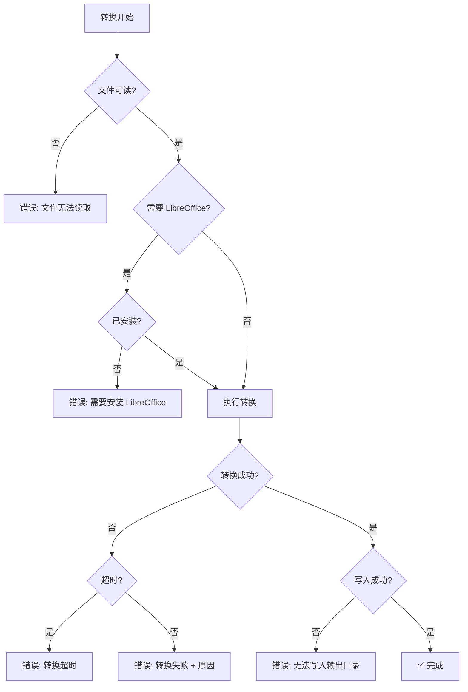

# 文件格式转换 - 架构设计 V1

## 1. 系统架构

### 1.1 整体架构（C4 Container 级）



### 1.2 模块分层


---

## 2. 技术选型

| 层级          | 技术                      | 选型理由                                                |
| ------------- | ------------------------- | ------------------------------------------------------- |
| **UI 框架**   | Vue 3 + Naive UI          | 项目现有技术栈，保持一致                                |
| **状态管理**  | Pinia                     | 项目现有方案，与 Vue 3 深度集成                         |
| **IPC**       | Electron ipcMain/Renderer | 项目已有成熟的 IPC handler 模式（参考 clicker.handler） |
| **Word 解析** | `mammoth` (v1.8+)         | 纯 JS、无原生依赖、活跃维护、提取 docx 结构转 HTML/MD   |
| **HTML→MD**   | `turndown` (v7+)          | 最流行的 HTML→Markdown 转换库、可定制规则               |
| **MD→HTML**   | `marked` (v12+)           | 轻量、GFM 支持、高性能                                  |
| **MD→Word**   | `html-docx-js-typescript` | 将 HTML 转为 docx blob，配合 marked 使用                |
| **PDF 解析**  | `pdf-parse` (v1.1+)       | 纯 JS、提取 PDF 文字层、轻量                            |
| **Word 生成** | `docx` (v8+)              | 编程式生成 .docx、支持段落/表格/图片/样式               |
| **PPT 解析**  | `pptx-parser`             | 解析 .pptx XML 结构、提取幻灯片文字/图片                |
| **PDF 生成**  | LibreOffice CLI           | 最高排版保真度、支持 Word/PPT→PDF、需要安装             |
| **图片处理**  | `sharp`                   | 项目已有依赖、PDF→图片渲染                              |

### LibreOffice 使用策略



**默认安装路径检测顺序：**

1. `C:\Program Files\LibreOffice\program\soffice.exe`
2. `C:\Program Files (x86)\LibreOffice\program\soffice.exe`
3. `PATH` 环境变量

---

## 3. 数据模型

### 3.1 核心类型定义

```typescript
/** 支持的文档格式 */
type DocFormat = "docx" | "pptx" | "pdf" | "md" | "html";

/** 转换方向映射 */
type ConvertDirection = `${DocFormat}-to-${DocFormat}` | "pptx-to-image";

/** 转换任务状态 */
type ConvertStatus = "pending" | "converting" | "completed" | "failed";

/** 单个转换任务 */
interface ConvertTask {
  id: string; // 唯一 ID（uuid）
  inputPath: string; // 源文件绝对路径
  outputPath: string; // 输出文件绝对路径
  direction: ConvertDirection; // 转换方向
  status: ConvertStatus; // 当前状态
  progress: number; // 进度 0-100
  error?: string; // 失败原因
  inputSize: number; // 源文件大小 (bytes)
  outputSize?: number; // 输出文件大小 (bytes)
  startTime?: number; // 开始时间戳
  endTime?: number; // 结束时间戳
}

/** 转换配置 */
interface ConvertConfig {
  direction: ConvertDirection; // 转换方向
  outputDir: string; // 输出目录
  // Word→MD 专用
  imageExtractMode: "folder" | "base64" | "ignore";
  // PPT→Word 专用
  pptLayout: "section" | "continuous";
  // PDF→Word 专用
  pdfMode: "text" | "layout";
}

/** 批量转换进度 */
interface ConvertBatchProgress {
  total: number; // 总文件数
  completed: number; // 已完成
  failed: number; // 失败数
  currentFile: string; // 当前处理文件名
}
```

### 3.2 转换方向矩阵

```typescript
/** 源格式 → 可选目标格式 */
const FORMAT_MATRIX: Record<DocFormat, DocFormat[]> = {
  docx: ["pdf", "md", "html"],
  pptx: ["docx", "pdf"], // 'image' 特殊处理
  pdf: ["docx", "md"],
  md: ["html", "docx"],
  html: ["md"],
};
```

---

## 4. IPC 接口设计

### 4.1 通道定义

| 通道                       | 类型   | 方向    | 说明                  |
| -------------------------- | ------ | ------- | --------------------- |
| `convert:start`            | invoke | 渲染→主 | 开始批量转换          |
| `convert:cancel`           | invoke | 渲染→主 | 取消当前转换          |
| `convert:getStatus`        | invoke | 渲染→主 | 获取队列状态          |
| `convert:checkLibreOffice` | invoke | 渲染→主 | 检测 LibreOffice 安装 |
| `convert:selectOutputDir`  | invoke | 渲染→主 | 打开目录选择对话框    |
| `convert:progress`         | send   | 主→渲染 | 推送单文件进度        |
| `convert:taskDone`         | send   | 主→渲染 | 推送单文件完成        |
| `convert:taskError`        | send   | 主→渲染 | 推送单文件失败        |
| `convert:batchDone`        | send   | 主→渲染 | 推送批量转换完成      |

### 4.2 接口详细定义

```typescript
// ====== 渲染进程 → 主进程（invoke） ======

/** 开始批量转换 */
interface StartConvertRequest {
  files: string[]; // 源文件路径数组
  config: ConvertConfig; // 转换配置
}
interface StartConvertResponse {
  success: boolean;
  taskIds: string[]; // 创建的任务 ID
  error?: string;
}

/** 检测 LibreOffice */
interface CheckLOResponse {
  installed: boolean;
  path?: string; // soffice 路径
  version?: string; // 版本号
}

// ====== 主进程 → 渲染进程（send） ======

/** 单文件进度推送 */
interface ProgressEvent {
  taskId: string;
  progress: number; // 0-100
  stage: string; // '解析中' | '转换中' | '写入中'
}

/** 单文件完成推送 */
interface TaskDoneEvent {
  taskId: string;
  outputPath: string;
  outputSize: number;
  duration: number; // 耗时 ms
}

/** 单文件失败推送 */
interface TaskErrorEvent {
  taskId: string;
  error: string;
  recoverable: boolean; // 是否可重试
}

/** 批量完成推送 */
interface BatchDoneEvent {
  total: number;
  completed: number;
  failed: number;
  duration: number;
}
```

---

## 5. 核心模块设计

### 5.1 转换器接口

```typescript
/** 所有转换器必须实现此接口 */
interface IConverter {
  /** 支持的转换方向 */
  direction: ConvertDirection;

  /** 是否需要 LibreOffice */
  requiresLibreOffice: boolean;

  /** 执行转换 */
  convert(input: ConvertInput): Promise<ConvertOutput>;
}

interface ConvertInput {
  inputPath: string; // 源文件路径
  outputDir: string; // 输出目录
  config: ConvertConfig; // 转换配置
  onProgress: (p: number) => void; // 进度回调
}

interface ConvertOutput {
  outputPath: string; // 输出文件路径
  outputSize: number; // 输出文件大小
  assets?: string[]; // 附属文件（如提取的图片目录）
}
```

### 5.2 转换队列

```mermaid
statechart-v2
```

```typescript
/**
 * ConvertQueue — 串行执行转换任务
 *
 * 设计为串行（非并行），原因：
 * 1. LibreOffice CLI 不支持并发调用
 * 2. 大文档转换内存消耗高，串行可控
 * 3. 进度反馈更直观
 */
class ConvertQueue extends EventEmitter {
  private queue: ConvertTask[] = [];
  private running = false;

  /** 添加任务并开始处理 */
  addTasks(tasks: ConvertTask[]): void;

  /** 取消所有任务 */
  cancel(): void;

  /** 串行处理流程 */
  private async processNext(): Promise<void> {
    // 取队首 → 查找对应 Converter → 执行 → 推送结果 → 处理下个
  }
}
```

### 5.3 文件目录结构

```
electron/
├── core/
│   └── converter/
│       ├── types.ts              # 类型定义
│       ├── ConvertEngine.ts      # 引擎（转换器注册表 + 路由）
│       ├── ConvertQueue.ts       # 串行任务队列
│       ├── libreoffice.ts        # LibreOffice 检测与调用封装
│       └── converters/
│           ├── IConverter.ts     # 转换器接口
│           ├── WordToMd.ts       # mammoth + turndown
│           ├── WordToPdf.ts      # LibreOffice CLI
│           ├── WordToHtml.ts     # mammoth
│           ├── PptToWord.ts      # pptx-parser + docx
│           ├── PptToPdf.ts       # LibreOffice CLI
│           ├── PptToImage.ts     # LibreOffice + sharp
│           ├── PdfToWord.ts      # pdf-parse + docx
│           ├── PdfToMd.ts        # pdf-parse
│           ├── MdToHtml.ts       # marked
│           ├── MdToWord.ts       # marked + html-docx-js
│           └── HtmlToMd.ts       # turndown
├── ipc/
│   └── docConvert.handler.ts    # IPC handler
│
src/
├── stores/
│   └── docConvert.store.ts      # Pinia store
├── views/
│   └── DocConvertView.vue       # 主页面
└── components/
    └── PreviewPanel.vue         # 预览组件（二期）
```

---

## 6. 性能设计

### 6.1 大文档处理策略

| 场景             | 策略                                       |
| ---------------- | ------------------------------------------ |
| Word 上百页      | mammoth 流式解析，分段输出 Markdown        |
| PDF 上百页       | pdf-parse 按页提取，避免一次性加载全部文本 |
| LibreOffice 转换 | child_process 异步执行，不阻塞主进程       |
| 批量多文件       | 串行队列处理，单文件完成即推送结果         |
| 图片提取         | 流式写入磁盘，不在内存中缓存 Buffer        |

### 6.2 内存控制

```
目标：单文件转换内存增量 < 500MB

策略：
- PDF：按页读取，不缓存全量文本
- Word：mammoth 单次解析完释放 DOM
- 图片：sharp 管道流式处理
- 输出：流式写入文件系统
- 队列：串行执行，前一个完成后 GC 再启动下一个
```

### 6.3 超时控制

| 操作类型         | 超时时间 | 处理方式               |
| ---------------- | -------- | ---------------------- |
| LibreOffice 转换 | 120s     | kill 进程 + 标记失败   |
| npm 库解析       | 60s      | AbortController + 失败 |
| 文件读写         | 30s      | 超时标记失败           |

---

## 7. 安全设计

| 关注点           | 策略                                                |
| ---------------- | --------------------------------------------------- |
| **文件访问范围** | 仅读取用户选择的文件，不扫描文件系统                |
| **输出隔离**     | 输出到用户指定目录，不覆盖源文件                    |
| **外部进程**     | LibreOffice 通过 `--headless` 模式运行，无 GUI 交互 |
| **依赖安全**     | 选择活跃维护的 npm 包，定期更新                     |
| **临时文件**     | 转换过程中的临时文件在完成后清理                    |

---

## 8. 错误处理设计



所有错误均：

1. 不阻断批量队列中其他文件
2. 记录到任务的 `error` 字段
3. 推送到渲染进程显示给用户
4. 控制台输出日志

---

## 关联文档

- [需求澄清](./澄清.md)
- [需求分析](./需求分析.md)
- [需求规格](./需求规格.md)
- [产品设计](./产品设计.md)
