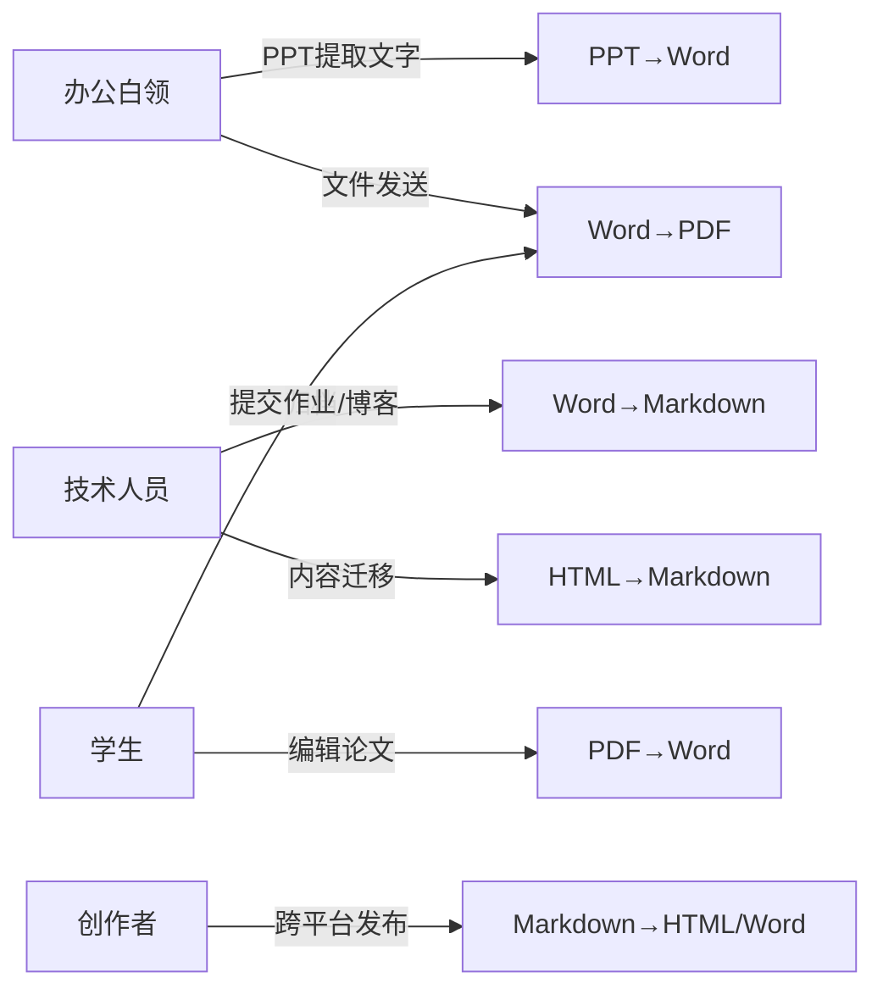
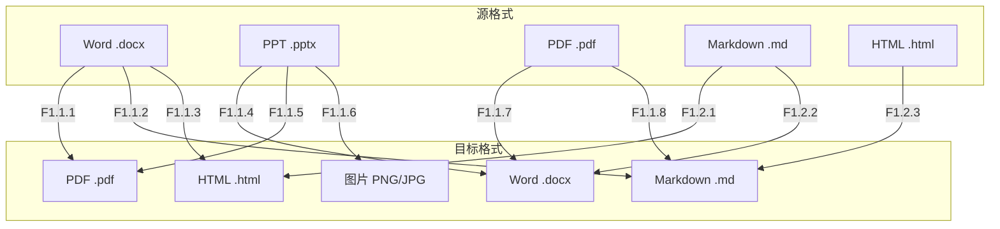
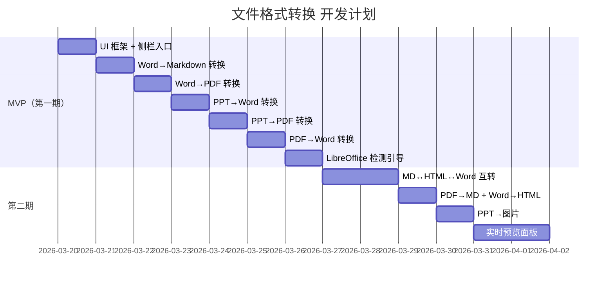

# 文件格式转换 - 需求分析

## 文档信息

| 项目         | 值                            |
| ------------ | ----------------------------- |
| **功能名称** | 文件格式转换                  |
| **所属迭代** | 2026-03 功能迭代-文件格式转换 |
| **创建日期** | 2026-03-19                    |
| **版本**     | V1.0                          |
| **状态**     | ✅ 已确认                     |

---

## 1. 业务背景

### 1.1 现状分析

Universal Toolkit 当前已具备**图片处理**能力（SVG 查看、图片压缩、图片格式转换、连点器），但用户日常办公中另一类高频需求——**文档格式转换**尚未覆盖。

现有市场痛点：

| 痛点                 | 影响                                               |
| -------------------- | -------------------------------------------------- |
| 在线转换工具隐私风险 | 文件上传到第三方服务器，敏感文档存在泄露风险       |
| 付费软件门槛高       | WPS / Adobe Acrobat 等工具需付费订阅               |
| 工具分散             | PPT→Word 用一个工具、Word→PDF 用另一个，操作碎片化 |
| 格式丢失严重         | 免费在线转换质量差，排版/图片常丢失                |
| 不支持批量           | 多数免费工具一次只能转一个文件                     |

### 1.2 业务目标

```mermaid
mindmap
  root((文件格式转换))
    离线安全
      不上传文件
      本地处理
    一站式
      11种转换方向
      统一界面
    批量高效
      多文件并行
      进度可视
    高质量
      LibreOffice 排版
      图片保留
    免费
      零付费
      开源方案
```

**核心目标**：让用户在一个工具内完成日常办公中**所有文档格式转换**需求，离线运行、免费使用、批量处理。

---

## 2. 用户分析

### 2.1 目标用户画像

| 用户角色   | 核心需求                | 使用频率 | 文档规模   |
| ---------- | ----------------------- | -------- | ---------- |
| 办公白领   | PPT→Word 提取、Word→PDF | 每周     | 10-50 页   |
| 技术人员   | Word→MD、HTML→MD        | 每日     | 5-30 页    |
| 学生       | PDF→Word、Word→PDF      | 每月     | 10-100+ 页 |
| 内容创作者 | MD→HTML/Word            | 每周     | 5-20 页    |

### 2.2 用户痛点优先级

| 排名 | 痛点                                | 严重程度 |
| ---- | ----------------------------------- | -------- |
| 1    | 在线工具上传文件不安全              | 🔴 严重  |
| 2    | 免费工具转换质量差（排版/图片丢失） | 🔴 严重  |
| 3    | 一次只能转一个文件，效率低          | 🟡 中等  |
| 4    | 需要安装多个工具才能覆盖不同格式    | 🟡 中等  |
| 5    | 付费订阅成本高                      | 🟢 一般  |

---

## 3. 需求概述

### 3.1 功能矩阵

**共计 11 种转换方向**，覆盖日常办公 95% 的文档转换场景。

### 3.2 核心功能清单

| 模块     | 功能             | 说明                                             | MVP  |
| -------- | ---------------- | ------------------------------------------------ | ---- |
| 转换核心 | Word → PDF       | LibreOffice CLI 排版转换                         | ✅   |
| 转换核心 | Word → Markdown  | mammoth 解析 + turndown 转换，图片提取到同名目录 | ✅   |
| 转换核心 | Word → HTML      | mammoth 直出 HTML                                | 二期 |
| 转换核心 | PPT → Word       | 解析 pptx 结构，提取文字/图片生成 docx           | ✅   |
| 转换核心 | PPT → PDF        | LibreOffice CLI                                  | ✅   |
| 转换核心 | PPT → 图片       | LibreOffice → PDF → sharp 逐页渲染               | 二期 |
| 转换核心 | PDF → Word       | pdf-parse 提取文字层 + docx 生成                 | ✅   |
| 转换核心 | PDF → Markdown   | pdf-parse + Markdown 格式化                      | 二期 |
| 转换核心 | MD → HTML        | marked / markdown-it 渲染                        | 二期 |
| 转换核心 | MD → Word        | marked → HTML → html-docx-js                     | 二期 |
| 转换核心 | HTML → MD        | turndown 转换                                    | 二期 |
| UI       | 独立侧栏页面     | 侧栏入口「文档转换」                             | ✅   |
| UI       | 源/目标格式选择  | 两个下拉框联动过滤                               | ✅   |
| UI       | 批量文件列表     | 拖拽/选择添加，进度/状态显示                     | ✅   |
| UI       | 实时预览面板     | MD/HTML 转换结果右侧渲染                         | 二期 |
| 基础设施 | LibreOffice 检测 | 首次使用自动检测 soffice，引导安装               | ✅   |
| 基础设施 | 输出目录管理     | 可选择 + 路径记忆                                | ✅   |

### 3.3 已排除功能

| 功能          | 排除原因                                  |
| ------------- | ----------------------------------------- |
| Excel → CSV   | 用户确认：使用频率低，可由 Excel 自身完成 |
| OCR 识别      | 技术复杂度过高，非本次迭代范围            |
| 视频/音频转换 | 与文档转换定位不同                        |
| 在线/云端转换 | 与离线安全定位冲突                        |

---

## 4. 约束条件

### 4.1 技术约束

| 约束                 | 说明                                                |
| -------------------- | --------------------------------------------------- |
| **LibreOffice 依赖** | PPT→PDF、Word→PDF 需安装 LibreOffice 7.x+，约 500MB |
| **PDF 扫描件不支持** | 仅支持有文字层的 PDF，扫描件需 OCR 不在范围内       |
| **排版还原有限**     | PDF→Word 复杂排版（多栏、表格嵌套）还原率约 70-80%  |
| **内存限制**         | 上百页大文档需流式处理，单文件转换内存 < 500MB      |

### 4.2 平台约束

| 约束         | 说明                               |
| ------------ | ---------------------------------- |
| **操作系统** | Windows 10+                        |
| **运行环境** | Electron（Node.js 主进程执行转换） |
| **离线运行** | 全部本地处理，不依赖网络           |

### 4.3 用户体验约束

| 约束           | 说明                                       |
| -------------- | ------------------------------------------ |
| **零学习成本** | 选格式 → 拖文件 → 点转换，三步完成         |
| **保留原文件** | 永远不删除/覆盖源文件                      |
| **错误友好**   | 中文提示，无技术术语，单文件失败不阻断批量 |

---

## 5. 成功指标

| 指标              | 目标值                         |
| ----------------- | ------------------------------ |
| 转换成功率        | > 95%（排除扫描件/损坏文件）   |
| 10 页文档转换耗时 | < 10 秒                        |
| 上百页文档        | 可完成，不崩溃，内存 < 500MB   |
| 用户操作步骤      | ≤ 3 步（选格式→加文件→点转换） |
| 排版保真度        | Word→PDF > 95%，PDF→Word > 70% |

---

## 6. 分期策略

| 阶段 | 交付内容                                                         | 工时   |
| ---- | ---------------------------------------------------------------- | ------ |
| MVP  | UI + Word→MD/PDF + PPT→Word/PDF + PDF→Word + LibreOffice 检测    | 5-7 天 |
| 二期 | MD↔HTML↔Word + PDF→MD + PPT→图片 + Word→HTML + 实时预览 + 大文档 | 4-6 天 |

---

## 7. 风险识别

| 风险                  | 影响  | 缓解措施                                    |
| --------------------- | ----- | ------------------------------------------- |
| LibreOffice 安装门槛  | 🟡 中 | 提供一键引导 + 检测提示，降低安装摩擦       |
| PDF→Word 排版还原率低 | 🟡 中 | 明确告知用户「仅提取文字」，预期管理        |
| 大文档内存溢出        | 🔴 高 | 流式处理 + 分块读取 + 并发限制              |
| PPT 解析兼容性        | 🟡 中 | 优先支持 .pptx（Office 2007+），.ppt 不支持 |
| 第三方库停止维护      | 🟢 低 | 选择活跃维护的 npm 包，预留替换接口         |

---

## 关联文档

- [需求澄清](./澄清.md)
- [需求规格](./需求规格.md)
