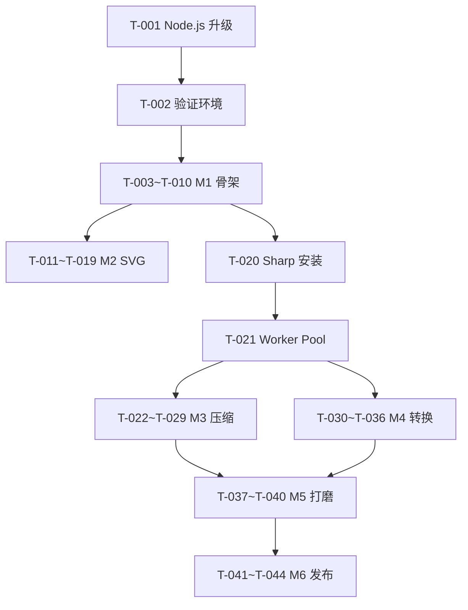

# Electron 图片工具库 - 任务清单

## 基本信息

| 项目         | 值                                                                                   |
| ------------ | ------------------------------------------------------------------------------------ |
| **功能名称** | Electron 图片工具库（ImageKit）                                                      |
| **所属迭代** | 2026-03-Electron工具库                                                               |
| **创建日期** | 2026-03-16                                                                           |
| **前置文档** | [开发计划](./工具库-开发计划.md) · [架构设计](../architecture/工具库-架构设计-V1.md) |

## 概览

| 项目       | 数值      |
| ---------- | --------- |
| 总任务数   | 38        |
| 可并行 [P] | 12        |
| 预计工时   | 24h       |
| 里程碑数   | 6 (M1-M6) |

---

## M0：环境准备

| #     | 任务                   | 复杂度 | 并行 | 文件     | 状态 |
| ----- | ---------------------- | ------ | ---- | -------- | ---- |
| T-001 | 升级 Node.js 到 20 LTS | S      | -    | 系统环境 | ⬜   |
| T-002 | 验证 npm / node 版本   | S      | -    | 系统环境 | ⬜   |

### 详细任务

- [ ] [S] **T-001**: 安装 Node.js 20 LTS
  - 验收标准: `node -v` 输出 `v20.x.x`
- [ ] [S] **T-002**: 验证依赖安装 (依赖 T-001)
  - `cd image-toolkit && npm install && npm run dev` 正常启动
  - 验收标准: Electron 窗口弹出

---

## M1：项目骨架

| #     | 任务                       | 复杂度 | 并行 | 文件                              | 状态      |
| ----- | -------------------------- | ------ | ---- | --------------------------------- | --------- |
| T-003 | Electron 窗口配置          | S      | -    | `electron/main.ts`                | ✅ 已完成 |
| T-004 | preload 安全桥接           | M      | -    | `electron/preload.ts`             | ✅ 已完成 |
| T-005 | Naive UI 暗色主题 Provider | S      | -    | `src/App.vue`                     | ✅ 已完成 |
| T-006 | 侧栏导航 + 路由            | M      | -    | `src/App.vue`, `src/main.ts`      | ✅ 已完成 |
| T-007 | IPC 文件对话框 Handler     | M      | -    | `electron/main.ts`                | ✅ 已完成 |
| T-008 | 全局拖拽 composable        | M      | -    | `src/composables/useFileDrop.ts`  | ⬜        |
| T-009 | 剪贴板粘贴 composable      | S      | P    | `src/composables/useClipboard.ts` | ⬜        |
| T-010 | 全局样式 + 滚动条美化      | S      | P    | `src/App.vue`                     | ✅ 已完成 |

### 详细任务

- [x] [S] **T-003**: Electron 窗口 1280×800、暗色背景、最小尺寸 - `electron/main.ts`
- [x] [M] **T-004**: contextBridge 暴露 ipcRenderer - `electron/preload.ts`
- [x] [S] **T-005**: `<NConfigProvider :theme="darkTheme">` 全局包裹 - `src/App.vue`
- [x] [M] **T-006**: `NLayoutSider` + `NMenu` + vue-router 三路由 - `src/App.vue`, `src/main.ts`
- [x] [M] **T-007**: `dialog:openFiles`, `dialog:openFolder`, `dialog:saveDir` - `electron/main.ts`
- [ ] [M] **T-008**: 监听 dragover/drop, 解析文件路径 - `src/composables/useFileDrop.ts`
  - 验收标准: 拖拽文件到窗口自动添加到当前页
- [ ] [P][S] **T-009**: Ctrl+V 读取剪贴板图片 - `src/composables/useClipboard.ts`
  - 验收标准: 粘贴图片自动添加到压缩/转换队列
- [x] [P][S] **T-010**: 自定义滚动条、全局 reset - `src/App.vue`

---

## M2：SVG 批量查看（P1）

| #     | 任务                          | 复杂度 | 并行 | 文件                          | 状态        |
| ----- | ----------------------------- | ------ | ---- | ----------------------------- | ----------- |
| T-011 | SVG 文件夹读取 IPC            | S      | -    | `electron/main.ts`            | ✅ 已完成   |
| T-012 | SVG Viewer 页面骨架           | M      | -    | `src/views/SvgViewer.vue`     | ✅ 已完成   |
| T-013 | 宫格视图 + 选中状态           | M      | -    | `src/views/SvgViewer.vue`     | ✅ 已完成   |
| T-014 | 列表视图                      | S      | -    | `src/views/SvgViewer.vue`     | ✅ 已完成   |
| T-015 | 实时搜索过滤                  | S      | P    | `src/views/SvgViewer.vue`     | ✅ 已完成   |
| T-016 | 颜色选择器 + 批量改色         | M      | -    | `src/views/SvgViewer.vue`     | ✅ 基础完成 |
| T-017 | cheerio 深度 SVG 解析改色     | M      | -    | `electron/ipc/svg.handler.ts` | ⬜          |
| T-018 | resvg-js PNG 导出 @1x @2x @3x | L      | -    | `electron/ipc/svg.handler.ts` | ⬜          |
| T-019 | SVG Pinia Store               | S      | P    | `src/stores/svg.store.ts`     | ⬜          |

### 详细任务

- [x] [S] **T-011**: `svg:readFolder` IPC，读取文件夹所有 .svg - `electron/main.ts`
- [x] [M] **T-012**: 工具栏 + 拖拽区 + 内容区骨架 - `src/views/SvgViewer.vue`
- [x] [M] **T-013**: `NGrid` 响应式宫格，点击选中/取消 - `src/views/SvgViewer.vue`
- [x] [S] **T-014**: 列表布局，显示文件名 + 大小 - `src/views/SvgViewer.vue`
- [x] [P][S] **T-015**: `computed` 过滤 + `NInput` 搜索框 - `src/views/SvgViewer.vue`
- [x] [M] **T-016**: `NColorPicker` + 简单 replace fill/stroke - `src/views/SvgViewer.vue`
  - ⚠️ 基础版，后续 T-017 用 cheerio 深度解析
- [ ] [M] **T-017**: cheerio 解析 SVG DOM，精确替换颜色属性 - `electron/ipc/svg.handler.ts`
  - 验收标准: 保留非颜色属性，只修改 fill/stroke；处理嵌套 group
- [ ] [L] **T-018**: resvg-js 渲染 SVG → PNG Buffer @1x @2x @3x，保存到指定目录 - `electron/ipc/svg.handler.ts`
  - 验收标准: 导出 3 个尺寸 PNG 文件，质量无损
- [ ] [P][S] **T-019**: 提取 SvgViewer 状态到 Pinia Store - `src/stores/svg.store.ts`
  - 验收标准: 文件列表、选中状态、视图模式在 store 中管理

---

## M3：图片压缩（P2）

| #     | 任务                          | 复杂度 | 并行 | 文件                                  | 状态 |
| ----- | ----------------------------- | ------ | ---- | ------------------------------------- | ---- |
| T-020 | Sharp 安装 + electron-rebuild | M      | -    | `package.json`                        | ⬜   |
| T-021 | Worker 线程池管理器           | L      | -    | `electron/workers/pool.ts`            | ⬜   |
| T-022 | 压缩 Worker 实现              | L      | -    | `electron/workers/compress.worker.ts` | ⬜   |
| T-023 | 压缩 IPC Handler              | M      | -    | `electron/ipc/compress.handler.ts`    | ⬜   |
| T-024 | 有损压缩逻辑                  | M      | P    | `electron/workers/compress.worker.ts` | ⬜   |
| T-025 | 无损压缩逻辑                  | S      | P    | `electron/workers/compress.worker.ts` | ⬜   |
| T-026 | 智能推荐逻辑                  | M      | -    | `electron/workers/compress.worker.ts` | ⬜   |
| T-027 | 压缩页面 UI（替换模拟数据）   | M      | -    | `src/views/ImageCompress.vue`         | ⬜   |
| T-028 | 压缩前后对比面板（真实数据）  | M      | -    | `src/views/ImageCompress.vue`         | ⬜   |
| T-029 | 压缩 Pinia Store              | S      | P    | `src/stores/compress.store.ts`        | ⬜   |

### 详细任务

- [ ] [M] **T-020**: `npm install sharp` + `npx electron-rebuild` - `package.json`
  - 验收标准: Sharp 在 Electron 主进程中可正常 require
- [ ] [L] **T-021**: `WorkerPool` 类，管理 `os.cpus()-1` 个 Worker - `electron/workers/pool.ts`
  - 验收标准: 并行处理文件，逐个回调结果
- [ ] [L] **T-022**: 接收 `{filePath, mode, quality}`，返回 `{compressedBuffer, size}` - `electron/workers/compress.worker.ts`
  - 验收标准: 处理完单个文件后向父线程发送结果
- [ ] [M] **T-023**: 注册 `compress:start` IPC，调度 Worker Pool - `electron/ipc/compress.handler.ts`
  - 验收标准: 通过 `webContents.send` 逐文件推送进度
- [ ] [P][M] **T-024**: `sharp().jpeg({quality})` / `.png({quality})` / `.webp({quality})` - `compress.worker.ts`
  - 验收标准: JPEG/PNG/WebP 压缩后文件明显缩小
- [ ] [P][S] **T-025**: `sharp().png({compressionLevel:9})` / `.webp({lossless:true})` - `compress.worker.ts`
  - 验收标准: 输出文件与原图像素级一致
- [ ] [M] **T-026**: 根据文件类型和大小自动选择最佳参数 - `compress.worker.ts`
  - 验收标准: JPEG→lossy 80%，PNG→lossless，WebP→lossy 85%
- [ ] [M] **T-027**: 替换模拟数据为真实 IPC 调用，显示真实文件大小 - `src/views/ImageCompress.vue`
  - 验收标准: 显示原始大小、压缩大小、节省百分比
- [ ] [M] **T-028**: 真实图片 Blob URL 预览 + 原图/压缩图对比 - `src/views/ImageCompress.vue`
  - 验收标准: 可视化对比，支持点击切换不同文件
- [ ] [P][S] **T-029**: 提取压缩状态到 Pinia Store - `src/stores/compress.store.ts`

---

## M4：格式转换（P3）

| #     | 任务                        | 复杂度 | 并行 | 文件                                 | 状态 |
| ----- | --------------------------- | ------ | ---- | ------------------------------------ | ---- |
| T-030 | 转换 Worker 实现            | M      | -    | `electron/workers/convert.worker.ts` | ⬜   |
| T-031 | 转换 IPC Handler            | M      | -    | `electron/ipc/convert.handler.ts`    | ⬜   |
| T-032 | Sharp 全格式转换封装        | M      | -    | `electron/workers/convert.worker.ts` | ⬜   |
| T-033 | 预设尺寸 resize             | S      | P    | `electron/workers/convert.worker.ts` | ⬜   |
| T-034 | ICO 多尺寸生成              | M      | -    | `electron/ipc/convert.handler.ts`    | ⬜   |
| T-035 | 转换页面 UI（替换模拟数据） | M      | -    | `src/views/FormatConvert.vue`        | ⬜   |
| T-036 | 转换 Pinia Store            | S      | P    | `src/stores/convert.store.ts`        | ⬜   |

### 详细任务

- [ ] [M] **T-030**: 接收 `{filePath, targetFormat, size}`，返回转换后 Buffer - `convert.worker.ts`
  - 验收标准: Worker 内完成单文件转换
- [ ] [M] **T-031**: 注册 `convert:start` IPC，调度 Worker Pool - `electron/ipc/convert.handler.ts`
  - 验收标准: 逐文件推送转换进度
- [ ] [M] **T-032**: `sharp().toFormat(fmt, options)` 封装 - `convert.worker.ts`
  - 验收标准: JPEG↔PNG↔WebP↔AVIF↔TIFF↔BMP 互转正确
- [ ] [P][S] **T-033**: `sharp().resize(size, size, {fit:'contain'})` - `convert.worker.ts`
  - 验收标准: 输出图片尺寸与预设一致
- [ ] [M] **T-034**: `png-to-ico` 集成，生成含 16/32/48/256 的 .ico - `convert.handler.ts`
  - 验收标准: .ico 文件可在 Windows 资源管理器正确显示
- [ ] [M] **T-035**: 替换模拟数据为真实 IPC 调用 - `src/views/FormatConvert.vue`
  - 验收标准: 真实文件名 + 格式 badge + 输出路径
- [ ] [P][S] **T-036**: 提取转换状态到 Pinia Store - `src/stores/convert.store.ts`

---

## M5：体验打磨

| #     | 任务                        | 复杂度 | 并行 | 文件                             | 状态 |
| ----- | --------------------------- | ------ | ---- | -------------------------------- | ---- |
| T-037 | 全局拖拽自动分发            | S      | -    | `src/composables/useFileDrop.ts` | ⬜   |
| T-038 | 全局错误处理 + 跳过异常文件 | S      | P    | `electron/ipc/*.handler.ts`      | ⬜   |
| T-039 | 过渡动画 + loading 态       | S      | P    | `src/views/*.vue`                | ⬜   |
| T-040 | 快捷键绑定                  | S      | P    | `electron/main.ts`               | ⬜   |

### 详细任务

- [ ] [S] **T-037**: 根据当前路由自动将拖拽文件分发到对应页面 - `useFileDrop.ts`
  - 验收标准: /svg 页拖入→加载 SVG，/compress 页拖入→添加压缩队列
- [ ] [P][S] **T-038**: try-catch 包裹，异常文件跳过并 toast 提示 - `electron/ipc/*.handler.ts`
  - 验收标准: 损坏文件不中断批量处理
- [ ] [P][S] **T-039**: 页面切换动画 + 处理中 skeleton - `src/views/*.vue`
- [ ] [P][S] **T-040**: Ctrl+O 打开文件、Ctrl+Shift+O 打开文件夹 - `electron/main.ts`

---

## M6：打包发布

| #     | 任务                  | 复杂度 | 并行 | 文件                     | 状态 |
| ----- | --------------------- | ------ | ---- | ------------------------ | ---- |
| T-041 | electron-builder 配置 | M      | -    | `electron-builder.json5` | ⬜   |
| T-042 | 应用图标生成          | S      | P    | `resources/icon.png`     | ⬜   |
| T-043 | Windows NSIS 打包测试 | M      | -    | —                        | ⬜   |
| T-044 | README 项目文档       | S      | P    | `README.md`              | ⬜   |

### 详细任务

- [ ] [M] **T-041**: appId、productName、文件关联、NSIS 配置 - `electron-builder.json5`
  - 验收标准: `npm run build` 输出 .exe 可安装运行
- [ ] [P][S] **T-042**: 1024×1024 应用图标 + 自动生成各尺寸 - `resources/icon.png`
- [ ] [M] **T-043**: 安装→启动→三功能验证→卸载 全流程测试
- [ ] [P][S] **T-044**: 项目介绍、截图、安装说明、开发指南 - `README.md`

---

## 依赖关系图

---

## 进度统计

| 状态      | 数量                    | 占比 |
| --------- | ----------------------- | ---- |
| ✅ 已完成 | 12                      | 27%  |
| ⬜ 待开发 | 32                      | 73%  |
| 🚫 阻塞中 | 1（T-001 Node.js 升级） | —    |

---

## 变更记录

| 日期       | 版本 | 变更内容 | 变更人 |
| ---------- | ---- | -------- | ------ |
| 2026-03-16 | V1.0 | 初始版本 | —      |
