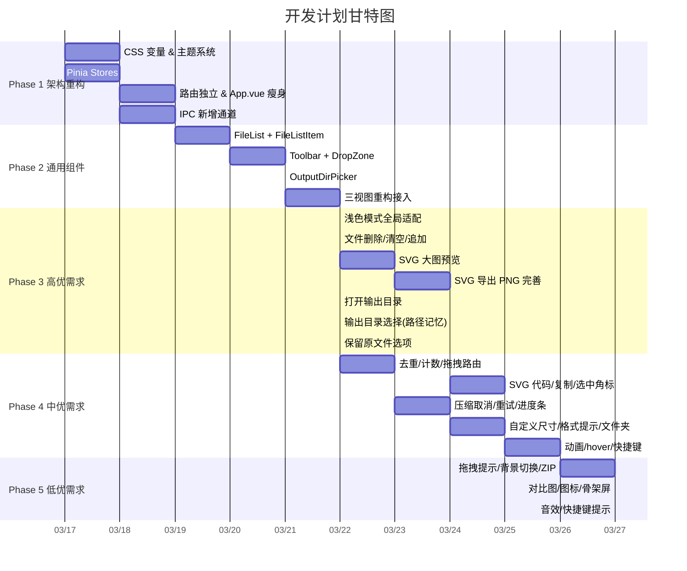

# Image Toolkit 操作优化 - 开发计划

## 基本信息

| 项目         | 值                              |
| ------------ | ------------------------------- |
| **功能名称** | Image Toolkit 操作优化          |
| **所属迭代** | 2026-03-17 功能迭代             |
| **架构版本** | V2.0                            |
| **创建日期** | 2026-03-17                      |
| **预计工期** | 5 天（2026-03-17 ~ 2026-03-21） |
| **总任务数** | 40 项                           |

---

## MVP 拆解总览

---

## Phase 1：架构基础重构（Day 1 上午）

> **目标**：偿还架构债务，为后续功能开发打下基础。

### 里程碑：M1 — 架构基础就绪

| #     | 任务                                                            | 涉及文件                                          | 工时  | 依赖  |
| ----- | --------------------------------------------------------------- | ------------------------------------------------- | ----- | ----- |
| T-001 | 创建 CSS 变量文件 `variables.css`，定义浅色/深色双主题 token    | `src/styles/variables.css` [新]                   | 0.5h  | —     |
| T-002 | 创建 `transitions.css`，定义 TransitionGroup 入退场动画         | `src/styles/transitions.css` [新]                 | 0.25h | —     |
| T-003 | 创建 `fileStore` — 文件列表状态管理（追加/删除/去重/清空/计数） | `src/stores/file.store.ts` [新]                   | 1h    | —     |
| T-004 | 创建 `settingsStore` — 用户偏好持久化（输出路径/音效/主题）     | `src/stores/settings.store.ts` [新]               | 0.5h  | T-010 |
| T-005 | 创建 `undoStore` — 撤销/重做栈（容量 50）                       | `src/stores/undo.store.ts` [新]                   | 1h    | —     |
| T-006 | 路由独立到 `router/index.ts`                                    | `src/router/index.ts` [新], `src/main.ts`         | 0.25h | —     |
| T-007 | 抽取 `useTheme` composable，App.vue 瘦身                        | `src/composables/useTheme.ts` [新], `src/App.vue` | 0.5h  | T-001 |
| T-008 | 创建 IPC 类型定义 `ipc.types.ts`                                | `electron/types/ipc.types.ts` [新]                | 0.25h | —     |
| T-009 | 新增 `system.handler.ts` — `system:openPath` 打开文件夹         | `electron/ipc/system.handler.ts` [新]             | 0.25h | —     |
| T-010 | 新增 `config.ts` — electron-store 配置管理 + IPC 通道           | `electron/core/config.ts` [新]                    | 0.5h  | —     |

**验收标准**：

- [ ] 浅色/深色主题切换后所有 CSS 变量正确生效
- [ ] `fileStore` 通过单元测试（追加去重、删除、清空、计数）
- [ ] `undoStore` 通过单元测试（推入/撤销/重做/容量限制）
- [ ] 路由切换正常，App.vue 行数减少 30%+

---

## Phase 2：通用组件抽取（Day 1 下午 ~ Day 2 上午）

> **目标**：抽取三视图中的重复逻辑为通用组件，消除代码重复。

### 里程碑：M2 — 通用组件库就绪

| #     | 任务                                                               | 涉及文件                                  | 工时 | 依赖                |
| ----- | ------------------------------------------------------------------ | ----------------------------------------- | ---- | ------------------- |
| T-011 | 创建 `FileListItem.vue` — 单文件行（名称/大小/状态/进度/删除按钮） | `src/components/FileListItem.vue` [新]    | 1h   | T-001               |
| T-012 | 创建 `FileList.vue` — 虚拟列表容器 + TransitionGroup               | `src/components/FileList.vue` [新]        | 1h   | T-011               |
| T-013 | 创建 `Toolbar.vue` — 工具栏（文件计数/清空/插槽）                  | `src/components/Toolbar.vue` [新]         | 0.5h | —                   |
| T-014 | 创建 `DropZone.vue` — 拖拽区域（空状态 + 格式提示）                | `src/components/DropZone.vue` [新]        | 0.5h | —                   |
| T-015 | 创建 `OutputDirPicker.vue` — 输出目录选择器（路径记忆）            | `src/components/OutputDirPicker.vue` [新] | 0.5h | T-004, T-010        |
| T-016 | 升级 `useFileDrop.ts` — 格式识别 + 自动路由分发                    | `src/composables/useFileDrop.ts`          | 0.5h | T-003               |
| T-017 | 重构 `ImageCompress.vue` — 接入 fileStore + 通用组件               | `src/views/ImageCompress.vue`             | 1h   | T-012, T-013, T-003 |
| T-018 | 重构 `FormatConvert.vue` — 接入 fileStore + 通用组件               | `src/views/FormatConvert.vue`             | 1h   | T-012, T-013, T-003 |
| T-019 | 重构 `SvgViewer.vue` — 接入通用组件                                | `src/views/SvgViewer.vue`                 | 1h   | T-012, T-013        |
| T-020 | App.vue 接入 DropZone + useFileDrop（替代内联拖拽）                | `src/App.vue`                             | 0.5h | T-014, T-016        |

**验收标准**：

- [ ] 三个视图均使用 `FileList`、`Toolbar` 组件，无重复文件列表代码
- [ ] `ImageCompress` 的 `selectFiles` 变为追加模式（F1.1.3）
- [ ] 文件列表支持单个删除（×按钮）和清空列表（F1.1.1~2）
- [ ] 拖拽文件后自动识别格式并路由到对应模块

---

## Phase 3：第一批高优需求（Day 2 下午 ~ Day 3）

> **目标**：完成 7 项核心体验优化。

### 里程碑：M3 — 核心体验上线

| #     | 任务                                                         | 对应需求       | 涉及文件                                  | 工时 | 依赖         |
| ----- | ------------------------------------------------------------ | -------------- | ----------------------------------------- | ---- | ------------ |
| T-021 | 全局搜索替换硬编码色值 → CSS 变量                            | F5.1           | 全部 `.vue` 文件                          | 1h   | T-001        |
| T-022 | 创建 `PreviewModal.vue` — SVG 大图预览（缩放/平移）          | F2.1.1         | `src/components/PreviewModal.vue` [新]    | 2h   | —            |
| T-023 | `SvgViewer` 接入 PreviewModal，点击缩略图弹出预览            | F2.1.1         | `src/views/SvgViewer.vue`                 | 0.5h | T-022        |
| T-024 | 创建 `ExportPngDialog.vue` — 导出设置弹窗（倍率+自定义像素） | F2.2.2         | `src/components/ExportPngDialog.vue` [新] | 1h   | —            |
| T-025 | 升级 `svg:exportPng` IPC — 支持自定义像素宽高                | F2.2.2         | `electron/ipc/svg.handler.ts`             | 0.5h | —            |
| T-026 | `SvgViewer` 接入 ExportPngDialog                             | F2.2.2         | `src/views/SvgViewer.vue`                 | 0.5h | T-024, T-025 |
| T-027 | 压缩/转换完成后显示"打开输出文件夹"按钮                      | F3.1.5, F4.1.4 | `ImageCompress.vue`, `FormatConvert.vue`  | 0.5h | T-009        |
| T-028 | 压缩模块接入 `OutputDirPicker`（路径记忆）                   | F3.1.1         | `src/views/ImageCompress.vue`             | 0.5h | T-015        |
| T-029 | 格式转换增加"保留原文件"开关（默认开启）                     | F4.1.1         | `FormatConvert.vue`, `convert.handler.ts` | 0.5h | T-004        |

**验收标准**：

- [ ] 浅色模式下全部文字/背景正确显示，无白底白字问题
- [ ] 点击 SVG 缩略图弹出大图预览，支持滚轮缩放和拖拽平移
- [ ] SVG 导出 PNG 支持倍率选择（1x/2x/3x）和自定义像素宽高
- [ ] 压缩/转换完成后可一键打开输出文件夹
- [ ] 压缩模块有输出目录选择器，路径跨会话记忆
- [ ] 格式转换有"保留原文件"开关，默认打开

---

## Phase 4：第二批中优需求（Day 3 ~ Day 4）

> **目标**：效率提升功能全部落地。

### 里程碑：M4 — 效率提升完成

| #     | 任务                                                        | 对应需求 | 涉及文件                                   | 工时  | 依赖  |
| ----- | ----------------------------------------------------------- | -------- | ------------------------------------------ | ----- | ----- |
| T-030 | `fileStore.addFiles` 增加去重逻辑 + Toast 提示              | F1.1.4   | `src/stores/file.store.ts`                 | 0.25h | T-003 |
| T-031 | `Toolbar` 显示"共 N 个文件"标签                             | F1.1.5   | `src/components/Toolbar.vue`               | 0.25h | T-013 |
| T-032 | `useFileDrop` 混合格式拖入时自动拆分到对应模块              | F1.2.1   | `src/composables/useFileDrop.ts`           | 0.5h  | T-016 |
| T-033 | `PreviewModal` 增加 SVG 源代码查看标签页 + 复制按钮         | F2.1.2~3 | `src/components/PreviewModal.vue`          | 1h    | T-022 |
| T-034 | SVG 选中状态增加勾选角标 ✓ + 选中计数                       | F2.2.1   | `src/views/SvgViewer.vue`                  | 0.5h  | —     |
| T-035 | 压缩中取消 — IPC `compress:abort` + UI "取消"按钮           | F3.1.4   | `compress.handler.ts`, `ImageCompress.vue` | 1h    | —     |
| T-036 | 压缩失败单独重试按钮                                        | F3.2.3   | `FileListItem.vue`, `ImageCompress.vue`    | 0.5h  | T-011 |
| T-037 | 每个文件增加压缩进度条动画                                  | F3.2.1   | `FileListItem.vue`                         | 0.5h  | T-011 |
| T-038 | 压缩前预览缩略图 + 一键重新压缩                             | F3.1.2~3 | `ImageCompress.vue`                        | 0.5h  | —     |
| T-039 | 格式转换自定义宽高（锁定比例）                              | F4.1.2   | `FormatConvert.vue`, `convert.handler.ts`  | 1h    | —     |
| T-040 | 格式兼容提示（源=目标时弹出提示）                           | F4.1.3   | `FormatConvert.vue`                        | 0.25h | —     |
| T-041 | 格式转换"选择文件夹"批量加载                                | F4.1.5   | `FormatConvert.vue`                        | 0.5h  | —     |
| T-042 | 转换失败详情（hover 显示错误原因）                          | F4.2.1   | `FileListItem.vue`                         | 0.25h | T-011 |
| T-043 | `FileListItem` + `FileList` 添加 TransitionGroup 入退场动画 | F5.2     | `FileList.vue`, `FileListItem.vue`         | 0.5h  | T-002 |
| T-044 | `FileListItem` hover 背景高亮 + 阴影提升                    | F5.3     | `FileListItem.vue`                         | 0.25h | T-001 |
| T-045 | 创建 `useKeyboard.ts` — Ctrl+Z/Ctrl+A/Delete 快捷键         | F1.3.1~3 | `src/composables/useKeyboard.ts` [新]      | 1h    | T-005 |

**验收标准**：

- [ ] 重复文件拖入自动去重并 Toast 提示
- [ ] 混合格式拖入自动拆分到 SVG/压缩模块
- [ ] SVG 预览弹窗可切换源代码 + 一键复制
- [ ] 压缩过程可取消，失败文件可单独重试
- [ ] 格式转换支持自定义宽高（锁定比例）
- [ ] Ctrl+Z 撤销、Ctrl+A 全选、Delete 删除正常工作
- [ ] 文件列表项有 hover 高亮和入退场动画

---

## Phase 5：第三批低优需求（Day 4 ~ Day 5）

> **目标**：锦上添花功能完成，打磨体验。

### 里程碑：M5 — 迭代完成

| #     | 任务                                              | 对应需求 | 涉及文件                                                      | 工时  | 依赖  |
| ----- | ------------------------------------------------- | -------- | ------------------------------------------------------------- | ----- | ----- |
| T-046 | `DropZone` 按模块显示接受格式提示                 | F1.2.2   | `src/components/DropZone.vue`                                 | 0.25h | T-014 |
| T-047 | `DropZone` 空状态增加拖拽动画指引                 | F1.2.3   | `src/components/DropZone.vue`                                 | 0.25h | T-014 |
| T-048 | `PreviewModal` SVG 背景色切换（棋盘格/白色/深色） | F2.1.4   | `src/components/PreviewModal.vue`                             | 0.5h  | T-022 |
| T-049 | SVG 批量打包 ZIP 下载                             | F2.2.3   | `svg.handler.ts`, `SvgViewer.vue`                             | 1h    | —     |
| T-050 | 压缩结果前后大小对比柱状图                        | F3.2.2   | `ImageCompress.vue`                                           | 0.5h  | —     |
| T-051 | 文件格式专属图标/颜色标签                         | F4.2.2   | `FileListItem.vue`                                            | 0.25h | T-011 |
| T-052 | 大量文件加载骨架屏占位                            | F5.5     | `FileList.vue`                                                | 0.5h  | T-012 |
| T-053 | 创建 `useAudio.ts` — 成功/失败音效（可关闭）      | F5.4     | `src/composables/useAudio.ts` [新], `src/assets/sounds/` [新] | 0.5h  | T-004 |
| T-054 | `Toolbar` 按钮 Tooltip 显示快捷键提示             | F1.3.4   | `src/components/Toolbar.vue`                                  | 0.25h | T-013 |

**验收标准**：

- [ ] 拖拽遮罩按模块显示"支持 SVG 格式"等提示
- [ ] SVG 预览支持棋盘格/白色/深色背景切换
- [ ] 选中 SVG 可打包 ZIP 下载
- [ ] 压缩完成后有前后大小对比柱状图
- [ ] 文件项按格式显示不同图标
- [ ] 操作完成/失败有提示音（设置中可关闭）

---

## 工时汇总

| Phase            | 任务数 | 预计工时 | 计划日期                |
| ---------------- | ------ | -------- | ----------------------- |
| Phase 1 架构重构 | 10     | 5h       | 03-17 上午              |
| Phase 2 通用组件 | 10     | 7.5h     | 03-17 下午 ~ 03-18 上午 |
| Phase 3 高优需求 | 9      | 7h       | 03-18 下午 ~ 03-19      |
| Phase 4 中优需求 | 16     | 7.5h     | 03-19 ~ 03-20           |
| Phase 5 低优需求 | 9      | 4h       | 03-20 ~ 03-21           |
| **合计**         | **54** | **31h**  | **5 天**                |

---

## 风险与缓冲

| 风险                            | 影响                   | 应对                                         |
| ------------------------------- | ---------------------- | -------------------------------------------- |
| 虚拟列表与 TransitionGroup 冲突 | 动画不生效或性能下降   | 预留 0.5d 调试，降级方案：仅虚拟列表无动画   |
| electron-store 与打包兼容性     | 配置无法持久化         | 降级方案：使用 localStorage                  |
| SVG 缩放/平移实现复杂度         | PreviewModal 开发超时  | 优先实现基础缩放，拖拽平移降为可选           |
| 撤销栈边界 case 复杂            | 参数变更撤销需录放快照 | Phase 4 先支持文件列表撤销，参数撤销后续增强 |

---

## 关联文档

| 文档        | 路径                                                                     |
| ----------- | ------------------------------------------------------------------------ |
| V2 架构设计 | [工具库-架构设计-V2.md](../architecture/工具库-架构设计-V2.md)           |
| 需求规格    | [功能迭代-需求规格.md](../demand/2026.3.17功能迭代/功能迭代-需求规格.md) |
| 需求澄清    | [功能迭代-澄清.md](../demand/2026.3.17功能迭代/功能迭代-澄清.md)         |
| 原始需求    | [功能迭代-需求.md](../demand/2026.3.17功能迭代/功能迭代-需求.md)         |

## 变更记录

| 日期       | 版本 | 变更内容     | 变更人 |
| ---------- | ---- | ------------ | ------ |
| 2026-03-17 | V1.0 | 初始开发计划 | —      |
