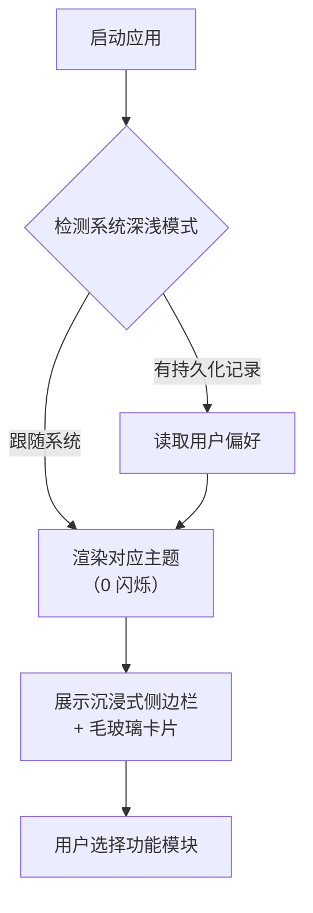
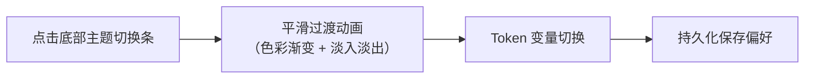
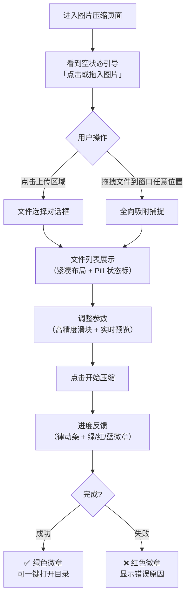

# 全站 UI 现代化重构 (Glassmorphism) - 产品设计 V1

## 1. 功能概述

将现有基础 Naive UI 默认主题全面升级为 **Glassmorphism（毛玻璃质感）** 设计语言，通过沉浸式空间背景、多维阴影、大圆角卡片、微动效和深色模式平滑切换，让整个桌面工具拥有媲美一线产品的现代高级感与人性化体验。

---

## 2. 目标用户

| 用户角色 | 特征 | 使用场景 |
|----------|------|----------|
| 视觉内容创作者 | 对界面审美有较高要求，日常处理大量图片 | 长时间使用工具，需要舒适不刺眼的界面 |
| 效率办公用户 | 注重操作流畅度，厌恶多余步骤 | 批量文件处理，希望一切"开箱即用" |
| 夜间/暗光环境用户 | 在低光照下工作，偏好深色界面 | 需要自动跟随系统深浅模式切换 |
| 新手用户 | 初次接触工具，对功能不熟悉 | 需要界面提供清晰的引导和状态反馈 |

---

## 3. 用户流程

### 3.1 首次启动体验



### 3.2 深浅模式切换



### 3.3 典型操作流程（以图片压缩为例）



---

## 4. 功能清单

### 4.1 设计基建

- [ ] CSS Token 体系：注入全套 Light/Dark 颜色变量
- [ ] 全局光效背景：彩色光晕渐变映衬毛玻璃
- [ ] 毛玻璃材质：`backdrop-filter: blur(12px)` 标准化
- [ ] 圆角规范：12px / 16px / 24px 三级体系
- [ ] 阴影体系：多层次 box-shadow 空间感
- [ ] Naive UI 主题覆写：Primary Color / Border Radius / Shadow

### 4.2 微交互体系

- [ ] Hover 抬升：`translateY(-2px)` + 阴影扩展
- [ ] 按钮动态发光：Primary 按钮带色彩阴影呼吸
- [ ] 页面切换过渡：FadeIn + SlideUp 组合动画
- [ ] 焦点轮廓环：发光 Focus Ring 替代浏览器默认蓝框

### 4.3 人性化体验

- [ ] 大面积宽容触控：充足的按钮 Padding 和拖拽热区
- [ ] 智能空状态：图标 + 引导文字 + 明确操作入口
- [ ] 禁用态反馈：`cursor: not-allowed` + 按钮灰化
- [ ] 状态微章（Pill Badge）：颜色感知的进度标识
- [ ] 一键快捷默认值：合理初始值 + 进阶修改入口
- [ ] 配置状态记忆：页面切换不丢失设置
- [ ] 长文本截断 + Tooltip：`text-overflow: ellipsis` + hover 提示
- [ ] 危险操作拦截：警示红色 + 二次确认 / Undo 机会
- [ ] 键盘导航与热键：Tab 焦点切换 + 全局热键映射
- [ ] 深浅模式持久化：跟随系统 + 本地存储
- [ ] 骨架屏 / 加载遮罩：避免 DOM 闪烁白屏

### 4.4 核心框架改造 (`App.vue`)

- [ ] 漂浮式侧边导航（去除硬分离线条）
- [ ] 品牌色渐变 Logo 文字
- [ ] 活跃菜单项圆角高亮
- [ ] 底部条形深浅模式切换器
- [ ] 无边框窗口 + 自定义拖拽区域 (`-webkit-app-region: drag`)

### 4.5 模块改造

- [ ] SVG 查看器：悬浮搜索药丸条 + 分段布局切换器 + Hover 染色卡片
- [ ] 图片压缩：左右不对称布局 + 高精度范围滑块 + 全向拖拽吸附
- [ ] 连点器：设置组卡片重组 + 分段选择器 + Mac 风格键帽显示
- [ ] 文档/格式转换：联排下拉选择器 + 轻量拖拽区 + Pill Badge 文件队列

---

## 5. 界面原型

### 5.1 整体布局结构

```
┌─────────────────────────────────────────────────────────┐
│ [-webkit-app-region: drag]     (无边框，自定义拖拽区域)   │
├──────────┬──────────────────────────────────────────────┤
│          │                                              │
│  渐变    │           ┌──────────────────────┐           │
│  Logo    │           │                      │           │
│          │           │   毛玻璃内容卡片       │           │
│  ─────   │           │   (backdrop-filter)   │           │
│  菜单项1  │           │                      │           │
│ [活跃态]  │           │   圆角 16px           │           │
│  菜单项2  │           │   阴影 multi-layer    │           │
│  菜单项3  │           │                      │           │
│  菜单项4  │           └──────────────────────┘           │
│  菜单项5  │                                              │
│          │      彩色光晕背景 (radial-gradient)            │
│          │                                              │
│  ─────   │                                              │
│ [🌙/☀️]  │                                              │
│ 主题切换  │                                              │
└──────────┴──────────────────────────────────────────────┘
```

### 5.2 侧边栏活跃态

```
  ┌──────────────────┐
  │  💎 Universal     │  ← 品牌色渐变文字
  │     Toolkit       │
  ├──────────────────┤
  │                  │
  │  ╭─────────────╮ │
  │  │ 📷 图片压缩  │ │  ← 活跃态：primary-light 背景
  │  ╰─────────────╯ │      全圆角包裹
  │    📄 格式转换    │
  │    🖱️ 连点器     │
  │    📝 文档转换    │  ← 非活跃态：透明背景
  │    🎨 SVG 查看    │      hover 时轻微高亮
  │                  │
  │  ┈┈┈┈┈┈┈┈┈┈┈┈┈  │
  │  ╭─────────────╮ │
  │  │ ☀️ 浅色模式  │ │  ← 条形切换器
  │  ╰─────────────╯ │
  └──────────────────┘
```

### 5.3 空状态引导

```
  ╭───────────────────────────────────────╮
  │                                       │
  │         ╭──────────╮                  │
  │         │  📁      │  ← 大尺寸圆形    │
  │         │  (icon)  │     白底容器      │
  │         ╰──────────╯                  │
  │                                       │
  │     点击选择文件，或拖拽到这里           │
  │                                       │
  │  支持 JPEG / PNG / WebP / AVIF / TIFF  │
  │                                       │
  ╰───────────────────────────────────────╯
```

---

## 6. 交互设计

### 6.1 核心交互规范

| 交互行为 | 视觉反馈 | 技术实现 |
|----------|----------|----------|
| 鼠标悬停卡片 | 卡片上浮 2px + 阴影扩大 | `transform: translateY(-2px)` + `transition: 0.2s` |
| 鼠标悬停按钮 | 发光阴影增强 | `box-shadow` 模糊半径增加 |
| 点击 Primary 按钮 | 轻微下沉 1px + 阴影缩小 | `translateY(1px)` + `active` 伪类 |
| 切换页面 | 旧页淡出 + 新页从下方滑入 | Vue `<Transition>` `fade-slide-up` |
| 深浅模式切换 | 全局色值平滑过渡 | CSS `transition: background 0.35s, color 0.35s` |
| 拖拽文件到窗口 | 拖拽区域高亮 + 呼吸脉冲 | `dragover` 事件 + CSS `animation: pulse` |
| 长文本截断 | 省略号 + 悬浮显示全文 | `text-overflow: ellipsis` + `<NTooltip>` |
| 危险操作（清空） | 按钮变红 + 弹出确认气泡 | Danger 色调 + `NPopconfirm` |

### 6.2 动画时间规范

| 类型 | 时间 | 缓动函数 |
|------|------|----------|
| 微交互（hover/active） | 150~200ms | `ease` |
| 状态切换（主题/页面） | 300~400ms | `cubic-bezier(0.4, 0, 0.2, 1)` |
| 入场动画 | 400~500ms | `cubic-bezier(0, 0, 0.2, 1)` |
| 加载骨架屏 | 1.5s 循环 | `linear` |

---

## 7. 边界情况

| 场景 | 处理方式 |
|------|----------|
| 首次启动无主题偏好 | 自动检测系统 `prefers-color-scheme`，无法检测则默认浅色 |
| 超长文件名（>60 字符） | 中间截断 `abc...xyz.png` + hover Tooltip 显示完整路径 |
| 大量文件同时拖入（>100） | 前端分批渲染 + 显示"已加载 n/N" 进度 |
| `backdrop-filter` 性能问题 | 检测 GPU 加速可用性，降级为半透明实色背景 |
| 旧版 Windows 不支持圆角窗口 | 不开启 `transparent: true`，在应用内部渲染圆角 |
| 切换主题时组件尚未挂载 | Preload 脚本预读主题值，首帧即应用正确底色 |
| Naive UI 弹窗/下拉层样式不一致 | 通过 `themeOverrides` 统一覆写组件内阴影和圆角 |
| 用户快速连续切换主题 | 防抖处理，300ms 内仅执行最后一次切换 |
| 键盘 Tab 导航到不可见元素 | 隐藏元素设置 `tabindex="-1"`，仅可见元素可聚焦 |
| 清空文件列表误操作 | 弹出 `NPopconfirm` 确认，或提供 5 秒 Undo 按钮 |

---

## 关联文档

- [需求规格说明书](./需求规格说明书.md)
- [UI 重构澄清](./全站UI重构-澄清.md)
