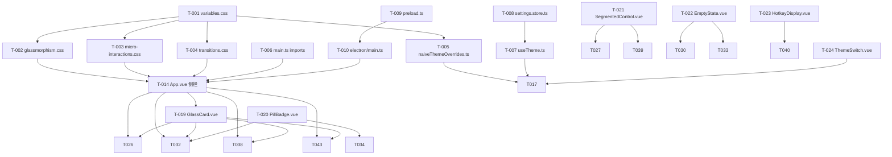

# 全站 UI 现代化重构 (Glassmorphism) - 任务清单

## 概览

| 项目 | 数值 |
|------|------|
| 总任务数 | 48 |
| 可并行 `[P]` | 18 |
| 预计总工时 | 38h (含缓冲) |
| 里程碑数 | 6 |

## 依赖关系总览



---

## M1: 设计系统 & 基建

### US-001: 建立 Glassmorphism 设计系统

> 作为开发者，我需要一套完整的 CSS Token / 材质 / 微交互基础设施，使后续所有 UI 组件可以一致地使用 Glassmorphism 样式。

| 任务 | 复杂度 | 并行 | 文件 | 状态 |
|------|--------|------|------|------|
| T-001 重写 Design Tokens | M | - | `src/styles/variables.css` | ⬜ |
| T-002 毛玻璃材质 CSS | S | ✅ | `src/styles/glassmorphism.css` | ⬜ |
| T-003 微交互 CSS | S | ✅ | `src/styles/micro-interactions.css` | ⬜ |
| T-004 页面转场动画 | S | ✅ | `src/styles/transitions.css` | ⬜ |
| T-005 Naive UI 覆写 | S | ✅ | `src/theme/naiveThemeOverrides.ts` | ⬜ |
| T-006 样式入口导入 | S | - | `src/main.ts` | ⬜ |

### 详细任务

- [ ] [M] **T-001**: 重写 `variables.css` — 全量 Light/Dark Token (颜色/几何/阴影/毛玻璃/动画) - `src/styles/variables.css`
  - 验收标准: `:root` 和 `[data-theme="dark"]` 各含完整 token 集；浏览器 DevTools 可实时切换验证

- [ ] [P][S] **T-002**: 新建 `glassmorphism.css` — `.glass-bg` 光效背景 + `.glass-card` 毛玻璃卡片 + `.glass-sidebar` 侧栏材质 (依赖 T-001) - `src/styles/glassmorphism.css`
  - 验收标准: 各类名可直接附加到元素并呈现毛玻璃效果；`backdrop-filter: blur(12px)` 生效

- [ ] [P][S] **T-003**: 新建 `micro-interactions.css` — `.btn-glow` 按钮发光 + `:focus-visible` 焦点环 + `.hover-lift` 悬浮抬升 (依赖 T-001) - `src/styles/micro-interactions.css`
  - 验收标准: Primary 按钮具备发光阴影；Tab 键聚焦时显示紫色光环而非浏览器默认蓝框

- [ ] [P][S] **T-004**: 重构 `transitions.css` — `.page-fade-up` 替代 `.page-slide`；保留并增强列表动画 (依赖 T-001) - `src/styles/transitions.css`
  - 验收标准: 页面切换呈现 FadeIn + SlideUp 组合效果，时长 300ms

- [ ] [P][S] **T-005**: 新建 `naiveThemeOverrides.ts` — 导出 `lightThemeOverrides` / `darkThemeOverrides` 对象 (依赖 T-001) - `src/theme/naiveThemeOverrides.ts`
  - 验收标准: NButton / NInput / NSelect / NCard 圆角统一 12~16px；Primary 色为 `#5c6bc0`

- [ ] [S] **T-006**: 更新 `main.ts` — 添加 `glassmorphism.css` / `micro-interactions.css` 导入 (依赖 T-002, T-003) - `src/main.ts`
  - 验收标准: 三个新样式文件均被加载且无控制台报错

---

### US-002: 主题运行时三态切换

> 作为用户，我希望应用能跟随系统深浅模式，或手动切换 Light / Dark，且启动时不闪白屏。

| 任务 | 复杂度 | 并行 | 文件 | 状态 |
|------|--------|------|------|------|
| T-007 useTheme 重构 | M | - | `src/composables/useTheme.ts` | ⬜ |
| T-008 settings.store 扩展 | S | - | `src/stores/settings.store.ts` | ⬜ |
| T-009 preload 主题预读 | S | - | `electron/preload.ts` | ⬜ |
| T-010 无边框窗口 | M | - | `electron/main.ts` | ⬜ |
| T-011 M1 自测 | S | - | — | ⬜ |

### 详细任务

- [ ] [S] **T-008**: 扩展 `settings.store.ts` — theme 类型由 `'light' | 'dark'` 扩展为 `'light' | 'dark' | 'system'`；初始化增加 system 判断 - `src/stores/settings.store.ts`
  - 验收标准: store 的 theme 可设置为 'system' 并持久化到 electron-store

- [ ] [M] **T-007**: 重构 `useTheme.ts` — 三态切换 (Light / Dark / System)；监听 `matchMedia('prefers-color-scheme: dark')`；返回 `resolvedIsDark` + `themeMode`；返回 Naive UI `themeOverrides` computed (依赖 T-005, T-008) - `src/composables/useTheme.ts`
  - 验收标准: System 模式下跟随 OS 主题变化实时响应；手动切换 300ms 防抖生效

- [ ] [S] **T-009**: 重构 `preload.ts` — 在 `contextBridge` 之前同步读取 electron-store 主题值；立即注入 `document.documentElement.setAttribute('data-theme', ...)` - `electron/preload.ts`
  - 验收标准: 冷启动时首帧即为用户偏好底色，无白屏闪烁

- [ ] [M] **T-010**: 重构 `electron/main.ts` — `frame: false` 无边框窗口；根据持久化主题动态设置 `backgroundColor`；自定义最小化/最大化/关闭窗口控制 IPC (依赖 T-009) - `electron/main.ts`
  - 验收标准: 窗口无原生标题栏；可通过自定义按钮或快捷键执行最小化/最大化/关闭

- [ ] [S] **T-011**: M1 阶段自测 — 验证 Token 热切换 + 无边框窗口拖拽 + Light/Dark/System 三态切换 (依赖 T-001~T-010)
  - 验收标准: 所有 M1 交付物功能正常，无控制台报错

---

## M2: 应用外壳 & 共享组件

### US-003: 漂浮式毛玻璃侧边栏

> 作为用户，我希望看到现代感的漂浮侧边栏，带渐变 Logo、圆角高亮菜单项、底部主题切换条。

| 任务 | 复杂度 | 并行 | 文件 | 状态 |
|------|--------|------|------|------|
| T-012 窗口控制按钮组 | S | ✅ | `src/components/ui/WindowControls.vue` | ⬜ |
| T-013 顶部 drag 区域 | S | ✅ | `src/App.vue` | ⬜ |
| T-014 漂浮侧栏 | L | - | `src/App.vue` | ⬜ |
| T-015 渐变 Logo | S | - | `src/App.vue` | ⬜ |
| T-016 圆角活跃菜单 | S | - | `src/App.vue` | ⬜ |
| T-017 接入 ThemeSwitch + 覆写 | S | - | `src/App.vue` | ⬜ |
| T-018 光效背景 + 过渡 | S | - | `src/App.vue` | ⬜ |

### 详细任务

- [ ] [P][S] **T-012**: 新建 `WindowControls.vue` — 自定义最小化/最大化/关闭按钮组件，通过 IPC 调用窗口操作；实现 `-webkit-app-region: no-drag` - `src/components/ui/WindowControls.vue`
  - 验收标准: 点击三个按钮分别触发最小化/最大化/关闭

- [ ] [P][S] **T-013**: App.vue — 顶部 drag 区域，设置 `-webkit-app-region: drag`；接入 WindowControls (依赖 T-012) - `src/App.vue`
  - 验收标准: 拖拽窗口顶部区域可移动窗口；不覆盖控制按钮

- [ ] [L] **T-014**: App.vue — 移除 `NLayoutSider`，替换为自定义 `<aside>` 漂浮式侧栏；应用 `.glass-sidebar`；自定义 `<nav>` 菜单替代 `NMenu` (依赖 T-002, T-013) - `src/App.vue`
  - 验收标准: 侧栏呈毛玻璃质感，无硬分离线条；菜单项可正常导航

- [ ] [S] **T-015**: App.vue — 品牌色渐变 Logo 文字 `linear-gradient(135deg, #667eea, #764ba2)` (依赖 T-014) - `src/App.vue`
  - 验收标准: Logo 文字呈紫蓝渐变，背景剪裁正确

- [ ] [S] **T-016**: App.vue — 活跃菜单项 `--primary-light` 背景 + Icon/文字着色 `--primary` + 全圆角包裹 (依赖 T-014) - `src/App.vue`
  - 验收标准: 当前路由菜单项有明显高亮区分；非活跃态 hover 时轻微高亮

- [ ] [S] **T-017**: App.vue — 接入 `ThemeSwitch.vue` 底部切换器 + `NConfigProvider` 使用 `naiveThemeOverrides` (依赖 T-005, T-007, T-024) - `src/App.vue`
  - 验收标准: 底部切换器可切换 Light/Dark/System；Naive UI 组件样式跟随覆写配置

- [ ] [S] **T-018**: App.vue — 主内容区应用 `.glass-bg` 光效背景 + 路由过渡改为 `page-fade-up` (依赖 T-002, T-004) - `src/App.vue`
  - 验收标准: 主内容区域可见微弱的紫蓝色光晕；页面切换有 FadeIn + SlideUp 动画

---

### US-004: Glassmorphism 共享 UI 组件

> 作为开发者，我需要一组可复用的 UI 原子组件，以加速各视图的 Glassmorphism 改造。

| 任务 | 复杂度 | 并行 | 文件 | 状态 |
|------|--------|------|------|------|
| T-019 GlassCard | S | ✅ | `src/components/ui/GlassCard.vue` | ⬜ |
| T-020 PillBadge | S | ✅ | `src/components/ui/PillBadge.vue` | ⬜ |
| T-021 SegmentedControl | M | ✅ | `src/components/ui/SegmentedControl.vue` | ⬜ |
| T-022 EmptyState | S | ✅ | `src/components/ui/EmptyState.vue` | ⬜ |
| T-023 HotkeyDisplay | S | ✅ | `src/components/ui/HotkeyDisplay.vue` | ⬜ |
| T-024 ThemeSwitch | M | ✅ | `src/components/ui/ThemeSwitch.vue` | ⬜ |
| T-025 M2 自测 | S | - | — | ⬜ |

### 详细任务

- [ ] [P][S] **T-019**: 新建 `GlassCard.vue` — Props: `hoverable`, `padding`, `radius` ('md'|'lg'|'xl')；封装毛玻璃卡片 + hover 抬升 - `src/components/ui/GlassCard.vue`
  - 验收标准: 卡片呈半透明毛玻璃质感；hoverable 模式下 hover 有 translateY(-2px) + 阴影扩展

- [ ] [P][S] **T-020**: 新建 `PillBadge.vue` — Props: `status` ('success'|'error'|'processing'|'waiting'), `label`；色彩感知药丸微章 - `src/components/ui/PillBadge.vue`
  - 验收标准: 四种状态对应不同颜色（绿/红/蓝律动/灰）；processing 有呼吸动画

- [ ] [P][M] **T-021**: 新建 `SegmentedControl.vue` — Props: `options`, `modelValue`, `size`；分段选择器 + 滑动选中动画 - `src/components/ui/SegmentedControl.vue`
  - 验收标准: 选中项有滑块过渡动画；v-model 双向绑定正常；Dark 模式下对比度足够

- [ ] [P][S] **T-022**: 新建 `EmptyState.vue` — Props: `icon`, `title`, `description`, `actionLabel`；Emit: `action`；空状态引导 - `src/components/ui/EmptyState.vue`
  - 验收标准: 居中展示图标/文字/操作按钮；按钮 click 触发 action 事件

- [ ] [P][S] **T-023**: 新建 `HotkeyDisplay.vue` — Props: `keys` (string[])；Mac 风格键帽 + 代码字体 + 内阴影 - `src/components/ui/HotkeyDisplay.vue`
  - 验收标准: 键帽呈圆角矩形浮雕效果；代码字体；Dark 模式适配

- [ ] [P][M] **T-024**: 新建 `ThemeSwitch.vue` — Props: `modelValue` ('light'|'dark'|'system')；底部条形三态切换器 + 图标动画 - `src/components/ui/ThemeSwitch.vue`
  - 验收标准: 三态可切换；当前选中态有高亮背景滑块；触发 update:modelValue 事件

- [ ] [S] **T-025**: M2 阶段自测 — 侧栏交互 + 所有共享组件独立渲染 + Light/Dark 双模式验证 (依赖 T-012~T-024)
  - 验收标准: App 外壳功能完整；6 个 UI 组件在两种主题下均正常显示

---

## M3: 视图改造 (Batch 1)

### US-005: SVG 查看器现代化

> 作为用户，我希望 SVG 查看器拥有悬浮搜索栏、分段布局切换器和 hover 染色卡片。

| 任务 | 复杂度 | 并行 | 文件 | 状态 |
|------|--------|------|------|------|
| T-026 悬浮药丸搜索栏 | M | - | `src/views/SvgViewer.vue` | ⬜ |
| T-027 布局切换器 | S | - | `src/views/SvgViewer.vue` | ⬜ |
| T-028 Hover 染色卡片 | M | - | `src/views/SvgViewer.vue` | ⬜ |
| T-029 SVG 深色验证 | S | - | — | ⬜ |

### 详细任务

- [ ] [M] **T-026**: SvgViewer — 重构顶部工具栏为悬浮药丸搜索栏 (Pill shape)；搜索框深度圆角 + 毛玻璃背景 (依赖 T-019) - `src/views/SvgViewer.vue`
  - 验收标准: 搜索栏悬浮于内容上方；药丸形状 `border-radius: 999px`；毛玻璃透明

- [ ] [S] **T-027**: SvgViewer — 替换布局选择下拉为 `SegmentedControl`；添加滑动过渡 (依赖 T-021) - `src/views/SvgViewer.vue`
  - 验收标准: 网格/列表布局可切换；SegmentedControl 滑块动画流畅

- [ ] [M] **T-028**: SvgViewer — SVG 卡片使用 `GlassCard`；Hover 时边框染色 + 微放大 `scale(1.02)` (依赖 T-019) - `src/views/SvgViewer.vue`
  - 验收标准: 卡片悬浮时有主色边框高亮 + 微放大效果

- [ ] [S] **T-029**: SvgViewer — Dark 模式逐项验证；修复对比度/可见性问题 (依赖 T-026~T-028)
  - 验收标准: Dark 模式下所有文字、图标、卡片对比度达 WCAG AA

---

### US-006: 图片压缩现代化

> 作为用户，我希望图片压缩页面有不对称布局、高精度滑块和全向拖拽吸附。

| 任务 | 复杂度 | 并行 | 文件 | 状态 |
|------|--------|------|------|------|
| T-030 不对称布局 | M | - | `src/views/ImageCompress.vue` | ⬜ |
| T-031 高精度滑块 | S | - | `src/views/ImageCompress.vue` | ⬜ |
| T-032 EmptyState + 拖拽 | M | - | `src/views/ImageCompress.vue` | ⬜ |
| T-033 压缩深色验证 | S | - | — | ⬜ |
| T-034 组件适配 Batch1 | S | - | `src/components/*` | ⬜ |

### 详细任务

- [ ] [M] **T-030**: ImageCompress — 弃用全宽平铺，重构为左右不对称布局（左侧控制面板 + 右侧文件列表）；使用 `GlassCard` 包裹 (依赖 T-019, T-022) - `src/views/ImageCompress.vue`
  - 验收标准: 左侧参数面板约 35% 宽；右侧列表区 65% 宽；两区域均为 GlassCard

- [ ] [S] **T-031**: ImageCompress — 高精度范围滑块重新样式化；轨道/滑块/进度条使用 Token 颜色 - `src/views/ImageCompress.vue`
  - 验收标准: 滑块拖动流畅；实时显示数值；样式与 Glassmorphism 整体风格一致

- [ ] [M] **T-032**: ImageCompress — 无文件时显示 `EmptyState` 引导；背景卡片全区域均可触发拖拽 (依赖 T-022, T-020) - `src/views/ImageCompress.vue`
  - 验收标准: 空状态显示引导图标和操作入口；拖拽文件到卡片任意区域均可捕获

- [ ] [S] **T-033**: ImageCompress — Dark 模式逐项验证 (依赖 T-030~T-032)
  - 验收标准: Dark 模式下卡片/滑块/列表对比度正常

- [ ] [S] **T-034**: 组件适配 — `FileList.vue` / `FileListItem.vue` / `PreviewPanel.vue` 使用新 Token + GlassCard + PillBadge (依赖 T-019, T-020) - `src/components/FileList.vue`, `src/components/FileListItem.vue`, `src/components/PreviewPanel.vue`
  - 验收标准: 三个共享组件在新设计系统下正常渲染；PillBadge 替代原进度/状态显示

---

## M4: 视图改造 (Batch 2)

### US-007: 格式转换 & 文档转换现代化

> 作为用户，我希望格式转换页面有联排下拉选择器、PillBadge 文件队列和轻量拖拽区。

| 任务 | 复杂度 | 并行 | 文件 | 状态 |
|------|--------|------|------|------|
| T-035 联排选择器 | M | - | `src/views/FormatConvert.vue` | ⬜ |
| T-036 拖拽区 + EmptyState | S | - | `src/views/FormatConvert.vue` | ⬜ |
| T-037 PillBadge 文件队列 | S | - | `src/views/FormatConvert.vue` | ⬜ |
| T-038 格式转换深色验证 | S | - | — | ⬜ |
| T-039 文档转换复用方案 | M | - | `src/views/DocConvertView.vue` | ⬜ |
| T-040 文档转换 PillBadge | S | - | `src/views/DocConvertView.vue` | ⬜ |
| T-041 文档转换深色验证 | S | - | — | ⬜ |
| T-042 组件适配 Batch2 | S | - | `src/components/*` | ⬜ |

### 详细任务

- [ ] [M] **T-035**: FormatConvert — 实现两个 `NSelect` 并列 + 中间融合箭头 UI；使用 GlassCard 包裹 (依赖 T-019) - `src/views/FormatConvert.vue`
  - 验收标准: 双下拉框水平排列，中间有方向箭头；整体在 GlassCard 内

- [ ] [S] **T-036**: FormatConvert — 轻量拖拽区弱化边框 + EmptyState 引导 (依赖 T-022) - `src/views/FormatConvert.vue`
  - 验收标准: 拖拽区无厚重边框仅有虚线暗示；空状态有引导图标

- [ ] [S] **T-037**: FormatConvert — 文件队列紧凑排版 + PillBadge 状态标 (等待/完成/失败) (依赖 T-020) - `src/views/FormatConvert.vue`
  - 验收标准: 移除厚重进度条，改用 PillBadge；队列紧凑可快速扫视

- [ ] [S] **T-038**: FormatConvert — Dark 模式验证 (依赖 T-035~T-037)
  - 验收标准: 所有元素 Dark 模式对比度正常

- [ ] [M] **T-039**: DocConvertView — 复用 FormatConvert 联排选择器 + 拖拽区方案；适配文档格式选项 (依赖 T-035, T-019) - `src/views/DocConvertView.vue`
  - 验收标准: 文档转换页面布局与格式转换一致；格式选项正确

- [ ] [S] **T-040**: DocConvertView — PillBadge 状态管理 + HotkeyDisplay 快捷键提示 (依赖 T-020, T-023) - `src/views/DocConvertView.vue`
  - 验收标准: 文件状态由 PillBadge 展示；关键操作旁显示热键提示

- [ ] [S] **T-041**: DocConvertView — Dark 模式验证 (依赖 T-039~T-040)
  - 验收标准: Dark 模式全量通过

- [ ] [S] **T-042**: 组件适配 — `OutputDirPicker.vue` / `Toolbar.vue` 使用新 Token + GlassCard (依赖 T-019) - `src/components/OutputDirPicker.vue`, `src/components/Toolbar.vue`
  - 验收标准: 两个组件在新设计系统下正常渲染

---

## M5: 视图改造 (Batch 3)

### US-008: 连点器 & 水印工具现代化

> 作为用户，我希望连点器有分组卡片、分段选择器和键帽显示；水印工具有毛玻璃参数面板。

| 任务 | 复杂度 | 并行 | 文件 | 状态 |
|------|--------|------|------|------|
| T-043 设置组卡片重组 | M | - | `src/views/ClickerView.vue` | ⬜ |
| T-044 SegmentedControl 替代 | S | - | `src/views/ClickerView.vue` | ⬜ |
| T-045 HotkeyDisplay 键帽 | S | - | `src/views/ClickerView.vue` | ⬜ |
| T-046 连点器深色验证 | S | - | — | ⬜ |
| T-047 水印 GlassCard 面板 | S | ✅ | `src/views/ImageWatermark.vue` | ⬜ |
| T-048 水印预览毛玻璃 | S | ✅ | `src/views/ImageWatermark.vue` | ⬜ |
| T-049 水印深色验证 | S | - | — | ⬜ |
| T-050 组件适配 Batch3 | M | - | `src/components/*` | ⬜ |

### 详细任务

- [ ] [M] **T-043**: ClickerView — 将表单元素重组为两组 `GlassCard`（点击设置组 + 热键设置组）(依赖 T-019) - `src/views/ClickerView.vue`
  - 验收标准: 设置区域分为两个逻辑清晰的卡片组；布局整洁不拥挤

- [ ] [S] **T-044**: ClickerView — Select/Radio 替换为 `SegmentedControl`（模式选择、键位选择等）(依赖 T-021) - `src/views/ClickerView.vue`
  - 验收标准: 分段控制器滑动切换流畅；选中值与原功能一致

- [ ] [S] **T-045**: ClickerView — 键位/热键显示使用 `HotkeyDisplay` 键帽组件 (依赖 T-023) - `src/views/ClickerView.vue`
  - 验收标准: 快捷键显示为 Mac 风格浮雕键帽

- [ ] [S] **T-046**: ClickerView — Dark 模式验证 (依赖 T-043~T-045)
  - 验收标准: Dark 模式下卡片/键帽/控制器对比度正常

- [ ] [P][S] **T-047**: ImageWatermark — 参数面板使用 `GlassCard` 包裹 (依赖 T-019) - `src/views/ImageWatermark.vue`
  - 验收标准: 参数面板呈毛玻璃质感

- [ ] [P][S] **T-048**: ImageWatermark — 预览区域背景使用毛玻璃效果 (依赖 T-002) - `src/views/ImageWatermark.vue`
  - 验收标准: 预览区有 `.glass-card` 背景

- [ ] [S] **T-049**: ImageWatermark — Dark 模式验证 (依赖 T-047~T-048)
  - 验收标准: Dark 模式全量通过

- [ ] [M] **T-050**: 组件适配 — `WatermarkParams.vue` / `WatermarkPreview.vue` / `ExportPngDialog.vue` / `PreviewModal.vue` 使用新 Token + GlassCard (依赖 T-019) - `src/components/WatermarkParams.vue`, `src/components/WatermarkPreview.vue`, `src/components/ExportPngDialog.vue`, `src/components/PreviewModal.vue`
  - 验收标准: 四个组件在新设计系统下正常渲染；弹窗/面板圆角阴影一致

---

## M6: 集成验收

### US-009: 全站质量保障

> 作为用户，我希望整个应用在 Light 和 Dark 模式下视觉一致、过渡丝滑、无残留旧样式。

| 任务 | 复杂度 | 并行 | 文件 | 状态 |
|------|--------|------|------|------|
| T-051 Light 全站验收 | M | ✅ | — | ⬜ |
| T-052 Dark 全站验收 | M | ✅ | — | ⬜ |
| T-053 过渡丝滑度 | S | - | — | ⬜ |
| T-054 无边框窗口测试 | S | - | — | ⬜ |
| T-055 修复遗留缺陷 | M | - | — | ⬜ |

### 详细任务

- [ ] [P][M] **T-051**: 全站 Light 模式验收 — 逐页截图对比原型；检查圆角/阴影/颜色/毛玻璃/微交互 (依赖 M1~M5)
  - 验收标准: 6 个页面 Light 模式与 `prototype_all_views.html` 美学一致 ≥ 90%

- [ ] [P][M] **T-052**: 全站 Dark 模式验收 — 逐页截图；检查对比度 WCAG AA / 毛玻璃可见性 (依赖 M1~M5)
  - 验收标准: Dark 模式所有信息层级对比度足够；无遗漏的方角像素

- [ ] [S] **T-053**: 主题切换过渡检查 — Light↔Dark 切换丝滑度；验证 CSS transition 300~400ms 生效 (依赖 T-051, T-052)
  - 验收标准: 切换过渡无闪烁/跳帧；颜色渐变平滑

- [ ] [S] **T-054**: 无边框窗口测试 — 拖拽/最小化/最大化/关闭/任务栏行为 (依赖 T-010)
  - 验收标准: Windows 任务栏行为正常；所有窗口操作功能完整

- [ ] [M] **T-055**: 修复 M6 验收中发现的遗留缺陷 (依赖 T-051~T-054)
  - 验收标准: 所有 P0/P1 缺陷修复完毕

---

## 执行顺序参考

```
T-001 ──┬──> T-002 ──┐
         ├──> T-003 ──┤
         ├──> T-004 ──├──> T-006 ──┐
         └──> T-005 ──┘            │
T-008 ──> T-007 ──────────────────>│
T-009 ──> T-010 ──────────────────>│
                                   ▼
T-012 + T-013 ──> T-014 ──> T-015~T-018
T-019~T-024 (并行) ──> T-025 (自测)
                          │
          ┌───────────────┼───────────────┐
          ▼               ▼               ▼
M3: T-026~T-034    M4: T-035~T-042    M5: T-043~T-050
          │               │               │
          └───────────────┼───────────────┘
                          ▼
                 M6: T-051~T-055
```

---

## 关联文档

- [需求规格说明书](./需求规格说明书.md)
- [产品设计 V1](./全站UI重构-产品设计-V1.md)
- [架构设计 V1](./全站UI重构-架构设计-V1.md)
- [开发计划](./全站UI重构-开发计划.md)
