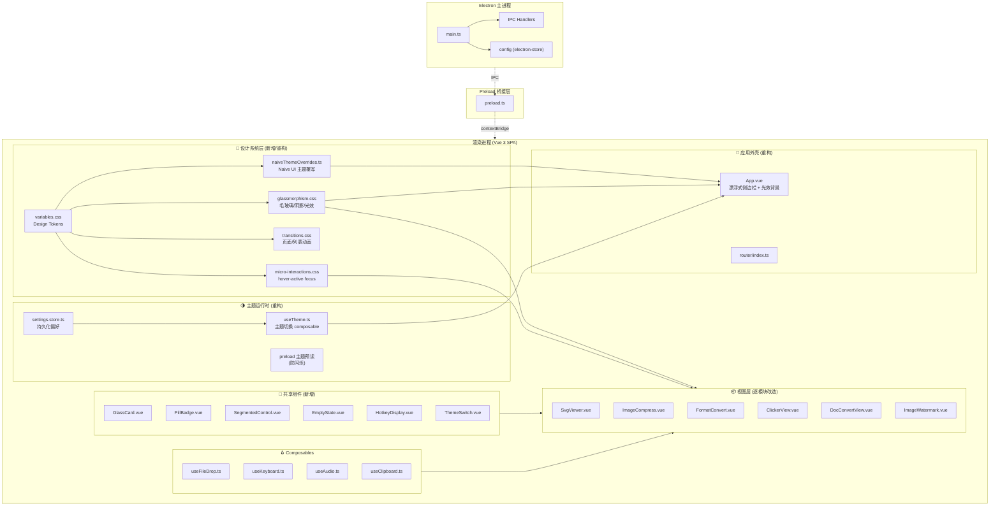
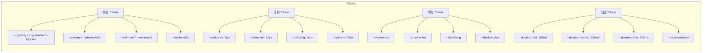
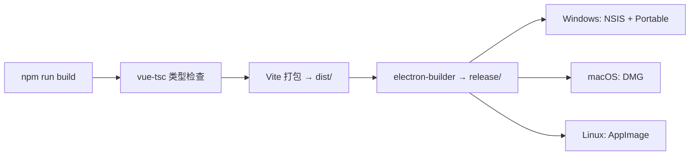

# 全站 UI 现代化重构 (Glassmorphism) - 架构设计 V1

## 1. 系统架构

### 1.1 整体架构图



### 1.2 分层架构说明

| 层级 | 职责 | 关键文件 |
|------|------|----------|
| **设计系统层** | CSS Token、毛玻璃材质、微交互、动画、Naive UI 覆写 | `src/styles/*`, `src/theme/*` |
| **主题运行时** | Light/Dark 切换、系统跟随、持久化、防闪烁 | `useTheme.ts`, `settings.store.ts`, `preload.ts` |
| **应用外壳** | 无边框窗口、漂浮侧栏、光效背景、路由视图 | `App.vue`, `electron/main.ts` |
| **共享组件** | 可复用的 Glassmorphism UI 原子组件 | `src/components/ui/*` |
| **视图层** | 各功能模块的具体页面改造 | `src/views/*` |
| **主进程** | 窗口管理、IPC、配置持久化 | `electron/*` |

---

## 2. 技术选型

| 层级 | 技术 | 版本 | 选型理由 |
|------|------|------|----------|
| 前端框架 | Vue 3 (Composition API) | ^3.4.21 | 已有技术栈，无需迁移 |
| UI 组件库 | Naive UI | ^2.44.1 | 已有技术栈，通过 `themeOverrides` 深度定制 |
| 状态管理 | Pinia | ^3.0.4 | 已有技术栈，管理主题/配置持久化 |
| 路由 | Vue Router (Hash Mode) | ^4.6.4 | Electron 环境下 Hash 路由稳定 |
| 构建工具 | Vite | ^5.1.6 | 已有技术栈，CSS 变量热更新高效 |
| 桌面运行时 | Electron | ^30.0.1 | 已有技术栈，支持无边框窗口 |
| 类型系统 | TypeScript | ^5.2.2 | 已有技术栈 |
| CSS 方案 | CSS Custom Properties + Scoped CSS | — | 零依赖、热更新友好、深浅模式原生支持 |
| 动画 | CSS Transitions + `<Transition>` | — | 性能优，GPU 加速，无额外包 |
| 配置持久化 | electron-store (IPC) | — | 已有机制，扩展主题预读即可 |

> **不引入新依赖**：本次重构纯 CSS + Vue 组件层改造，不新增任何 npm 包。

---

## 3. 数据模型

### 3.1 主题状态模型

```typescript
// settings.store.ts (扩展)
interface SettingsState {
  theme: 'light' | 'dark' | 'system'  // 新增 'system' 选项
  outputDir: string | null
  keepOriginalFile: boolean
  soundEnabled: boolean
}
```

### 3.2 CSS Token 数据模型



### 3.3 Token 映射表（Light → Dark）

| Token | Light | Dark |
|-------|-------|------|
| `--bg-body` | `#f5f7fa` | `#0f111a` |
| `--bg-sidebar` | `rgba(255,255,255,0.7)` | `rgba(26,30,41,0.7)` |
| `--bg-card` | `rgba(255,255,255,0.85)` | `rgba(30,35,48,0.6)` |
| `--bg-card-hover` | `rgba(255,255,255,0.95)` | `rgba(30,35,48,0.8)` |
| `--primary` | `#5c6bc0` | `#5c6bc0` |
| `--primary-light` | `rgba(92,107,192,0.1)` | `rgba(92,107,192,0.15)` |
| `--text-main` | `#2d3748` | `#f7fafc` |
| `--text-muted` | `#718096` | `#a0aec0` |
| `--border-color` | `rgba(226,232,240,0.8)` | `rgba(255,255,255,0.08)` |

---

## 4. 模块设计

### 4.1 设计系统模块

#### [重构] `src/styles/variables.css` — Design Tokens

完全重写现有 token 系统，对齐需求规格中的 Glassmorphism 色彩规范：

```css
:root {
  /* — 颜色 — */
  --bg-body: #f5f7fa;
  --bg-sidebar: rgba(255, 255, 255, 0.7);
  --bg-card: rgba(255, 255, 255, 0.85);
  --bg-card-hover: rgba(255, 255, 255, 0.95);
  --primary: #5c6bc0;
  --primary-light: rgba(92, 107, 192, 0.1);
  --text-main: #2d3748;
  --text-muted: #718096;
  --border-color: rgba(226, 232, 240, 0.8);

  /* — 几何 — */
  --radius-sm: 8px;
  --radius-md: 12px;
  --radius-lg: 16px;
  --radius-xl: 24px;

  /* — 阴影 — */
  --shadow-sm: 0 1px 3px rgba(0,0,0,0.06);
  --shadow-md: 0 4px 12px rgba(0,0,0,0.08);
  --shadow-lg: 0 8px 32px rgba(0,0,0,0.12);
  --shadow-glow: 0 4px 12px rgba(92,107,192,0.3);

  /* — 毛玻璃 — */
  --glass-blur: blur(12px);
  --glass-border: 1px solid rgba(255,255,255,0.18);

  /* — 动画 — */
  --duration-fast: 150ms;
  --duration-normal: 300ms;
  --duration-slow: 500ms;
  --ease-standard: cubic-bezier(0.4, 0, 0.2, 1);
  --ease-decelerate: cubic-bezier(0, 0, 0.2, 1);
}

[data-theme="dark"] {
  --bg-body: #0f111a;
  --bg-sidebar: rgba(26, 30, 41, 0.7);
  --bg-card: rgba(30, 35, 48, 0.6);
  --bg-card-hover: rgba(30, 35, 48, 0.8);
  --primary-light: rgba(92, 107, 192, 0.15);
  --text-main: #f7fafc;
  --text-muted: #a0aec0;
  --border-color: rgba(255, 255, 255, 0.08);
  /* 阴影加深 */
  --shadow-sm: 0 1px 3px rgba(0,0,0,0.2);
  --shadow-md: 0 4px 12px rgba(0,0,0,0.3);
  --shadow-lg: 0 8px 32px rgba(0,0,0,0.4);
}
```

#### [新增] `src/styles/glassmorphism.css` — 毛玻璃材质与光效

```css
/* 全局光效背景 */
.glass-bg::before {
  content: '';
  position: fixed; inset: 0; z-index: -1;
  background:
    radial-gradient(circle at 15% 50%, rgba(92,107,192,0.08), transparent 25%),
    radial-gradient(circle at 85% 20%, rgba(118,75,162,0.06), transparent 25%);
}

/* 毛玻璃卡片材质 */
.glass-card {
  background: var(--bg-card);
  backdrop-filter: var(--glass-blur);
  -webkit-backdrop-filter: var(--glass-blur);
  border-radius: var(--radius-lg);
  border: var(--glass-border);
  box-shadow: var(--shadow-md);
  transition: all var(--duration-fast) var(--ease-standard);
}

.glass-card:hover {
  background: var(--bg-card-hover);
  transform: translateY(-2px);
  box-shadow: var(--shadow-lg);
}

/* 毛玻璃侧边栏 */
.glass-sidebar {
  background: var(--bg-sidebar);
  backdrop-filter: var(--glass-blur);
  -webkit-backdrop-filter: var(--glass-blur);
}
```

#### [新增] `src/styles/micro-interactions.css` — 微交互

```css
/* 按钮发光 */
.btn-glow {
  box-shadow: var(--shadow-glow);
  transition: box-shadow var(--duration-fast) var(--ease-standard),
              transform var(--duration-fast) var(--ease-standard);
}
.btn-glow:hover { box-shadow: 0 6px 20px rgba(92,107,192,0.4); }
.btn-glow:active { transform: translateY(1px); }

/* Focus Ring */
:focus-visible {
  outline: none;
  box-shadow: 0 0 0 3px rgba(92,107,192,0.4);
  border-radius: var(--radius-md);
}
```

#### [重构] `src/styles/transitions.css` — 页面转场

```css
/* FadeIn + SlideUp 组合（替代原 page-slide） */
.page-fade-up-enter-active { transition: all var(--duration-normal) var(--ease-decelerate); }
.page-fade-up-leave-active { transition: all 200ms var(--ease-standard); }
.page-fade-up-enter-from { opacity: 0; transform: translateY(12px); }
.page-fade-up-leave-to { opacity: 0; transform: translateY(-8px); }
```

### 4.2 Naive UI 主题覆写模块

#### [新增] `src/theme/naiveThemeOverrides.ts`

```typescript
import type { GlobalThemeOverrides } from 'naive-ui'

export const lightThemeOverrides: GlobalThemeOverrides = {
  common: {
    primaryColor: '#5c6bc0',
    primaryColorHover: '#7986cb',
    primaryColorPressed: '#3f51b5',
    borderRadius: '12px',
    borderRadiusSmall: '8px',
    boxShadow1: '0 4px 12px rgba(0,0,0,0.08)',
    boxShadow2: '0 8px 32px rgba(0,0,0,0.12)',
  },
  Button: {
    borderRadiusMedium: '12px',
    borderRadiusLarge: '16px',
  },
  Card: {
    borderRadius: '16px',
  },
  Input: {
    borderRadius: '12px',
  },
  Select: {
    borderRadius: '12px',
  },
}

export const darkThemeOverrides: GlobalThemeOverrides = {
  ...lightThemeOverrides,
  common: {
    ...lightThemeOverrides.common,
    bodyColor: '#0f111a',
    cardColor: 'rgba(30, 35, 48, 0.6)',
  },
}
```

### 4.3 主题运行时模块

#### [重构] `src/composables/useTheme.ts`

扩展支持三态切换（Light / Dark / System）和系统跟随：

```typescript
// 核心改动点：
// 1. 增加 'system' 模式，监听 matchMedia('prefers-color-scheme: dark')
// 2. 返回 resolvedIsDark (实际渲染的深浅) 和 themeMode (用户选择)
// 3. 增加 Naive UI themeOverrides 的 computed 返回
```

#### [重构] `electron/preload.ts` — 主题预读防闪烁

```typescript
// 在 contextBridge 之前同步读取 localStorage/electron-store 中的主题值
// 立即设置 document.documentElement.setAttribute('data-theme', ...)
// 确保首帧渲染即为用户偏好底色
```

#### [重构] `electron/main.ts` — 无边框窗口

```typescript
// createWindow() 改动：
// - frame: false (无边框)
// - 根据持久化主题设置 backgroundColor
// - nativeTheme.themeSource 跟随
```

### 4.4 应用外壳模块

#### [重构] `src/App.vue`

| 改动点 | 详情 |
|--------|------|
| 移除 `NLayoutSider` | 换为自定义漂浮式侧边栏，应用 `.glass-sidebar` |
| Logo | 渐变文字 `linear-gradient(135deg, #667eea, #764ba2)` |
| 菜单项 | `--primary-light` 背景 + 全圆角高亮活跃态 |
| 主题切换 | 底部条形 `ThemeSwitch.vue` 组件替代圆形按钮 |
| 光效背景 | 主内容区应用 `.glass-bg` |
| 拖拽区域 | 侧栏顶部 `-webkit-app-region: drag` |
| 页面过渡 | `page-slide` → `page-fade-up` |

### 4.5 共享组件模块

#### [新增] `src/components/ui/GlassCard.vue`

```
Props: hoverable (boolean), padding (string), radius ('md' | 'lg' | 'xl')
功能: 封装毛玻璃卡片样式，统一圆角/阴影/hover 抬升
```

#### [新增] `src/components/ui/PillBadge.vue`

```
Props: status ('success' | 'error' | 'processing' | 'waiting'), label (string)
功能: 带色彩感知的药丸状态微章
```

#### [新增] `src/components/ui/SegmentedControl.vue`

```
Props: options, modelValue, size
功能: 分段控制器，滑动选中动画，替代 Select/Radio
```

#### [新增] `src/components/ui/EmptyState.vue`

```
Props: icon (string), title (string), description (string), actionLabel (string)
Events: action
功能: 智能空状态引导组件
```

#### [新增] `src/components/ui/HotkeyDisplay.vue`

```
Props: keys (string[])
功能: Mac 风格键帽显示，代码字体 + 内阴影
```

#### [新增] `src/components/ui/ThemeSwitch.vue`

```
Props: modelValue ('light' | 'dark' | 'system')
Events: update:modelValue
功能: 底部条形三态主题切换器
```

### 4.6 视图改造模块

```mermaid
gantt
    title 视图改造顺序
    dateFormat X
    axisFormat %s

    section Phase 1 - 基建
    Design Tokens 重写           :a1, 0, 1
    glassmorphism.css            :a2, 0, 1
    micro-interactions.css       :a3, 0, 1
    Naive UI 覆写                :a4, 0, 1
    useTheme 重构                :a5, 0, 1
    无边框窗口 + preload          :a6, 0, 1

    section Phase 2 - 外壳
    App.vue 重构                 :b1, 1, 2
    共享 UI 组件                  :b2, 1, 2

    section Phase 3 - 模块
    SvgViewer.vue                :c1, 2, 3
    ImageCompress.vue            :c2, 3, 4
    FormatConvert.vue            :c3, 4, 5
    DocConvertView.vue           :c4, 4, 5
    ClickerView.vue              :c5, 5, 6
    ImageWatermark.vue           :c6, 5, 6
```



**各视图改造要点：**

| 视图 | 关键改造 |
|------|----------|
| **SvgViewer** | 悬浮药丸搜索栏、`SegmentedControl` 布局切换器、Hover 染色卡片 |
| **ImageCompress** | 左右不对称布局、高精度范围滑块、`EmptyState` 引导、全向拖拽吸附 |
| **FormatConvert** | 联排下拉选择器 + 融合箭头、`PillBadge` 文件队列、轻量拖拽区 |
| **DocConvertView** | 复用 FormatConvert 改造方案、`PillBadge` 状态管理 |
| **ClickerView** | 设置组卡片重组、`SegmentedControl` 替代 Radio、`HotkeyDisplay` 键帽 |
| **ImageWatermark** | `GlassCard` 参数面板、预览区毛玻璃背景 |

---

## 5. 安全设计

| 方面 | 方案 |
|------|------|
| IPC 最小化暴露 | 维持现有 `contextBridge` 白名单机制，不新增敏感通道 |
| 内容安全策略 (CSP) | 生产环境注入 `Content-Security-Policy`，禁止 `eval` |
| 文件操作 | 所有文件系统操作通过主进程 IPC handler，渲染进程无 `nodeIntegration` |
| 用户数据 | 配置仅存储于本地 electron-store，不传输外部 |

---

## 6. 性能设计

| 方面 | 方案 |
|------|------|
| `backdrop-filter` 性能 | 限制同时可见的毛玻璃层数 ≤ 3；检测 GPU 压力时降级为半透明实色 |
| 路由懒加载 | 已有，维持 `() => import()` 异步组件 |
| CSS 过渡 vs JS 动画 | 优先使用 CSS `transition`/`animation` 触发 GPU 合成层，避免 JS timer |
| 主题切换防抖 | 300ms 防抖处理连续切换 |
| 大文件列表 | >100 文件时分批渲染 + 虚拟滚动（按需引入）|
| 骨架屏 | 组件挂载前显示 CSS-only 骨架，避免 DOM 闪烁 |
| 首帧渲染 | preload 同步注入主题值，`backgroundColor` 预设正确底色 |

---

## 7. 部署架构

### 7.1 构建流程



### 7.2 环境配置

| 环境 | 启动命令 | 说明 |
|------|----------|------|
| 开发 | `npm run dev` | Vite HMR + Electron 热重载 |
| 测试 | `npm run test` | Vitest 单元测试 |
| 生产 | `npm run build` | 全量构建 + 打包安装器 |

### 7.3 无边框窗口配置

```typescript
// electron/main.ts 改动
win = new BrowserWindow({
  frame: false,              // 无边框
  transparent: false,        // 不开启窗口透明（兼容旧版 Windows）
  backgroundColor: themeColor, // 根据持久化主题动态设置
  webPreferences: {
    preload: path.join(__dirname, 'preload.js'),
  },
})
```

---

## 8. 文件变更清单

### 设计系统

| 操作 | 文件路径 |
|------|----------|
| **重构** | `src/styles/variables.css` |
| **新增** | `src/styles/glassmorphism.css` |
| **新增** | `src/styles/micro-interactions.css` |
| **重构** | `src/styles/transitions.css` |
| **新增** | `src/theme/naiveThemeOverrides.ts` |

### 主题运行时

| 操作 | 文件路径 |
|------|----------|
| **重构** | `src/composables/useTheme.ts` |
| **重构** | `src/stores/settings.store.ts` |
| **重构** | `electron/preload.ts` |
| **重构** | `electron/main.ts` |

### 应用外壳 & 入口

| 操作 | 文件路径 |
|------|----------|
| **重构** | `src/App.vue` |
| **修改** | `src/main.ts` (import 新样式文件) |

### 共享 UI 组件

| 操作 | 文件路径 |
|------|----------|
| **新增** | `src/components/ui/GlassCard.vue` |
| **新增** | `src/components/ui/PillBadge.vue` |
| **新增** | `src/components/ui/SegmentedControl.vue` |
| **新增** | `src/components/ui/EmptyState.vue` |
| **新增** | `src/components/ui/HotkeyDisplay.vue` |
| **新增** | `src/components/ui/ThemeSwitch.vue` |

### 视图改造

| 操作 | 文件路径 |
|------|----------|
| **重构** | `src/views/SvgViewer.vue` |
| **重构** | `src/views/ImageCompress.vue` |
| **重构** | `src/views/FormatConvert.vue` |
| **重构** | `src/views/DocConvertView.vue` |
| **重构** | `src/views/ClickerView.vue` |
| **重构** | `src/views/ImageWatermark.vue` |

---

## 关联文档

- [需求规格说明书](./需求规格说明书.md)
- [产品设计 V1](./全站UI重构-产品设计-V1.md)
- [需求澄清](./全站UI重构-澄清.md)
