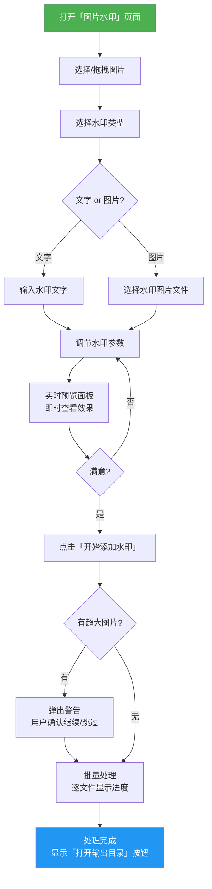
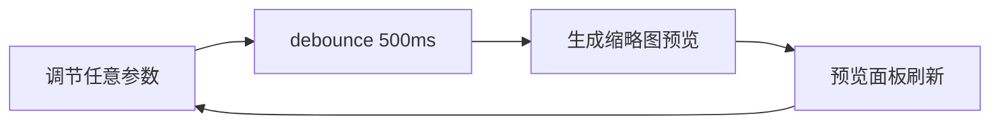
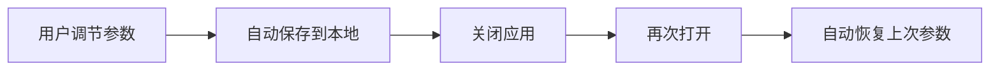
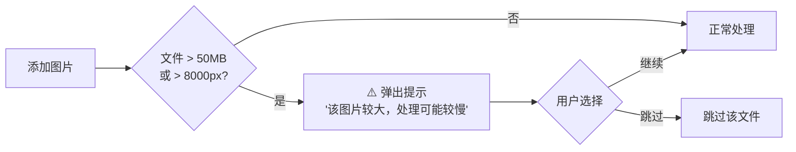

# 图片水印 - 产品设计方案 V1

## 基本信息

| 项目         | 值                           |
| ------------ | ---------------------------- |
| **功能名称** | 图片水印（文字 + 图片）       |
| **所属迭代** | 2026-03-23 功能迭代-图片水印 |
| **创建日期** | 2026-03-23                   |
| **状态**     | 设计中                       |
| **平台限制** | Windows 10+                  |

## 澄清结论摘要

| 问题         | 结论                                                       |
| ------------ | ---------------------------------------------------------- |
| MVP 范围     | 全量交付 P0 + P1 + P2                                     |
| 水印类型     | 文字水印 + 图片水印同时实现                                |
| 字体选择     | 先用系统默认字体，降低复杂度                               |
| 颜色选取     | 预设色板（白/黑/红/灰/蓝/绿）                             |
| 图片水印格式 | 支持所有常见格式（PNG/SVG/WebP/JPEG 等）                   |
| 输出策略     | 保持原格式输出，默认 `_watermarked` 后缀，可自定义         |
| 实时预览     | MVP 必需                                                   |
| 平铺间距     | 用户可调                                                   |
| 批量处理     | 默认相同参数，可选自适应缩放                               |
| 大图处理     | 弹出警告提示，不阻断                                       |
| 参数记忆     | 自动保存，下次打开自动恢复                                 |

---

## 一、功能概述

为 Universal Toolkit 新增「图片水印」功能，让用户在**离线环境**下为图片批量添加**文字水印**或**图片水印（Logo）**，支持实时预览、九宫格定位、满屏平铺等模式，保护图片版权与品牌标识。

---

## 二、目标用户

| 用户角色     | 特征                            | 使用场景                             |
| ------------ | ------------------------------- | ------------------------------------ |
| 摄影师       | 批量处理大量照片，注重版权保护  | 拍完照后批量加版权文字或个人 Logo    |
| 电商运营     | 每日处理商品图，防止盗图        | 给商品图批量加商标/店铺名防盗        |
| 自媒体创作者 | 内容图片需标注版权              | 发布前给配图加版权水印               |
| 企业用户     | 内部文件需标记密级              | 给截图/文档图片加「机密」「内部」平铺 |

---

## 三、用户流程

### 3.1 核心操作流程



### 3.2 参数调节流程（所见即所得）



---

## 四、功能清单

### 4.1 水印类型

- [x] F1.1 文字水印 — 输入自定义中英文文字
- [x] F1.2 图片水印 — 选择 PNG/SVG/WebP/JPEG 等图片作为水印

### 4.2 样式配置

- [x] F2.1 字体大小 — 滑块 12-120px，默认 36px
- [x] F2.2 颜色预设 — 白/黑/红/灰/蓝/绿色板点选，默认白色
- [x] F2.3 透明度 — 滑块 0%-100%，默认 30%
- [x] F2.4 旋转角度 — 滑块 -180°~180°，默认 -30°
- [x] F4.2 图片水印缩放 — 滑块 5%-50%（相对原图），默认 15%

### 4.3 位置配置

- [x] F3.1 九宫格预设 — 左上/中上/右上/左中/居中/右中/左下/中下/右下
- [x] F3.2 平铺水印 — 满屏重复平铺，间距用户可调（默认 200px）
- [x] F3.3 自定义偏移 — X/Y 偏移微调（像素值）

### 4.4 预览

- [x] F5.1 实时预览 — 参数变化 ≤500ms 刷新，使用缩略图

### 4.5 处理与输出

- [x] F6.1 批量处理 — 一键应用相同水印
- [x] F6.2 逐文件进度 — 处理中/成功/失败状态
- [x] F6.3 输出目录 — 复用 OutputDirPicker
- [x] F6.4 保留原文件 — 输出新文件，默认 `_watermarked` 后缀，可自定义
- [x] F6.5 参数持久化 — 自动保存/恢复水印设置
- [x] F6.6 大图警告 — >50MB 或 >8000px 弹出警告
- [x] F6.7 批量自适应 — 可选按图片尺寸等比缩放水印

---

## 五、界面原型

### 5.1 侧栏导航（更新）

```
┌──────────────────┐
│ 🧰 Universal     │
│    Toolkit       │
├──────────────────┤
│ 🖼️  SVG 查看     │
│ 🗜️  图片压缩     │
│ 🔄 格式转换      │
│ 🖱️  连点器       │
│ 📝 文档转换      │
│ 💧 图片水印  🆕  │  ← 新增
├──────────────────┤
│     🌙 / ☀️       │
└──────────────────┘
```

### 5.2 图片水印主页面

```
┌─────────────────────────────────────────────────────────────────┐
│ 工具栏                                                           │
│ [📂 选择图片] [水印类型 ▼]  参数控件区...     [💧 开始添加水印]  │
├──────────────────────────┬──────────────────────────────────────┤
│                          │                                      │
│  📋 文件列表              │  👁️ 实时预览                        │
│                          │                                      │
│  ┌────────────────────┐  │  ┌──────────────────────────────┐   │
│  │ 📄 photo1.jpg  ✅  │  │  │                              │   │
│  │ 📄 photo2.jpg  ⏳  │  │  │                              │   │
│  │ 📄 photo3.png  等待 │  │  │    原图 + 水印叠加效果       │   │
│  │ 📄 banner.jpg  等待 │  │  │                              │   │
│  └────────────────────┘  │  │         © My Brand            │   │
│                          │  │                              │   │
│                          │  └──────────────────────────────┘   │
│                          │                                      │
├──────────────────────────┴──────────────────────────────────────┤
│ ⚙️ 水印参数面板                                                  │
│                                                                  │
│  水印文字: [请输入水印文字____________]    输出后缀: [_watermarked]│
│                                                                  │
│  字体大小   [────●────────] 36px    透明度  [──●──────────] 30%  │
│  旋转角度   [────────●────] -30°    平铺间距 [────●───────] 200px │
│                                                                  │
│  颜色: ⚪ ⚫ 🔴 🔘 🔵 🟢               ☐ 按图片尺寸自适应     │
│                                                                  │
│  位置:  ┌───┬───┬───┐                                           │
│         │   │   │ ✓ │  ← 右上                                   │
│         ├───┼───┼───┤     📎 输出目录: [默认]                    │
│         │   │   │   │                                            │
│         ├───┼───┼───┤     偏移 X: [0] px  Y: [0] px             │
│         │   │   │   │                                            │
│         └───┴───┴───┘     ☐ 平铺模式                            │
│                                                                  │
└──────────────────────────────────────────────────────────────────┘
```

### 5.3 空状态

```
┌──────────────────────────────────────────────────────────────────┐
│                                                                  │
│                          🎨                                      │
│                                                                  │
│              点击选择图片，或拖拽到这里                           │
│                                                                  │
│          支持 JPEG / PNG / WebP / AVIF / TIFF                    │
│          添加文字或图片水印，保护你的作品                         │
│                                                                  │
└──────────────────────────────────────────────────────────────────┘
```

### 5.4 水印类型切换（图片水印模式）

文字水印参数面板切换为图片水印面板：

```
│ ⚙️ 图片水印参数面板                                              │
│                                                                  │
│  水印图片: [photo_logo.png]  [📂 选择水印图片]  [✕ 清除]        │
│                                                                  │
│  缩放比例  [──●───────────] 15%    透明度  [──●──────────] 30%   │
│  旋转角度  [────────●─────] -30°                                 │
│                                                                  │
│  位置: (同文字水印九宫格)         输出后缀: [_watermarked]       │
```

---

## 六、交互设计

### 6.1 工具栏交互

| 元素               | 交互行为                                                 |
| ------------------ | -------------------------------------------------------- |
| 「选择图片」按钮   | 打开系统文件选择对话框，支持多选                         |
| 「水印类型」下拉   | 切换文字/图片水印，参数面板对应切换                      |
| 「开始添加水印」   | 执行批量处理；无文件时 `disabled`；处理中显示 `loading`  |
| 「打开输出目录」   | 处理完成后出现，点击打开文件管理器到输出路径             |

### 6.2 文件列表交互

| 操作             | 行为                                                   |
| ---------------- | ------------------------------------------------------ |
| 拖拽文件到窗口   | 添加到文件列表，重复文件自动跳过并提示                 |
| 点击文件项       | 预览面板切换显示该文件的水印效果                       |
| 点击删除按钮     | 从列表移除文件，支持撤销                               |
| 点击空状态区域   | 触发文件选择对话框                                     |

### 6.3 参数面板交互

| 操作             | 行为                                                   |
| ---------------- | ------------------------------------------------------ |
| 拖动任意滑块     | 实时预览更新（debounce 500ms）                         |
| 点击颜色色块     | 立即切换水印颜色，预览刷新                             |
| 点击九宫格位置   | 切换水印位置，预览刷新                                 |
| 勾选「平铺模式」 | 九宫格禁用，水印改为满屏平铺，出现间距滑块             |
| 修改输出后缀     | 自定义输出文件命名规则                                 |
| 勾选自适应       | 水印大小按每张图的尺寸等比缩放                         |

### 6.4 预览面板交互

| 操作           | 行为                                                     |
| -------------- | -------------------------------------------------------- |
| 默认显示       | 列表第一张图片 + 当前水印参数的合成预览                  |
| 参数变化       | ≤500ms debounce 后刷新缩略图预览                         |
| 鼠标滚轮       | 缩放预览图查看水印细节                                   |
| 加载中         | 显示轻量 loading 动画，避免闪烁                          |

### 6.5 键盘快捷键

| 快捷键       | 功能                   |
| ------------ | ---------------------- |
| `Ctrl+O`     | 选择图片               |
| `Ctrl+Enter` | 开始添加水印           |
| `Ctrl+Z`     | 撤销移除操作           |
| `Delete`     | 移除选中文件           |

---

## 七、边界情况

| 场景                         | 处理方式                                              |
| ---------------------------- | ----------------------------------------------------- |
| 未添加任何图片就点击执行     | 按钮 `disabled` + 置灰，无法点击                     |
| 文字水印内容为空             | `warning` 提示「请输入水印文字」，阻断执行            |
| 图片水印未选择水印图片       | `warning` 提示「请选择水印图片」，阻断执行            |
| 添加重复文件                 | 自动跳过 + `info` 提示「X 个文件已存在，已跳过」     |
| 超大图片（>50MB / >8000px）  | 弹出警告「该图片较大，处理可能需要较长时间」，用户选择继续/跳过 |
| 批量中某文件处理失败         | 该文件标记 ❌，不中断其余文件，完成后汇总             |
| 水印图片自身是 JPEG 无透明   | 正常合成，JPEG 水印将有白色/实色背景叠加              |
| 输出目录不存在               | 自动创建目录                                          |
| 输出文件名重复               | 自动追加编号后缀（如 `_watermarked_1.jpg`）           |
| 处理中关闭窗口               | 二次确认「正在处理中，确认关闭？」                    |
| 首次使用无历史参数           | 加载智能默认值（白色/30%/右下/-30°/36px）             |
| 平铺模式 + 自定义偏移        | 偏移应用于每个平铺单元格内的水印位置                  |
| 图片格式不支持               | 添加时过滤，只接受 JPEG/PNG/WebP/AVIF/TIFF            |

---

## 八、人性化设计

### 8.1 智能默认值

打开水印功能时，所有参数**开箱即用**，无需任何配置即可直接处理：

| 参数         | 默认值         | 设计理由                           |
| ------------ | -------------- | ---------------------------------- |
| 水印类型     | 文字水印       | 最常用场景                         |
| 文字内容     | 空（提示占位） | 避免用户忘记修改默认文字           |
| 字体大小     | 36px           | 适中大小，兼顾可读性和美观         |
| 颜色         | 白色           | 在大多数图片上可见度最高           |
| 透明度       | 30%            | 既能看到水印又不过度遮挡原图       |
| 旋转角度     | -30°           | 行业惯例，增加去除难度             |
| 位置         | 右下角         | 摄影/设计行业最常用版权标记位置    |
| 图片水印缩放 | 15%            | 水印面积适中，不喧宾夺主           |
| 平铺间距     | 200px          | 视觉均匀分布，不过于密集           |
| 输出后缀     | `_watermarked` | 直观表意，避免覆盖原文件           |

### 8.2 参数持久化与自动恢复



- 所有参数（文字/大小/颜色/透明度/角度/位置/缩放等）自动持久化
- 下次打开**零配置**即可使用上次的设置
- 首次使用加载智能默认值

### 8.3 大图安全保护



- 警告不阻断操作，用户自主决定
- 批量处理时统一提示一次，避免反复打断

### 8.4 实时预览体验

| 设计要点       | 方案                                                 |
| -------------- | ---------------------------------------------------- |
| **即时响应**   | 参数变化 → debounce 500ms → 刷新预览                |
| **缩略图优先** | 预览用缩略图（≤800px），正式处理用原图               |
| **文件切换**   | 点击文件列表项，预览面板切换显示该文件的水印效果     |
| **缩放查看**   | 鼠标滚轮缩放预览图，查看水印细节                     |
| **加载状态**   | 预览刷新时轻量 loading 动画，无闪烁                  |

### 8.5 批量处理自适应

- **默认模式**：所有图片使用完全相同的水印参数
- **自适应模式**（可选开关）：水印大小按每张图的实际尺寸等比缩放
  - 示例：缩放比例 15% → 1000px 宽图水印 150px，2000px 宽图水印 300px
  - 确保不同尺寸图片的水印**视觉大小一致**

### 8.6 操作反馈与容错

| 场景                   | 反馈方式                                       |
| ---------------------- | ---------------------------------------------- |
| 添加重复文件           | `info`「X 个文件已存在，已跳过」               |
| 水印文字为空点击执行   | `warning`「请输入水印文字」，阻断执行          |
| 单文件处理失败         | 标记 ❌，不中断其余文件，完成后汇总失败数     |
| 全部成功               | `success`「水印添加完成！共处理 X 个文件」     |
| 处理完成               | 显示「打开输出目录」按钮                       |
| 未选择图片             | 按钮 `disabled` 置灰                           |
| 处理中                 | 按钮 `loading` 状态，防止重复点击              |

### 8.7 友好空状态引导

- 空状态区域**可点击**触发文件选择
- 整个内容区**支持拖拽**放入文件
- 文案简洁温暖：「点击选择图片，或拖拽到这里 · 添加文字或图片水印，保护你的作品」
- 标注支持格式：JPEG / PNG / WebP / AVIF / TIFF

---

## 九、分期计划

本次迭代为全量交付，无分期。

| 模块       | 功能范围                                                        |
| ---------- | --------------------------------------------------------------- |
| 水印类型   | 文字水印 + 图片水印                                             |
| 样式配置   | 字体大小 / 预设颜色 / 透明度 / 旋转角度 / 缩放                 |
| 位置配置   | 九宫格预设 + 平铺（可调间距） + 自定义 XY 偏移                 |
| 实时预览   | 缩略图预览 + debounce 刷新 + 文件选中切换                      |
| 批量处理   | 逐文件进度 + 大图警告 + 自适应缩放可选                         |
| 输出管理   | 保持原格式 + 自定义命名 + OutputDirPicker                       |
| 参数持久化 | settingsStore 自动保存/恢复                                     |
| UI         | 侧栏新增「图片水印」入口页面                                   |

---

## 十、关联文档

- [需求文档](./需求文档.md)
- [需求澄清](./澄清.md)

## 变更记录

| 日期       | 版本 | 变更内容             | 变更人 |
| ---------- | ---- | -------------------- | ------ |
| 2026-03-23 | V1.0 | 初始版本             | —      |
| 2026-03-23 | V1.1 | 新增人性化设计章节   | —      |
