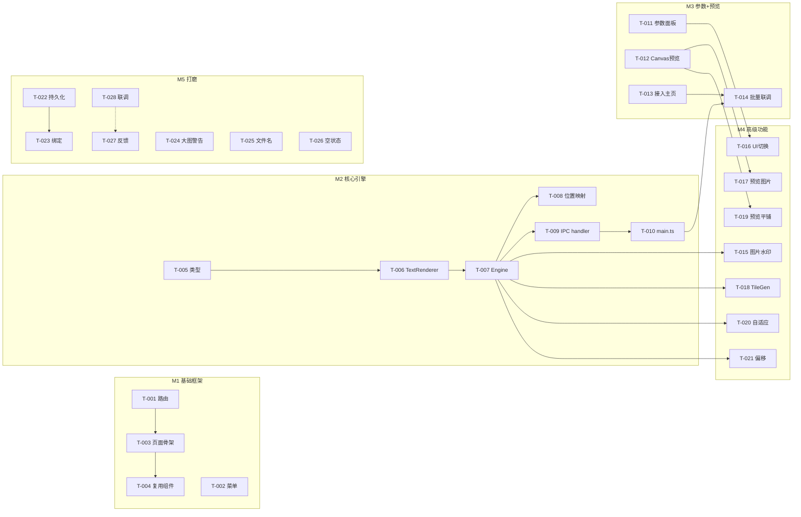

# 图片水印 - 任务清单

## 概览

| 项目       | 数值    |
| ---------- | ------- |
| 总任务数   | 28      |
| 可并行     | 8       |
| 预计工时   | 36.5h   |

> 复杂度：`[S]` ≤1h · `[M]` 1-3h · `[L]` 3-5h  
> `[P]` = 可并行

---

## M1 · 基础框架搭建（3h）

### US-001: 用户可以在侧栏看到「图片水印」入口并进入页面

| 任务 | 复杂度 | 并行 | 文件 | 状态 |
|------|--------|------|------|------|
| T-001 路由注册 | S | ✅ | `src/router/index.ts` | ⬜ |
| T-002 侧栏菜单 | S | ✅ | `src/App.vue` | ⬜ |
| T-003 页面骨架 | M | - | `src/views/ImageWatermark.vue` | ⬜ |
| T-004 复用文件列表与工具栏 | S | - | `src/views/ImageWatermark.vue` | ⬜ |

#### 详细任务

- [ ] [P][S] **T-001**: 添加 `/watermark` 路由 - `src/router/index.ts`
  - 验收标准: 访问 `#/watermark` 可加载 ImageWatermark 视图

- [ ] [P][S] **T-002**: 侧栏菜单新增「图片水印」项，使用 `WaterOutline` 图标 - `src/App.vue`
  - 验收标准: 侧栏显示「图片水印」菜单，点击可跳转

- [ ] [M] **T-003**: 创建 ImageWatermark.vue 页面骨架（工具栏 + 文件列表 + 预览区 + 参数面板布局） - `src/views/ImageWatermark.vue`
  - 验收标准: 页面三栏布局可见，工具栏/列表/预览/参数面板区域占位正确
  - 依赖: T-001

- [ ] [S] **T-004**: 接入 FileList / Toolbar / OutputDirPicker 复用组件 + 拖拽文件添加 - `src/views/ImageWatermark.vue`
  - 验收标准: 可选择/拖拽图片到列表，列表显示文件名和状态，可清空/删除
  - 依赖: T-003

---

## M2 · 核心引擎（8h）

### US-002: 用户可以为图片添加文字水印并输出

| 任务 | 复杂度 | 并行 | 文件 | 状态 |
|------|--------|------|------|------|
| T-005 类型定义 | S | ✅ | `electron/core/watermark/types.ts` | ⬜ |
| T-006 TextRenderer | M | - | `electron/core/watermark/TextRenderer.ts` | ⬜ |
| T-007 WatermarkEngine 单图合成 | M | - | `electron/core/watermark/WatermarkEngine.ts` | ⬜ |
| T-008 九宫格位置映射 | S | - | `electron/core/watermark/WatermarkEngine.ts` | ⬜ |
| T-009 IPC handler 注册 | M | - | `electron/ipc/watermark.handler.ts` | ⬜ |
| T-010 main.ts 注册 | S | - | `electron/main.ts` | ⬜ |

#### 详细任务

- [ ] [P][S] **T-005**: 定义 `WatermarkOptions`、`WatermarkPosition`、`ProcessResult` 等类型 - `electron/core/watermark/types.ts`
  - 验收标准: 类型可被 Engine/Handler 正确引用，编译无错误

- [ ] [M] **T-006**: 实现 TextRenderer，文字 → SVG → Buffer，含旋转包围盒计算和 XML 转义 - `electron/core/watermark/TextRenderer.ts`
  - 验收标准: 输入文字/字号/颜色/旋转，输出可被 Sharp composite 消费的 SVG Buffer
  - 依赖: T-005

- [ ] [M] **T-007**: 实现 WatermarkEngine.process()，读取源图 → 合成水印层 → 输出文件 - `electron/core/watermark/WatermarkEngine.ts`
  - 验收标准: 给定一张 JPEG + 文字水印参数，输出带水印的 JPEG 文件
  - 依赖: T-005, T-006

- [ ] [S] **T-008**: 实现九宫格位置到 Sharp gravity 的映射 + offset 偏移计算 - `electron/core/watermark/WatermarkEngine.ts`
  - 验收标准: 9 个位置均正确映射，偏移值叠加生效
  - 依赖: T-007

- [ ] [M] **T-009**: 创建 watermark.handler.ts，注册 `watermark:start` + `watermark:progress` 通道 - `electron/ipc/watermark.handler.ts`
  - 验收标准: 渲染进程 invoke → 主进程批量合成 → 逐文件 progress 推送回渲染进程
  - 依赖: T-007

- [ ] [S] **T-010**: 在 main.ts 注册 `registerWatermarkHandlers()` - `electron/main.ts`
  - 验收标准: 应用启动后水印 IPC 通道可用
  - 依赖: T-009

---

## M3 · 参数面板与实时预览（8h）

### US-003: 用户可以调节水印参数并实时看到预览效果

| 任务 | 复杂度 | 并行 | 文件 | 状态 |
|------|--------|------|------|------|
| T-011 参数面板组件 | L | ✅ | `src/components/WatermarkParams.vue` | ⬜ |
| T-012 Canvas 预览组件 | L | ✅ | `src/components/WatermarkPreview.vue` | ⬜ |
| T-013 参数面板接入主页 | S | - | `src/views/ImageWatermark.vue` | ⬜ |
| T-014 批量处理联调 | M | - | `src/views/ImageWatermark.vue` | ⬜ |

#### 详细任务

- [ ] [P][L] **T-011**: 创建 WatermarkParams 组件，包含：文字输入、字体大小滑块、6 色色板、透明度滑块、旋转角度滑块、九宫格位置选择器、平铺开关+间距、偏移 X/Y、输出后缀输入、自适应开关 - `src/components/WatermarkParams.vue`
  - 验收标准: 所有参数控件可交互，通过 v-model / emit 向父组件传递参数变化

- [ ] [P][L] **T-012**: 创建 WatermarkPreview 组件，Canvas 2D 绘制底图 + 文字水印叠加，debounce 300ms 刷新 - `src/components/WatermarkPreview.vue`
  - 验收标准: 选中文件后显示缩略图，参数变化 ≤500ms 内重绘，支持滚轮缩放

- [ ] [S] **T-013**: 将 WatermarkParams + WatermarkPreview 接入 ImageWatermark.vue，双向绑定参数 - `src/views/ImageWatermark.vue`
  - 验收标准: 参数面板 → 预览面板数据流通畅，文件列表点击切换预览图
  - 依赖: T-011, T-012

- [ ] [M] **T-014**: 实现「开始添加水印」按钮逻辑，调用 IPC 批量处理 + 进度更新 + 状态反馈 - `src/views/ImageWatermark.vue`
  - 验收标准: 点击按钮 → 文件逐个处理 → 进度更新 → 完成提示 → 可打开输出目录
  - 依赖: T-010, T-013

---

## M4 · 高级功能（8.5h）

### US-004: 用户可以使用图片作为水印（如 Logo）

| 任务 | 复杂度 | 并行 | 文件 | 状态 |
|------|--------|------|------|------|
| T-015 图片水印读取+缩放+透明度 | M | - | `electron/core/watermark/WatermarkEngine.ts` | ⬜ |
| T-016 图片水印 UI 切换 | M | - | `src/components/WatermarkParams.vue` | ⬜ |
| T-017 Canvas 预览支持图片水印 | S | - | `src/components/WatermarkPreview.vue` | ⬜ |

#### 详细任务

- [ ] [M] **T-015**: 实现 `prepareImageWatermark()`：读取水印图片 → 按比例缩放 → 旋转 → alpha 通道透明度处理 - `electron/core/watermark/WatermarkEngine.ts`
  - 验收标准: PNG/JPEG/SVG/WebP 水印图片均可正确合成，透明度生效
  - 依赖: T-007

- [ ] [M] **T-016**: 参数面板新增水印类型切换（文字/图片），图片模式显示文件选择器 + 缩放滑块 - `src/components/WatermarkParams.vue`
  - 验收标准: 切换模式后面板控件正确显示/隐藏，选择水印图片路径可传递
  - 依赖: T-011

- [ ] [S] **T-017**: Canvas 预览支持绘制图片水印（drawImage） - `src/components/WatermarkPreview.vue`
  - 验收标准: 图片水印模式下预览正确显示缩放/旋转/透明的水印图
  - 依赖: T-012, T-016

### US-005: 用户可以使用平铺水印覆盖全图

| 任务 | 复杂度 | 并行 | 文件 | 状态 |
|------|--------|------|------|------|
| T-018 TileGenerator | M | - | `electron/core/watermark/TileGenerator.ts` | ⬜ |
| T-019 Canvas 预览支持平铺 | M | - | `src/components/WatermarkPreview.vue` | ⬜ |

#### 详细任务

- [ ] [M] **T-018**: 实现 TileGenerator，按间距计算 overlay 数组，限制最大 500 个 overlay - `electron/core/watermark/TileGenerator.ts`
  - 验收标准: 不同间距（50-500px）均能正确平铺，大图不超出 overlay 限制
  - 依赖: T-007

- [ ] [M] **T-019**: Canvas 预览支持平铺模式绘制（循环 drawImage/fillText） - `src/components/WatermarkPreview.vue`
  - 验收标准: 勾选平铺后预览正确展示满屏重复水印，间距可调
  - 依赖: T-012

### US-006: 用户可以让水印按图片尺寸自适应缩放

| 任务 | 复杂度 | 并行 | 文件 | 状态 |
|------|--------|------|------|------|
| T-020 自适应缩放逻辑 | S | - | `electron/core/watermark/WatermarkEngine.ts` | ⬜ |
| T-021 自定义偏移逻辑 | S | - | `electron/core/watermark/WatermarkEngine.ts` | ⬜ |

#### 详细任务

- [ ] [S] **T-020**: 实现自适应模式：按原图宽度 × 缩放百分比计算水印实际像素大小 - `electron/core/watermark/WatermarkEngine.ts`
  - 验收标准: 同批次不同尺寸图片的水印视觉大小一致
  - 依赖: T-007

- [ ] [S] **T-021**: 实现自定义偏移：在 gravity 基础上叠加 X/Y 像素偏移 - `electron/core/watermark/WatermarkEngine.ts`
  - 验收标准: 偏移值正确叠加到水印位置
  - 依赖: T-008

---

## M5 · 打磨与测试（9h）

### US-007: 用户设置的水印参数下次打开可自动恢复

| 任务 | 复杂度 | 并行 | 文件 | 状态 |
|------|--------|------|------|------|
| T-022 settingsStore 扩展 | S | - | `src/stores/settings.store.ts` | ⬜ |
| T-023 参数面板绑定持久化 | S | - | `src/views/ImageWatermark.vue` | ⬜ |

#### 详细任务

- [ ] [S] **T-022**: settingsStore 新增 `watermarkSettings` 字段 + init 加载 + set 保存 - `src/stores/settings.store.ts`
  - 验收标准: 水印参数通过 `config:get/set` 持久化到 JSON 文件

- [ ] [S] **T-023**: ImageWatermark.vue 初始化时从 settingsStore 加载参数，参数变化时自动保存 - `src/views/ImageWatermark.vue`
  - 验收标准: 关闭重开应用后，上次的水印设置自动恢复
  - 依赖: T-022

### US-008: 用户体验优化

| 任务 | 复杂度 | 并行 | 文件 | 状态 |
|------|--------|------|------|------|
| T-024 大图警告 | S | ✅ | `electron/ipc/watermark.handler.ts` | ⬜ |
| T-025 文件名冲突处理 | S | ✅ | `electron/ipc/watermark.handler.ts` | ⬜ |
| T-026 空状态引导 | S | - | `src/views/ImageWatermark.vue` | ⬜ |
| T-027 操作反馈完善 | S | - | `src/views/ImageWatermark.vue` | ⬜ |
| T-028 联调测试 + bug 修复 | L | - | 全部文件 | ⬜ |

#### 详细任务

- [ ] [P][S] **T-024**: 实现 `watermark:checkFileSize` 通道，>50MB 或 >8000px 返回 isLarge 标记 - `electron/ipc/watermark.handler.ts`
  - 验收标准: 添加大图时弹出警告对话框，用户可选继续/跳过

- [ ] [P][S] **T-025**: 实现输出文件名冲突自动追加编号后缀 - `electron/ipc/watermark.handler.ts`
  - 验收标准: 输出路径已存在时自动命名为 `_watermarked_1`、`_watermarked_2`...

- [ ] [S] **T-026**: 实现友好空状态引导（图标 + 引导文案 + 点击触发选择） - `src/views/ImageWatermark.vue`
  - 验收标准: 无文件时显示引导区域，点击可打开文件选择

- [ ] [S] **T-027**: 完善操作反馈：重复文件提示、空文字警告、完成汇总、打开输出目录按钮 - `src/views/ImageWatermark.vue`
  - 验收标准: 所有 7 种反馈场景正确触发（参见产品设计 8.6）

- [ ] [L] **T-028**: 端到端联调测试，覆盖 JPEG/PNG/WebP/AVIF/TIFF 格式，文字+图片水印，九宫格+平铺，修复发现的 bug - 全部文件
  - 验收标准: 5 种格式 × 2 种水印类型 × 2 种位置模式全部通过
  - 依赖: T-001 ~ T-027

---

## 依赖关系图

---

## 关联文档

- [需求文档](./需求文档.md)
- [需求澄清](./澄清.md)
- [产品设计](./产品设计.md)
- [架构设计](./架构设计.md)
- [开发计划](./开发计划.md)

## 变更记录

| 日期       | 版本 | 变更内容 | 变更人 |
| ---------- | ---- | -------- | ------ |
| 2026-03-23 | V1.0 | 初始版本 | —      |
