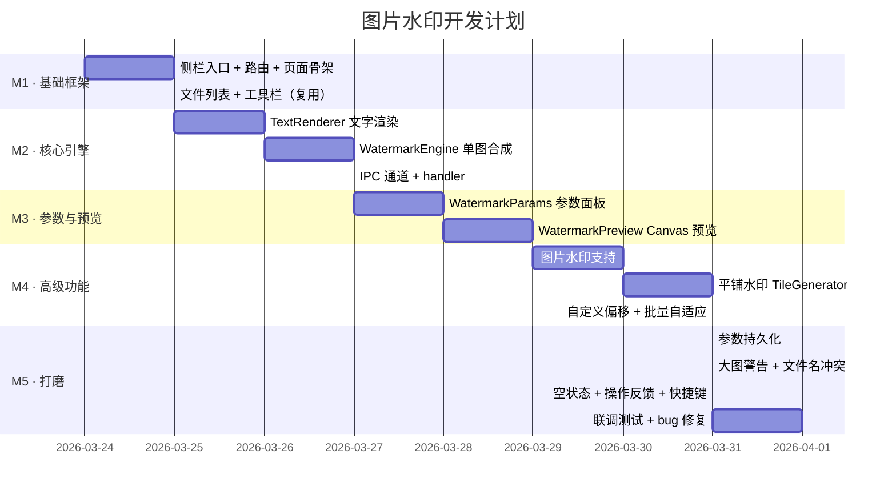
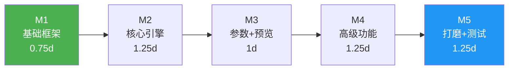

# 图片水印 - 开发计划

## 基本信息

| 项目         | 值                           |
| ------------ | ---------------------------- |
| **功能名称** | 图片水印（文字 + 图片）       |
| **所属迭代** | 2026-03-23 功能迭代-图片水印 |
| **创建日期** | 2026-03-23                   |
| **状态**     | 待执行                       |

---

## MVP 定义

本次为全量交付，无分期。以下按优先级分层，确保核心功能最先可用。

### 必须实现（P0 · 核心价值）

- [ ] F1.1 文字水印 — 输入文字 + SVG 渲染 + Sharp 合成
- [ ] F1.2 图片水印 — 选择水印图片 + 缩放 + 合成
- [ ] F2.1 字体大小 — 滑块 12-120px
- [ ] F2.2 颜色预设 — 白/黑/红/灰/蓝/绿色板
- [ ] F2.3 透明度 — 滑块 0%-100%
- [ ] F2.4 旋转角度 — 滑块 -180°~180°
- [ ] F3.1 九宫格定位 — 9 个预设位置
- [ ] F4.1 水印图片选择 — 文件对话框
- [ ] F4.2 水印图片缩放 — 滑块 5%-50%
- [ ] F5.1 实时预览 — Canvas 前端渲染
- [ ] F6.1 批量处理 — 逐文件 Sharp 合成
- [ ] F6.2 逐文件进度 — IPC 进度推送
- [ ] F6.3 输出目录管理 — 复用 OutputDirPicker
- [ ] F6.4 保留原文件 — `_watermarked` 后缀 + 可自定义
- [ ] F6.5 参数持久化 — settingsStore 保存/恢复
- [ ] F6.6 大图警告 — >50MB / >8000px 警告提示

### 同步实现（P1 + P2）

- [ ] F3.2 平铺水印 — TileGenerator + 用户可调间距
- [ ] F3.3 自定义偏移 — X/Y 偏移微调
- [ ] F6.7 批量自适应 — 按图片尺寸等比缩放水印

---

## 里程碑

| 里程碑 | 目标                         | 预计完成   | 交付物                                              |
| ------ | ---------------------------- | ---------- | --------------------------------------------------- |
| **M1** | 基础框架搭建                 | 0.75 天    | 侧栏入口 + 空页面 + 文件列表可用                    |
| **M2** | 核心引擎可用                 | 1.25 天    | 文字水印可合成输出，IPC 通道联通                     |
| **M3** | 参数面板 + 实时预览          | 1 天       | 参数调节 → Canvas 实时预览 → 批量处理完整链路        |
| **M4** | 图片水印 + 平铺 + 高级功能   | 1.25 天    | 图片水印、平铺水印、偏移微调、批量自适应             |
| **M5** | 打磨 + 测试                  | 1.25 天    | 参数持久化、大图警告、空状态、操作反馈、联调测试     |

**总预计工时：5.5 天**（含缓冲）

---

## 工时估算

| 阶段 | 任务                              | 预计工时 | 说明                           |
| ---- | --------------------------------- | -------- | ------------------------------ |
| 框架 | 路由 + 菜单 + 页面骨架            | 2h       | 参考现有模块，改动量小         |
| 框架 | 复用 FileList / Toolbar           | 1h       | 直接引用现有组件               |
| 引擎 | TextRenderer（SVG 文字渲染）      | 3h       | SVG 模板 + 旋转包围盒计算      |
| 引擎 | WatermarkEngine（单图合成）       | 3h       | Sharp composite + 位置映射     |
| 引擎 | watermark.handler.ts（IPC）       | 2h       | 参考 compress.handler 模式     |
| UI   | WatermarkParams（参数面板）       | 4h       | 滑块/色板/九宫格/开关等控件    |
| UI   | WatermarkPreview（Canvas 预览）   | 4h       | Canvas 2D 绘制 + debounce      |
| 功能 | 图片水印支持                      | 3h       | 读取 + 缩放 + 透明度处理       |
| 功能 | TileGenerator（平铺水印）         | 3h       | 间距计算 + overlay 数组         |
| 功能 | 自定义偏移 + 批量自适应           | 2h       | 偏移叠加 + 尺寸比例计算        |
| 持久 | settingsStore 扩展                | 1.5h     | 新增字段 + init/save           |
| 边界 | 大图警告 + 文件名冲突 + 容错      | 2h       | dialog 提示 + 编号追加         |
| 打磨 | 空状态引导 + 操作反馈 + 快捷键    | 2h       | 复用项目现有模式               |
| 测试 | 联调测试 + bug 修复               | 4h       | 端到端测试各种图片格式         |
|      | **合计**                          | **36.5h** | 约 **5 个工作日**             |

---

## 开发顺序

**策略**：先通后端再通前端，M2 完成后即可端到端跑通文字水印流程，M3 起逐步叠加 UI 和高级功能。

---

## 风险识别

| 风险                               | 概率 | 影响 | 应对措施                                           |
| ---------------------------------- | ---- | ---- | -------------------------------------------------- |
| SVG 中文渲染在不同系统字体不一致   | 中   | 中   | 指定 `Microsoft YaHei` + 降级 `sans-serif`         |
| Canvas 预览与 Sharp 合成效果有差异 | 中   | 低   | 可接受轻微差异，预览目的是快速反馈                 |
| 大图（>50MB）处理时内存溢出        | 低   | 高   | 串行处理 + Sharp 流式 pipeline + 大图警告          |
| 平铺水印 overlay 数量过多导致性能差 | 低   | 中   | 限制最大 overlay 数量（如 500 个），间距下限 50px   |
| 图片水印透明度处理（alpha 通道）   | 中   | 中   | 使用 raw pixel 操作预处理 alpha，已有方案           |
| 输出文件名冲突                     | 低   | 低   | 自动追加编号后缀                                   |

---

## 依赖项

| 依赖               | 负责方 | 状态     | 阻塞 |
| ------------------ | ------ | -------- | ---- |
| Sharp 库（已安装） | 项目   | ✅ 已就绪 | 否   |
| Naive UI 组件      | 项目   | ✅ 已就绪 | 否   |
| fileStore（复用）  | 项目   | ✅ 已就绪 | 否   |
| settingsStore      | 项目   | ✅ 已就绪 | 否   |
| config.ts 持久化   | 项目   | ✅ 已就绪 | 否   |
| FileList 组件      | 项目   | ✅ 已就绪 | 否   |
| Toolbar 组件       | 项目   | ✅ 已就绪 | 否   |
| OutputDirPicker    | 项目   | ✅ 已就绪 | 否   |

> 无外部阻塞依赖，所有基础设施均已就绪。

---

## 关联文档

- [需求文档](./需求文档.md)
- [需求澄清](./澄清.md)
- [产品设计](./产品设计.md)
- [架构设计](./架构设计.md)

## 变更记录

| 日期       | 版本 | 变更内容 | 变更人 |
| ---------- | ---- | -------- | ------ |
| 2026-03-23 | V1.0 | 初始版本 | —      |
