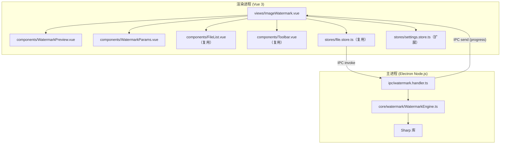
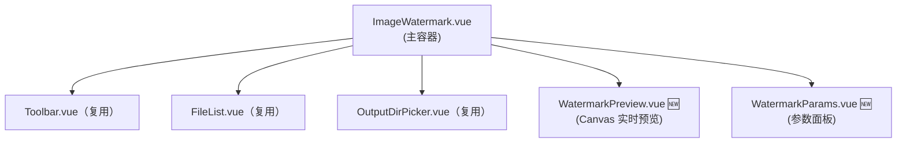
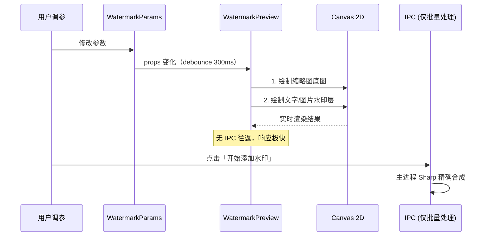
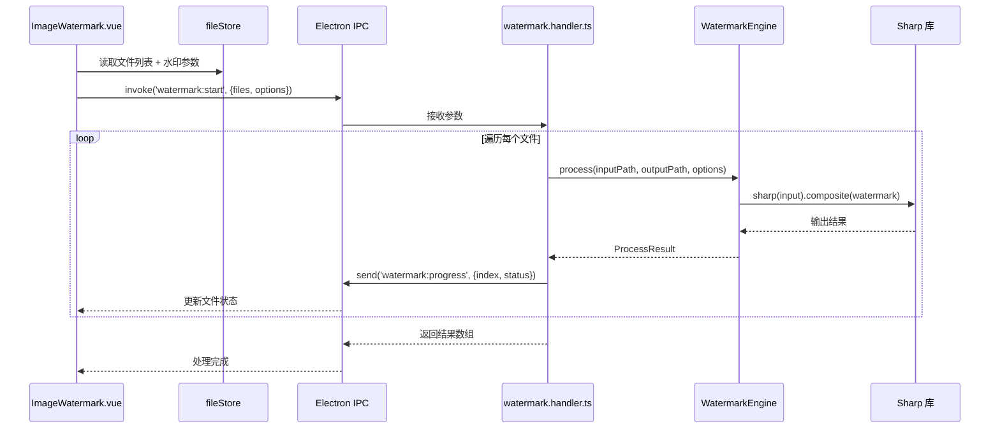
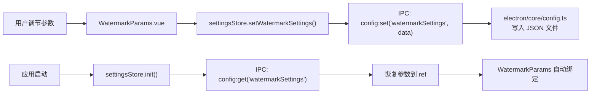

# 图片水印 - 技术架构设计

## 基本信息

| 项目         | 值                           |
| ------------ | ---------------------------- |
| **功能名称** | 图片水印（文字 + 图片）       |
| **所属迭代** | 2026-03-23 功能迭代-图片水印 |
| **创建日期** | 2026-03-23                   |
| **状态**     | 设计中                       |

---

## 一、技术选型

| 技术领域       | 选型                     | 理由                                                      |
| -------------- | ------------------------ | --------------------------------------------------------- |
| **图片处理**   | Sharp（已引入）          | 项目已使用，`composite()` API 支持图层叠加合成             |
| **文字渲染**   | SVG → Sharp Buffer       | Sharp 原生支持 SVG Buffer 输入，无需额外依赖              |
| **前端框架**   | Vue 3 + Naive UI（现有） | 与项目现有技术栈一致                                      |
| **状态管理**   | Pinia（现有）            | 复用 `fileStore` + 新增 watermark 设置持久化至 `settingsStore` |
| **持久化**     | config.ts（现有）        | 复用 `config:get` / `config:set` IPC 通道                 |
| **IPC 通信**   | Electron IPC（现有模式） | 沿用 `ipcMain.handle` + `event.sender.send` 进度推送模式  |
| **预览渲染**   | Canvas（渲染进程）       | 前端用 Canvas 实现实时预览，避免频繁 IPC 往返             |

---

## 二、系统架构

### 2.1 整体分层



### 2.2 目录结构（新增文件）

```
image-toolkit/
├── electron/
│   ├── core/
│   │   └── watermark/                       🆕 水印核心逻辑
│   │       ├── WatermarkEngine.ts           🆕 水印合成引擎
│   │       ├── TextRenderer.ts              🆕 文字→SVG→Buffer 渲染
│   │       ├── TileGenerator.ts             🆕 平铺水印合成
│   │       └── types.ts                     🆕 水印相关类型定义
│   ├── ipc/
│   │   └── watermark.handler.ts             🆕 水印 IPC 通道注册
│   └── main.ts                              ✏️ 新增 registerWatermarkHandlers()
├── src/
│   ├── views/
│   │   └── ImageWatermark.vue               🆕 水印主页面
│   ├── components/
│   │   ├── WatermarkPreview.vue             🆕 实时预览面板（Canvas）
│   │   └── WatermarkParams.vue              🆕 参数配置面板
│   ├── stores/
│   │   └── settings.store.ts                ✏️ 新增 watermark 参数持久化
│   └── router/
│       └── index.ts                         ✏️ 添加 /watermark 路由
└── src/
    └── App.vue                              ✏️ 侧栏菜单新增「图片水印」
```

---

## 三、核心模块设计

### 3.1 WatermarkEngine（水印合成引擎）

位置：`electron/core/watermark/WatermarkEngine.ts`

```typescript
import sharp from 'sharp'
import { TextRenderer } from './TextRenderer'
import { TileGenerator } from './TileGenerator'

interface WatermarkOptions {
  type: 'text' | 'image'
  // 文字水印参数
  text?: string
  fontSize?: number
  color?: string
  // 图片水印参数
  watermarkPath?: string
  scale?: number           // 相对原图百分比 5-50
  // 通用参数
  opacity: number          // 0-100
  rotation: number         // -180 ~ 180
  position: WatermarkPosition
  tileMode: boolean
  tileSpacing?: number     // px
  offsetX?: number
  offsetY?: number
  adaptive?: boolean       // 按图片尺寸自适应
  outputSuffix: string     // 默认 '_watermarked'
}

type WatermarkPosition =
  | 'top-left' | 'top-center' | 'top-right'
  | 'center-left' | 'center' | 'center-right'
  | 'bottom-left' | 'bottom-center' | 'bottom-right'

class WatermarkEngine {
  /**
   * 为单张图片添加水印
   */
  async process(
    inputPath: string,
    outputPath: string,
    options: WatermarkOptions
  ): Promise<ProcessResult> {
    const image = sharp(inputPath)
    const metadata = await image.metadata()
    const { width, height } = metadata

    // 1. 生成水印层 Buffer
    let watermarkBuffer: Buffer
    if (options.type === 'text') {
      watermarkBuffer = TextRenderer.render({
        text: options.text!,
        fontSize: options.fontSize!,
        color: options.color!,
        rotation: options.rotation,
        opacity: options.opacity / 100,
      })
    } else {
      watermarkBuffer = await this.prepareImageWatermark(
        options.watermarkPath!,
        width!, height!,
        options.scale! / 100,
        options.rotation,
        options.opacity / 100,
        options.adaptive
      )
    }

    // 2. 计算合成参数
    let compositeInput: sharp.OverlayOptions[]
    if (options.tileMode) {
      compositeInput = TileGenerator.generate(
        watermarkBuffer, width!, height!,
        options.tileSpacing || 200
      )
    } else {
      compositeInput = [{
        input: watermarkBuffer,
        ...this.calcGravityAndOffset(options.position, options.offsetX, options.offsetY)
      }]
    }

    // 3. 合成输出
    await image.composite(compositeInput).toFile(outputPath)

    return {
      status: 'success',
      inputPath,
      outputPath,
      outputSize: fs.statSync(outputPath).size
    }
  }

  /**
   * 将位置枚举转换为 Sharp gravity + offset
   */
  private calcGravityAndOffset(
    position: WatermarkPosition,
    offsetX = 0, offsetY = 0
  ): { gravity: string; left?: number; top?: number } { /* ... */ }

  /**
   * 准备图片水印：读取 → 缩放 → 旋转 → 调透明度
   */
  private async prepareImageWatermark(
    watermarkPath: string,
    imageWidth: number, imageHeight: number,
    scalePercent: number,
    rotation: number,
    opacity: number,
    adaptive?: boolean
  ): Promise<Buffer> { /* ... */ }
}
```

### 3.2 TextRenderer（文字渲染器）

位置：`electron/core/watermark/TextRenderer.ts`

```typescript
class TextRenderer {
  /**
   * 将文字渲染为带透明背景的 SVG → Buffer
   * Sharp 原生支持 SVG Buffer 作为 composite 输入
   */
  static render(options: {
    text: string
    fontSize: number
    color: string
    rotation: number      // 度数
    opacity: number       // 0-1
  }): Buffer {
    const { text, fontSize, color, rotation, opacity } = options

    // 计算文字包围盒尺寸（考虑旋转后的实际占用空间）
    const estimatedWidth = text.length * fontSize * 0.6
    const estimatedHeight = fontSize * 1.4
    const { boxWidth, boxHeight } = this.calcRotatedBBox(
      estimatedWidth, estimatedHeight, rotation
    )

    const svg = `
      <svg xmlns="http://www.w3.org/2000/svg"
           width="${boxWidth}" height="${boxHeight}">
        <text
          x="50%" y="50%"
          text-anchor="middle"
          dominant-baseline="central"
          font-size="${fontSize}px"
          font-family="Microsoft YaHei, PingFang SC, sans-serif"
          fill="${color}"
          opacity="${opacity}"
          transform="rotate(${rotation}, ${boxWidth/2}, ${boxHeight/2})"
        >${this.escapeXml(text)}</text>
      </svg>
    `

    return Buffer.from(svg)
  }

  /** 计算旋转后的包围盒 */
  private static calcRotatedBBox(w: number, h: number, deg: number) { /* ... */ }

  /** XML 特殊字符转义 */
  private static escapeXml(str: string): string { /* ... */ }
}
```

### 3.3 TileGenerator（平铺水印生成器）

位置：`electron/core/watermark/TileGenerator.ts`

```typescript
class TileGenerator {
  /**
   * 生成平铺水印的 composite 参数数组
   * 将水印按指定间距铺满整个画布
   */
  static generate(
    watermarkBuffer: Buffer,
    canvasWidth: number,
    canvasHeight: number,
    spacing: number
  ): sharp.OverlayOptions[] {
    const overlays: sharp.OverlayOptions[] = []

    // 获取水印尺寸
    // 从左上角开始，按间距铺满
    for (let y = 0; y < canvasHeight; y += spacing) {
      for (let x = 0; x < canvasWidth; x += spacing) {
        overlays.push({
          input: watermarkBuffer,
          left: x,
          top: y,
        })
      }
    }

    return overlays
  }
}
```

---

## 四、IPC 通道设计

### 4.1 通道清单

| 方向 | 通道名                    | 类型   | 描述                             |
| ---- | ------------------------- | ------ | -------------------------------- |
| R→M  | `watermark:start`         | invoke | 批量添加水印，返回结果数组       |
| M→R  | `watermark:progress`      | send   | 逐文件进度推送 `{index, status}` |
| R→M  | `watermark:preview`       | invoke | 生成预览缩略图（返回 base64）    |
| R→M  | `watermark:checkFileSize` | invoke | 检查图片尺寸是否超大             |

> R→M = 渲染进程 → 主进程，M→R = 主进程 → 渲染进程

### 4.2 IPC Handler 注册

位置：`electron/ipc/watermark.handler.ts`

```typescript
import { ipcMain, BrowserWindow } from 'electron'
import fs from 'node:fs'
import path from 'node:path'
import sharp from 'sharp'
import { WatermarkEngine } from '../core/watermark/WatermarkEngine'

export function registerWatermarkHandlers() {
  const engine = new WatermarkEngine()

  // 批量添加水印
  ipcMain.handle('watermark:start', async (event, options: {
    files: string[]
    watermarkOptions: WatermarkOptions
    outputDir?: string
  }) => {
    const results: any[] = []

    for (let i = 0; i < options.files.length; i++) {
      const filePath = options.files[i]
      const ext = path.extname(filePath)
      const baseName = path.basename(filePath, ext)
      const outputDir = options.outputDir || path.dirname(filePath)
      const suffix = options.watermarkOptions.outputSuffix || '_watermarked'
      const outputPath = path.join(outputDir, `${baseName}${suffix}${ext}`)

      try {
        const result = await engine.process(filePath, outputPath, options.watermarkOptions)
        results.push(result)
        event.sender.send('watermark:progress', {
          index: i, status: 'success', outputPath, outputSize: result.outputSize
        })
      } catch (e: any) {
        results.push({ status: 'error', inputPath: filePath, error: e.message })
        event.sender.send('watermark:progress', {
          index: i, status: 'error', error: e.message
        })
      }
    }

    return results
  })

  // 生成预览（返回 base64 缩略图）
  ipcMain.handle('watermark:preview', async (_event, options: {
    filePath: string
    watermarkOptions: WatermarkOptions
    maxSize: number  // 预览最大尺寸，默认 800
  }) => {
    const { filePath, watermarkOptions, maxSize = 800 } = options

    // 先缩小为缩略图再合成水印（节省性能）
    const thumbnail = sharp(filePath).resize(maxSize, maxSize, { fit: 'inside' })
    const thumbBuffer = await thumbnail.toBuffer()
    const thumbMeta = await sharp(thumbBuffer).metadata()

    // 按缩略图尺寸缩放水印参数
    const scaledOptions = { ...watermarkOptions }
    // ... 按比例缩放字体大小/间距等

    const result = await engine.processBuffer(thumbBuffer, scaledOptions)
    return `data:image/png;base64,${result.toString('base64')}`
  })

  // 检查文件尺寸
  ipcMain.handle('watermark:checkFileSize', async (_event, filePaths: string[]) => {
    return Promise.all(filePaths.map(async (p) => {
      const stats = fs.statSync(p)
      const meta = await sharp(p).metadata()
      return {
        path: p,
        fileSize: stats.size,
        width: meta.width || 0,
        height: meta.height || 0,
        isLarge: stats.size > 50 * 1024 * 1024 || (meta.width || 0) > 8000 || (meta.height || 0) > 8000
      }
    }))
  })
}
```

在 `electron/main.ts` 中注册：

```typescript
import { registerWatermarkHandlers } from './ipc/watermark.handler'
// ...
registerWatermarkHandlers()
```

---

## 五、渲染进程架构

### 5.1 组件层次



### 5.2 settingsStore 扩展

位置：`src/stores/settings.store.ts`（扩展现有）

```typescript
// 新增水印参数字段
const watermarkSettings = ref<WatermarkSettings>({
  type: 'text',
  text: '',
  fontSize: 36,
  color: '#FFFFFF',
  opacity: 30,
  rotation: -30,
  position: 'bottom-right',
  tileMode: false,
  tileSpacing: 200,
  offsetX: 0,
  offsetY: 0,
  scale: 15,
  adaptive: false,
  outputSuffix: '_watermarked',
  lastWatermarkImagePath: null,
})

// 新增 action
async function setWatermarkSettings(settings: Partial<WatermarkSettings>) {
  watermarkSettings.value = { ...watermarkSettings.value, ...settings }
  await saveToConfig('watermarkSettings', watermarkSettings.value)
}

// init() 方法中新增
watermarkSettings.value = await loadFromConfig('watermarkSettings', defaultWatermarkSettings)
```

### 5.3 WatermarkPreview.vue（Canvas 实时预览）

预览使用前端 Canvas 实现，避免每次参数变化都 IPC 往返主进程：



> **设计决策**：预览用 Canvas 前端渲染（速度 <50ms），正式处理用 Sharp 后端合成（精度高）。两者可能存在细微差异，但预览的目的是快速反馈，可接受。

### 5.4 路由更新

```typescript
// src/router/index.ts
{ path: '/watermark', component: () => import('../views/ImageWatermark.vue') }
```

### 5.5 App.vue 侧栏菜单更新

```typescript
// 新增菜单项
{
  label: '图片水印',
  key: '/watermark',
  icon: () => h(NIcon, null, { default: () => h(WaterOutline) }),
}
```

---

## 六、关键数据流

### 6.1 批量处理数据流



### 6.2 参数持久化数据流



---

## 七、关键技术细节

### 7.1 Sharp composite 用法

```typescript
// 单水印合成
await sharp(inputPath)
  .composite([{
    input: watermarkBuffer,  // SVG Buffer 或 PNG Buffer
    gravity: 'southeast',    // 九宫格位置映射
    blend: 'over',           // 默认混合模式
  }])
  .toFile(outputPath)

// 平铺水印合成（多个 overlay）
await sharp(inputPath)
  .composite([
    { input: watermarkBuffer, left: 0, top: 0 },
    { input: watermarkBuffer, left: 200, top: 0 },
    { input: watermarkBuffer, left: 0, top: 200 },
    { input: watermarkBuffer, left: 200, top: 200 },
    // ...
  ])
  .toFile(outputPath)
```

### 7.2 九宫格位置 → Sharp gravity 映射

```typescript
const POSITION_MAP: Record<WatermarkPosition, string> = {
  'top-left':      'northwest',
  'top-center':    'north',
  'top-right':     'northeast',
  'center-left':   'west',
  'center':        'centre',
  'center-right':  'east',
  'bottom-left':   'southwest',
  'bottom-center': 'south',
  'bottom-right':  'southeast',
}
```

### 7.3 图片水印透明度处理

```typescript
// Sharp 不直接支持设置 overlay 透明度
// 方案：预处理水印图片，通过 ensureAlpha + modulate 调整
async function applyOpacity(buffer: Buffer, opacity: number): Promise<Buffer> {
  // 先确保有 alpha 通道
  const withAlpha = await sharp(buffer).ensureAlpha().raw().toBuffer({ resolveWithObject: true })
  const { data, info } = withAlpha

  // 直接修改每个像素的 alpha 通道
  for (let i = 3; i < data.length; i += 4) {
    data[i] = Math.round(data[i] * opacity)
  }

  return sharp(data, { raw: { width: info.width, height: info.height, channels: 4 } })
    .png()
    .toBuffer()
}
```

### 7.4 输出文件名冲突处理

```typescript
function getUniqueOutputPath(basePath: string): string {
  if (!fs.existsSync(basePath)) return basePath

  const dir = path.dirname(basePath)
  const ext = path.extname(basePath)
  const name = path.basename(basePath, ext)
  let counter = 1

  while (fs.existsSync(path.join(dir, `${name}_${counter}${ext}`))) {
    counter++
  }

  return path.join(dir, `${name}_${counter}${ext}`)
}
```

---

## 八、性能优化策略

| 场景           | 策略                                                  |
| -------------- | ----------------------------------------------------- |
| 实时预览       | Canvas 前端渲染，debounce 300ms，无 IPC 往返          |
| 批量处理       | 逐文件串行处理，避免内存同时占用多张大图              |
| 大图片         | 预览使用缩略图（≤800px），正式处理才读取原图          |
| 水印 Buffer    | 同批次复用同一个水印 Buffer，不重复生成               |
| 平铺水印       | 预计算 overlay 数组，一次 `composite()` 调用完成       |
| 文件 I/O       | 输出使用 `sharp.toFile()` 流式写入，不在内存中持有完整结果 |

---

## 九、关联文档

- [需求文档](./需求文档.md)
- [需求澄清](./澄清.md)
- [产品设计](./产品设计.md)

## 变更记录

| 日期       | 版本 | 变更内容 | 变更人 |
| ---------- | ---- | -------- | ------ |
| 2026-03-23 | V1.0 | 初始版本 | —      |
