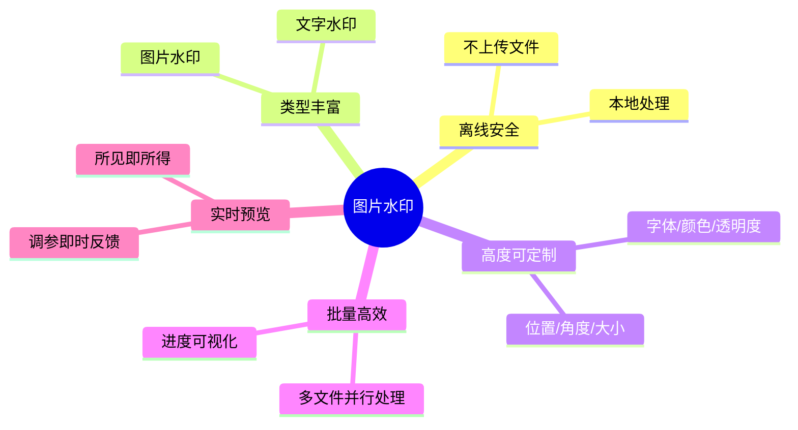
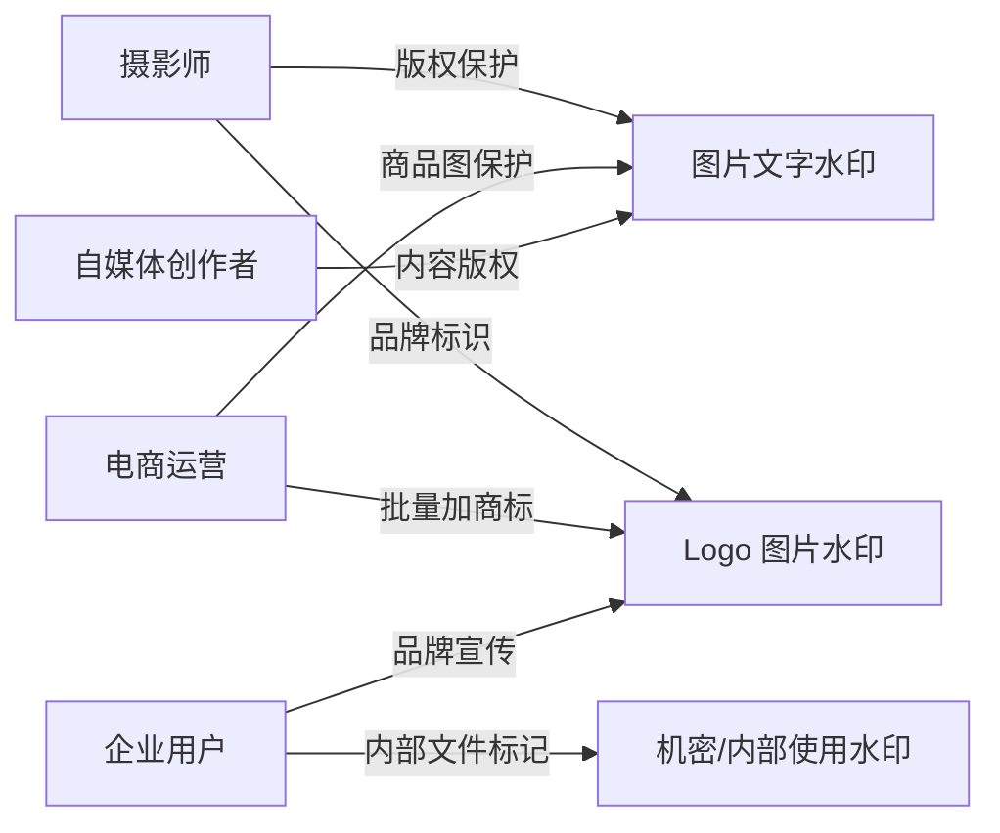
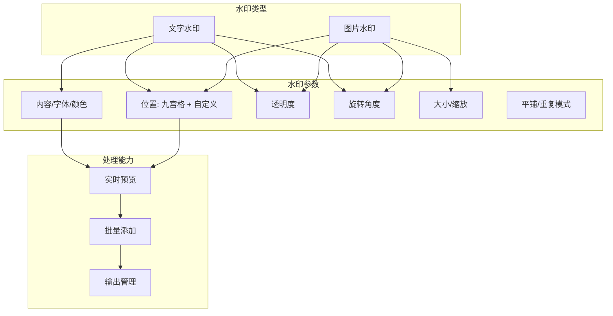
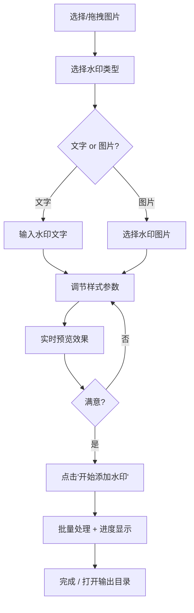
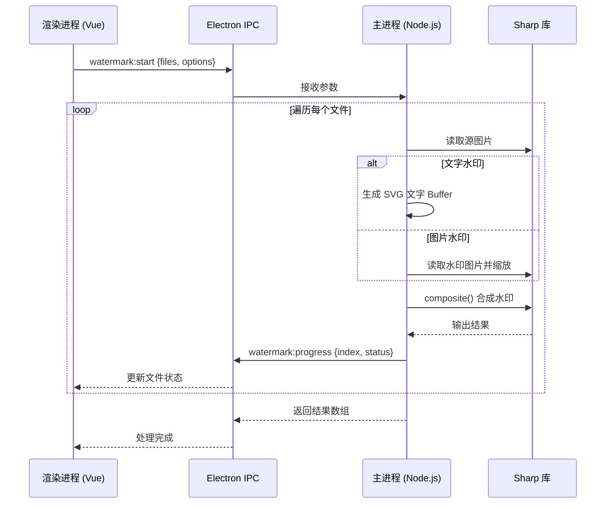
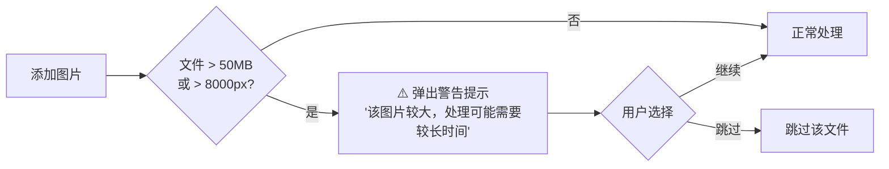

# 图片水印 - 需求文档

## 文档信息

| 项目         | 值                           |
| ------------ | ---------------------------- |
| **功能名称** | 图片水印                     |
| **所属迭代** | 2026-03-23 功能迭代-图片水印 |
| **创建日期** | 2026-03-23                   |
| **版本**     | V1.1                         |
| **状态**     | ✅ 已确认                    |

---

## 1. 业务背景

### 1.1 现状分析

Universal Toolkit 当前已具备**图片压缩**、**格式转换**、**SVG 查看**等图片处理能力，但在图片版权保护和品牌标识方面尚未覆盖——**图片水印**是用户日常工作中的高频需求。

现有市场痛点：

| 痛点                       | 影响                                         |
| -------------------------- | -------------------------------------------- |
| 在线水印工具存在隐私风险   | 图片上传到第三方服务器，敏感图片有泄露风险   |
| 专业图像软件操作复杂       | Photoshop 等软件学习成本高，仅加水印太重量级 |
| 批量水印效率低             | 大部分免费工具一次只能处理一张图片           |
| 水印样式单一               | 免费工具仅支持简单文字，不支持图片水印或样式调节 |
| 缺少统一管理               | 使用不同工具导致水印风格不一致               |

### 1.2 业务目标



**核心目标**：让用户在离线环境下，快速為图片添加可高度定制的水印（文字 / 图片），支持批量处理，保护图片版权与品牌标识。

---

## 2. 用户分析

### 2.1 目标用户画像



| 用户角色     | 核心需求                   | 使用频率 | 处理规模      |
| ------------ | -------------------------- | -------- | ------------- |
| 摄影师       | 批量添加版权文字/Logo      | 每周     | 50-200 张     |
| 电商运营     | 商品图加商标/防盗           | 每日     | 20-100 张     |
| 自媒体创作者 | 内容图片加版权             | 每周     | 5-30 张       |
| 企业用户     | 文件/截图标记机密等级       | 每月     | 10-50 张      |

### 2.2 用户痛点优先级

| 排名 | 痛点                                 | 严重程度 |
| ---- | ------------------------------------ | -------- |
| 1    | 在线工具上传图片不安全               | 🔴 严重  |
| 2    | 批量处理效率低，逐张手动加水印       | 🔴 严重  |
| 3    | 水印位置/样式调节不灵活             | 🟡 中等  |
| 4    | 无法实时预览效果，反复调试浪费时间   | 🟡 中等  |
| 5    | 专业工具学习成本高                   | 🟢 一般  |

---

## 3. 需求概述

### 3.1 功能架构



### 3.2 核心功能清单

| 模块       | 功能编号 | 功能名称         | 详细说明                                                                 | 优先级 |
| ---------- | -------- | ---------------- | ------------------------------------------------------------------------ | ------ |
| **水印类型** | F1.1   | 文字水印         | 用户输入自定义文字，支持中英文                                           | P0     |
| **水印类型** | F1.2   | 图片水印         | 上传 PNG/SVG/WebP 等图片作为水印（如 Logo）                              | P0     |
| **样式配置** | F2.1   | 字体设置         | 字体大小（滑块 12-120px）                                                | P0     |
| **样式配置** | F2.2   | 颜色设置         | 预设色板（白/黑/红/灰/蓝/绿），点选即用                                  | P0     |
| **样式配置** | F2.3   | 透明度           | 滑块调节不透明度（0%-100%），默认 30%                                     | P0     |
| **样式配置** | F2.4   | 旋转角度         | 滑块调节旋转角度（-180° ~ 180°），默认 -30°                              | P0     |
| **位置配置** | F3.1   | 九宫格预设位置   | 左上/中上/右上/左中/居中/右中/左下/中下/右下                             | P0     |
| **位置配置** | F3.2   | 平铺水印         | 满屏重复平铺（可设置间距），常用于机密文件标记                           | P1     |
| **位置配置** | F3.3   | 自定义偏移       | 基于预设位置的 X/Y 偏移微调（像素值）                                    | P2     |
| **图片水印** | F4.1   | 水印图片选择     | 通过文件对话框选择水印图片                                               | P0     |
| **图片水印** | F4.2   | 水印图片缩放     | 滑块调节水印图片大小（相对原图百分比 5%-50%），默认 15%                   | P0     |
| **预览**     | F5.1   | 实时预览         | 在面板中显示第一张图片的水印效果，参数变化实时更新                       | P0     |
| **处理**     | F6.1   | 批量处理         | 一键为所有已添加图片应用相同水印设置                                     | P0     |
| **处理**     | F6.2   | 逐文件进度       | 每个文件独立显示处理状态（处理中/成功/失败）                             | P0     |
| **处理**     | F6.3   | 输出目录管理     | 复用现有 OutputDirPicker 组件                                            | P0     |
| **处理**     | F6.4   | 保留原文件       | 水印图片输出到新文件，不覆盖源文件（默认 `_watermarked` 后缀，支持自定义命名规则） | P0     |
| **处理**     | F6.5   | 参数持久化       | 水印设置自动保存到本地，下次打开自动恢复上次参数                         | P0     |
| **处理**     | F6.6   | 大图警告         | 超大图片（>50MB / >8000px）弹出警告提示，不阻断操作                      | P0     |
| **处理**     | F6.7   | 批量自适应       | 默认所有图片使用相同参数，可选开启按图片尺寸自适应缩放水印               | P1     |

### 3.3 已排除功能（不在本次迭代范围）

| 功能               | 排除原因                                   |
| ------------------ | ------------------------------------------ |
| 视频水印           | 技术复杂度过高，非本次迭代范围             |
| 水印模板管理/保存  | 可后续迭代，MVP 不需要                     |
| 去除水印           | 与添加水印功能定位不同，涉及 AI 图像处理   |
| 动态水印（动图）   | GIF 处理复杂度高，优先支持静态图片水印     |

---

## 4. 交互设计

### 4.1 页面布局

```
┌──────────────────────────────────────────────────────────────┐
│ 工具栏                                                       │
│ [选择图片] [水印类型▾ 文字/图片]  参数控件...  [🖼 开始添加水印] │
├──────────────────────────┬───────────────────────────────────┤
│                          │                                   │
│    文件列表区域           │       实时预览区域                │
│    (FileList 组件)        │       (选中图片 + 水印叠加效果)   │
│                          │                                   │
│    📄 photo1.jpg  ✅     │       ┌─────────────────────┐     │
│    📄 photo2.jpg  ⏳     │       │                     │     │
│    📄 photo3.jpg  等待    │       │   预览图片 + 水印   │     │
│                          │       │                     │     │
│                          │       └─────────────────────┘     │
│                          │                                   │
├──────────────────────────┴───────────────────────────────────┤
│ 水印参数面板（可折叠）                                        │
│ [文字内容] [字体大小] [颜色] [透明度] [角度] [位置九宫格]     │
└──────────────────────────────────────────────────────────────┘
```

### 4.2 操作流程



### 4.3 水印位置九宫格

```
┌───────┬───────┬───────┐
│ 左上  │ 中上  │ 右上  │
├───────┼───────┼───────┤
│ 左中  │ 居中  │ 右中  │
├───────┼───────┼───────┤
│ 左下  │ 中下  │ 右下  │
└───────┴───────┴───────┘
       + [平铺] 选项
```

用户点选九宫格中的位置，水印即放置在对应区域。选择「平铺」时水印以指定间距重复覆盖全图。

---

## 5. 技术方案概要

### 5.1 技术栈适配

| 层级       | 技术选型                    | 说明                                  |
| ---------- | --------------------------- | ------------------------------------- |
| **渲染层** | Vue 3 + Naive UI            | 复用现有组件体系                      |
| **图片处理** | Sharp                     | 项目已引入，支持 composite 合成水印   |
| **文字渲染** | Sharp + SVG 文本          | 将文字渲染为 SVG → 转 Buffer → 合成   |
| **IPC 通信** | Electron IPC              | 新增 `watermark:start` 等通道         |
| **状态管理** | fileStore (Pinia)          | 复用现有文件列表状态管理              |

### 5.2 核心处理流程



### 5.3 文件变更清单（预估）

| 变更类型 | 文件路径                                | 说明                     |
| -------- | --------------------------------------- | ------------------------ |
| 新增     | `src/views/ImageWatermark.vue`          | 水印视图页面             |
| 新增     | `electron/watermark.ts`                 | 主进程水印处理逻辑       |
| 修改     | `src/router/index.ts`                   | 添加 `/watermark` 路由   |
| 修改     | `src/App.vue`                           | 侧栏菜单新增「图片水印」 |
| 修改     | `electron/main.ts`                      | 注册水印 IPC 通道        |

---

## 6. 约束条件

### 6.1 技术约束

| 约束                     | 说明                                                     |
| ------------------------ | -------------------------------------------------------- |
| **Sharp composite 能力** | 依赖 Sharp 的 `composite()` API，支持 overlay 合成       |
| **中文字体依赖**         | 文字水印使用系统字体，Windows 默认有「微软雅黑」可用      |
| **SVG 文字渲染**         | 复杂排版（竖排/曲线文字）暂不支持                         |
| **内存限制**             | 大尺寸图片（>50MB）需注意内存占用，建议流式处理           |

### 6.2 平台约束

| 约束         | 说明                                 |
| ------------ | ------------------------------------ |
| **操作系统** | Windows 10+                          |
| **运行环境** | Electron（Node.js 主进程执行水印合成） |
| **离线运行** | 全部本地处理，不依赖网络             |

### 6.3 用户体验约束

| 约束           | 说明                                         |
| -------------- | -------------------------------------------- |
| **零学习成本** | 选图 → 设参数 → 点按钮，操作直觉化          |
| **保留原文件** | 永远不修改/覆盖源文件                        |
| **实时预览**   | 参数调节后 ≤ 500ms 内刷新预览                |
| **错误友好**   | 中文提示，单文件失败不阻断批量处理           |

---

## 7. 成功指标

| 指标               | 目标值                               |
| ------------------ | ------------------------------------ |
| 水印添加成功率     | > 99%（排除损坏文件）                |
| 单张图片处理耗时   | < 2 秒（10MB 以内图片）              |
| 批量 100 张图耗时  | < 60 秒                              |
| 预览刷新延迟       | < 500ms                              |
| 用户操作步骤       | ≤ 4 步（选图→设水印→预览→执行）      |
| 支持图片格式       | JPEG / PNG / WebP / AVIF / TIFF      |

---

## 8. 风险识别

| 风险                       | 影响  | 缓解措施                                           |
| -------------------------- | ----- | -------------------------------------------------- |
| 中文文字渲染字体不一致     | 🟡 中 | 使用系统字体 + SVG 渲染，确保 Windows 下兼容       |
| 大图片内存溢出             | 🟡 中 | 限制单次批量数量，大文件使用 Sharp 流式 pipeline    |
| 透明背景图片水印合成效果差 | 🟢 低 | 水印层独立合成，不影响原图 alpha 通道              |
| 平铺水印密度计算复杂       | 🟢 低 | 提供固定间距选项，避免过于灵活导致 UI 复杂         |
| 预览性能（大图实时渲染）   | 🟡 中 | 预览使用缩略图（最大 800px），正式处理用原图        |

---

## 9. 人性化设计

### 9.1 智能默认值

| 参数         | 默认值                | 设计理由                                     |
| ------------ | --------------------- | -------------------------------------------- |
| 水印类型     | 文字水印              | 最常用场景                                   |
| 文字内容     | 空（placeholder 提示） | 避免用户忘记修改默认文字                     |
| 字体大小     | 36px                  | 适中大小，兼顾可读性和美观                   |
| 颜色         | 白色（#FFFFFF）       | 白色在大多数图片上可见度最高                 |
| 透明度       | 30%                   | 既能看到水印又不过度遮挡原图                 |
| 旋转角度     | -30°                  | 斜向水印是行业惯例，增加去除难度             |
| 位置         | 右下角                | 摄影/设计行业最常用的版权标记位置            |
| 图片水印缩放 | 15%                   | 水印面积适中，不喧宾夺主                     |
| 平铺间距     | 200px                 | 视觉均匀分布，不过于密集                     |
| 输出文件后缀 | `_watermarked`        | 直观表意，避免覆盖原文件                     |

### 9.2 参数持久化与恢复

- 用户设置的所有水印参数（文字内容、字体大小、颜色、透明度、角度、位置、缩放等）自动保存到 `settingsStore`
- 下次打开应用时自动恢复上次使用的水印参数，无需重新配置
- 首次使用时加载智能默认值

### 9.3 大图安全保护



- 警告提示不阻断操作，用户可选择继续或跳过
- 批量处理时，大图警告在处理前统一提示一次，避免反复打断

### 9.4 实时预览交互体验

| 设计要点         | 具体方案                                               |
| ---------------- | ------------------------------------------------------ |
| **响应速度**     | 参数变化后 ≤ 500ms 刷新预览，使用 debounce 防抖        |
| **缩略图预览**   | 预览面板使用缩略图（最大 800px），正式处理使用原图      |
| **选中高亮**     | 文件列表中点击某文件，预览面板切换显示该文件的水印效果  |
| **拖拽互动**     | 预览区域支持鼠标滚轮缩放查看水印细节                   |
| **加载状态**     | 预览刷新时显示轻量 loading 动画，避免闪烁              |

### 9.5 批量处理自适应

- **默认模式**：所有图片使用完全相同的水印参数（位置/大小/透明度）
- **自适应模式**（可选开关）：水印大小按每张图片的实际尺寸等比缩放
  - 例如：缩放比例设为 15% → 1000px 宽图水印为 150px，2000px 宽图水印为 300px
  - 确保不同尺寸图片的水印视觉大小一致

### 9.6 操作反馈与容错

| 场景                   | 反馈方式                                              |
| ---------------------- | ----------------------------------------------------- |
| 添加重复文件           | `info` 提示「X 个文件已存在，已跳过」                 |
| 水印文字为空时点击执行 | `warning` 提示「请输入水印文字」，不开始处理           |
| 单文件处理失败         | 该文件标记 ❌，不中断其余文件，完成后汇总失败数       |
| 全部处理成功           | `success` 提示「水印添加完成！共处理 X 个文件」       |
| 处理完成后             | 显示「打开输出目录」按钮，一键定位结果文件             |
| 未选择图片时点击执行   | 按钮置灰 + `disabled`，无法点击                       |
| 处理中                 | 按钮显示 loading 状态，防止重复点击                   |

### 9.7 友好空状态引导

```
┌─────────────────────────────────────────┐
│                                         │
│              🎨                         │
│                                         │
│     点击选择图片，或拖拽到这里           │
│                                         │
│   支持 JPEG / PNG / WebP / AVIF / TIFF  │
│   添加文字或图片水印，保护你的作品       │
│                                         │
└─────────────────────────────────────────┘
```

- 空状态区域可点击触发文件选择
- 整个内容区支持拖拽放入文件
- 文案简洁温暖，降低使用门槛

### 9.8 键盘快捷键

| 快捷键         | 功能                 |
| -------------- | -------------------- |
| `Ctrl+O`       | 选择图片             |
| `Ctrl+Enter`   | 开始添加水印         |
| `Ctrl+Z`       | 撤销（移除最近添加） |
| `Delete`       | 移除选中文件         |

---

## 关联文档

- 所属项目：Universal Toolkit (image-toolkit)
- 相关模块参考：[图片压缩](../../src/views/ImageCompress.vue) · [格式转换](../../src/views/FormatConvert.vue)
- [需求澄清](./澄清.md)
